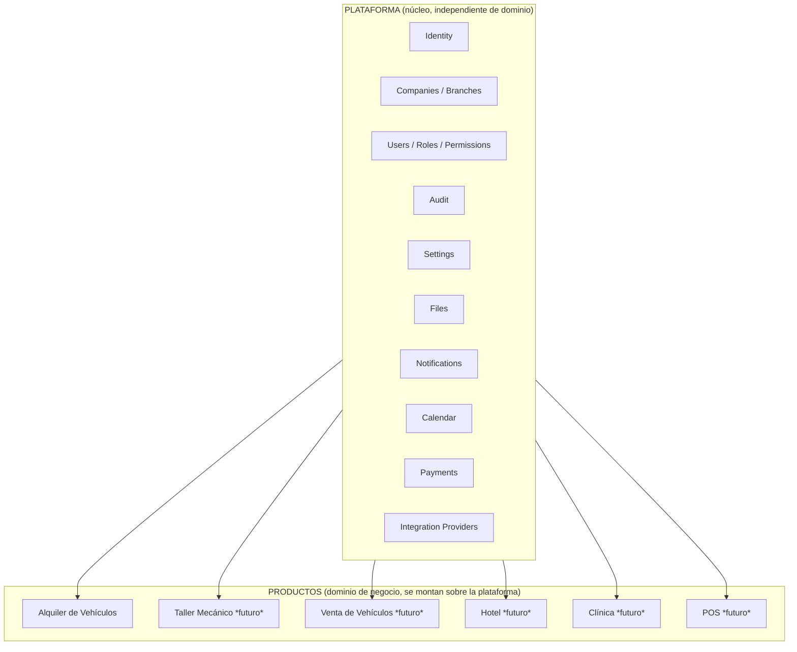

# 00 — Visión del Producto

## 1. Qué estamos construyendo realmente

No estamos construyendo un sistema de alquiler de vehículos. Estamos construyendo una **Plataforma Empresarial** (en adelante, "la Plataforma") capaz de soportar múltiples productos verticales de negocio a lo largo de al menos una década, sin que la incorporación de un nuevo producto obligue a reescribir o reestructurar el núcleo.

El alquiler de vehículos es el **primer producto** construido sobre la Plataforma. Es también el mecanismo con el que validaremos que la arquitectura es correcta: si construir el segundo producto (taller mecánico, venta de vehículos, hotel, clínica, POS, CRM, ERP...) requiere tocar el núcleo de la Plataforma, la arquitectura habrá fallado.

Esta distinción — Plataforma vs. Producto — es la decisión arquitectónica más importante de todo el proyecto y condiciona cada documento que sigue.

## 2. Objetivos

1. **Longevidad**: la Plataforma debe seguir siendo viable, comprensible y evolucionable dentro de 10 años, incluso si el equipo original ya no está.
2. **Reutilización real**: cada capacidad transversal (usuarios, empresas, sucursales, archivos, notificaciones, pagos, calendario, auditoría, configuración) se construye una sola vez y la usan todos los productos.
3. **Incorporación de productos sin fricción arquitectónica**: agregar "Taller Mecánico" en el año 3 debe ser, principalmente, escribir nuevos módulos de dominio — no modificar el núcleo.
4. **Independencia del dominio respecto del framework**: las reglas de negocio no deben saber que existen NestJS, Prisma, PostgreSQL, React o Next.js.
5. **Multi-tenant desde el día uno**: una misma instalación de la Plataforma debe poder servir a múltiples empresas (companies) con aislamiento de datos estricto, porque este es el modelo comercial (SaaS) previsto.
6. **Consistencia sobre velocidad**: se prioriza que 50 desarrolladores distintos, a lo largo de 10 años, construyan módulos de forma predecible y uniforme, por encima de ganar semanas en el corto plazo.

## 3. Filosofía

- **El dominio manda, la infraestructura obedece.** El código de negocio no depende de librerías; las librerías se adaptan al dominio mediante puertos y adaptadores.
- **Pragmatismo sobre dogma.** Usamos DDD, Clean Architecture y CQRS donde aportan valor medible, no como checklist. Ver [ADR-0002](ADR/0002-ddd-pragmatico.md).
- **Monolito modular, no microservicios prematuros.** La complejidad operativa de microservicios no se justifica hoy. La arquitectura se diseña para que la extracción a servicios sea posible mañana, sin que sea obligatoria hoy. Ver [ADR-0001](ADR/0001-modular-monolith.md).
- **Un módulo, un dueño, un límite claro.** Cada bounded context tiene fronteras explícitas de código y de datos. Nada "toma un atajo" cruzando esa frontera.
- **Toda integración externa es reemplazable.** WhatsApp, Stripe, Mercado Pago, S3, IA, OCR: todos entran por un Provider/Puerto. Cambiar de proveedor es cambiar un adaptador, no reescribir el dominio.
- **Nada es global ni implícito.** Sin singletons, sin estado oculto, sin "magia". Todo se inyecta, todo es explícito, todo es testeable.
- **La simplicidad es una decisión activa.** Se evita sobreingeniería: no se introduce un patrón hasta que el problema que resuelve existe de verdad.

## 4. Alcance

### 4.1 Alcance de esta fase de diseño

Este directorio `docs/` define:

- La arquitectura completa de la Plataforma (núcleo + reglas de extensión).
- El primer producto de dominio: **gestión de alquiler de vehículos**.
- Los módulos transversales necesarios para que ese primer producto funcione en producción: Identity, Companies, Branches, Users, Roles, Permissions, Customers, Vehicles, Reservations, Calendar, Payments, Invoices, Notifications, Files, Reports, Audit, Settings.
- Las convenciones de backend (NestJS), frontend web (Next.js) y móvil (React Native/Expo).
- Los contratos de API, el modelo de seguridad, la estrategia de testing y la arquitectura de integraciones externas.

### 4.2 No objetivos (explícitos)

- **No** se diseña el modelo físico de base de datos (DDL, migraciones concretas) en esta fase — ver [04-MODELO-DATOS.md](04-MODELO-DATOS.md), que define reglas, no el esquema.
- **No** se diseñan pantallas ni wireframes — ver [07-DESIGN-SYSTEM.md](07-DESIGN-SYSTEM.md), que define reglas de sistema de diseño, no mockups.
- **No** se implementa código en esta fase. Este directorio es la referencia oficial que guiará la implementación posterior.
- **No** se construyen microservicios, service mesh, ni orquestación Kubernetes en esta fase. Es una no-decisión deliberada, no un olvido — ver [ADR-0001](ADR/0001-modular-monolith.md).
- **No** se diseñan los productos futuros (Taller, Hotel, Clínica, etc.) en detalle. Solo se garantiza que la Plataforma los pueda alojar.

## 5. Principios rectores (checklist de todo diseño futuro)

Cualquier módulo, ADR o funcionalidad nueva debe poder responder "sí" a estas preguntas antes de aprobarse:

1. ¿El dominio de este módulo sigue siendo independiente de NestJS/Prisma/React?
2. ¿Esta funcionalidad es transversal (pertenece a la Plataforma) o específica de un producto (pertenece al dominio)? ¿Está en el lugar correcto?
3. ¿Este módulo depende de otro módulo a través de un contrato explícito (puerto/evento), o accede directamente a sus datos/internals?
4. ¿Si mañana agregamos "Taller Mecánico", este cambio nos obliga a tocar el núcleo?
5. ¿Estamos resolviendo un problema real y presente, o uno hipotético?
6. ¿La integración externa nueva entra por un adaptador, o se filtra directamente en el dominio?

## 6. Roadmap estratégico (resumen)

El detalle completo está en [01-ROADMAP.md](01-ROADMAP.md). En síntesis:

| Horizonte | Hito |
|---|---|
| Fase 0 | Fundaciones de plataforma: monorepo, CI/CD, Identity, Companies/Branches, Users/Roles/Permissions, Audit, Settings, Files |
| Fase 1 | Producto 1 (MVP): Vehicles, Customers, Reservations, Calendar |
| Fase 2 | Comercial: Payments, Invoices |
| Fase 3 | Comunicación: Notifications, integraciones (WhatsApp, Email) |
| Fase 4 | Reports, cierre de auditoría y seguridad |
| Fase 5 | Aplicación móvil (React Native/Expo) para clientes y/u operadores |
| Fase 6 | Hardening: performance, multi-tenant a escala, pentest |
| v1.0 | GA del producto de alquiler de vehículos sobre la Plataforma |
| Post v1.0 | Validación real de la Plataforma: construir el segundo producto (p. ej. Taller Mecánico) reutilizando el núcleo sin modificarlo |

La Plataforma no se considera exitosa cuando se lanza el producto de alquiler. Se considera exitosa cuando el **segundo producto** se construye más rápido que el primero, reutilizando el núcleo sin fricciones.
