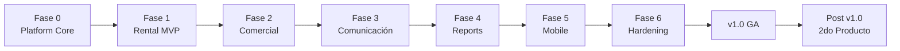

# 01 — Roadmap

## 1. Principio de ordenamiento

El orden de construcción no sigue "lo que el negocio quiere ver primero", sino **la dirección de las dependencias arquitectónicas**: primero lo que todo lo demás necesita (Platform Core), después lo que el dominio necesita para existir (Identity → Companies → Users), después el dominio de negocio en sí (Rental), y al final lo que depende de que el dominio ya tenga datos reales (Reports).

Construir en el orden incorrecto (p. ej. Reservations antes que Companies/Branches) obliga a retrabajo porque cada entidad de negocio necesita un tenant y un propietario desde su primer campo.

## 2. Fase 0 — Fundaciones de Plataforma

**Objetivo:** que exista un esqueleto ejecutable, seguro y multi-tenant, sin ninguna regla de negocio de alquiler todavía.

Orden interno (cada ítem depende del anterior):

1. **Monorepo + tooling**: estructura de repositorio, Nx, Docker Compose (Postgres, Redis, MinIO), CI básico (lint + build + test).
2. **Identity**: autenticación (JWT + refresh tokens), hashing de credenciales, sesión.
3. **Companies**: entidad tenant raíz. Sin esto nada puede tener dueño.
4. **Branches**: sucursales dentro de una company.
5. **Users**: usuarios pertenecientes a una company (y opcionalmente a una branch).
6. **Roles / Permissions**: RBAC. Necesario antes de exponer cualquier endpoint protegido de forma realista.
7. **Audit**: interceptor/listener transversal de auditoría. Se construye temprano porque instrumentar retroactivamente es costoso y propenso a huecos de cobertura.
8. **Settings**: configuración por company/branch (incluye el **registro de módulos activos**, ver [02-ARQUITECTURA.md](02-ARQUITECTURA.md)).
9. **Files**: abstracción de storage (S3/MinIO) con adaptador, usada luego por Vehicles (fotos), Customers (documentos), Invoices (PDFs).

**Criterio de salida de Fase 0**: se puede crear una company, una branch, un usuario, asignarle un rol, iniciar sesión, subir un archivo y ver el evento en el log de auditoría. Cero pantallas de negocio.

## 3. Fase 1 — Producto 1: Alquiler de Vehículos (MVP)

**Objetivo:** operar el ciclo de negocio mínimo: un cliente reserva un vehículo disponible en un rango de fechas.

1. **Customers**: clientes de una company (persona natural/jurídica), reutiliza Files para documentos.
2. **Vehicles**: catálogo de vehículos por branch, estados (disponible, reservado, en mantenimiento, fuera de servicio).
3. **Calendar** (plataforma, genérico): motor de disponibilidad/bloqueos por recurso y rango de fechas. Se construye como capacidad de plataforma —no como parte de Reservations— porque Taller (turnos), Hotel (habitaciones) y Clínica (citas) necesitarán exactamente el mismo motor.
4. **Reservations**: agrega Customers + Vehicles + Calendar en el flujo de negocio de alquiler.

**Criterio de salida**: flujo completo reserva → confirmación → check-out → check-in, con disponibilidad correctamente bloqueada y liberada.

## 4. Fase 2 — Capa Comercial

1. **Payments**: abstracción de cobro (plataforma) con adaptadores Stripe / Mercado Pago.
2. **Invoices**: emisión de comprobantes asociados a una Reservation, generación de PDF vía Files.

**Por qué después de Reservations y no antes**: Payments/Invoices necesitan un objeto de negocio (la reserva) sobre el cual cobrar. Construirlo antes sería especular sobre una interfaz que todavía no conocemos.

## 5. Fase 3 — Comunicación

1. **Notifications** (plataforma): motor de notificaciones multi-canal (email, SMS, push, WhatsApp) desacoplado vía Providers.
2. Integraciones: WhatsApp Business Cloud API, Email transaccional, Push.
3. Eventos de dominio de Reservations/Payments/Invoices se conectan a Notifications (confirmación de reserva, recordatorio, comprobante de pago) — integración tardía deliberada: primero el dominio genera eventos correctos, después se conectan canales.

## 6. Fase 4 — Reports y cierre de Auditoría/Seguridad

1. **Reports**: reportería operativa (ocupación de flota, ingresos, clientes) leyendo de vistas/proyecciones, nunca acoplando el modelo transaccional a necesidades de reporte (ver [02-ARQUITECTURA.md §6](02-ARQUITECTURA.md), CQRS selectivo).
2. Revisión de cobertura de Audit y hardening de Settings/Permissions con datos reales de uso.

## 7. Fase 5 — Aplicación Móvil

React Native/Expo, consumiendo la misma API pública (ver [08-API-CONTRACTS.md](08-API-CONTRACTS.md)). No antes, porque construir mobile contra una API inestable duplica el costo de cambio. Alcance típico: operadores de sucursal (check-in/check-out de vehículos) y/o clientes (autogestión de reservas), a definir con negocio al llegar a esta fase.

## 8. Fase 6 — Hardening

- Revisión de seguridad (OWASP, ver [09-SEGURIDAD.md](09-SEGURIDAD.md)) y pentest externo.
- Pruebas de carga multi-tenant (aislamiento de datos bajo concurrencia real).
- Revisión de performance de queries y de la estrategia de cache (Redis).
- Runbooks operativos y observabilidad (logs estructurados, métricas, alertas).

## 9. v1.0 — GA

Producto de alquiler de vehículos en producción, multi-tenant, con Payments, Notifications, Reports y Mobile activos.

## 10. Post v1.0 — Prueba real de la Plataforma

El siguiente producto (candidato natural: **Taller Mecánico**, por su cercanía de dominio con Rental — comparte Vehicles y Customers) se construye reutilizando Identity, Companies, Branches, Users, Roles, Permissions, Audit, Settings, Files, Calendar, Payments, Invoices y Notifications **sin modificarlos**. Este es el criterio de aceptación final de toda la arquitectura descrita en este directorio.

## 11. Qué NO va en el roadmap de v1.0

- Microservicios / service mesh.
- CQRS con event sourcing completo.
- Nuevos productos verticales más allá de Rental.
- Marketplace de integraciones de terceros.

Estas quedan documentadas como decisiones diferidas, no descartadas (ver ADRs correspondientes), para que un futuro arquitecto entienda que fueron evaluadas y conscientemente pospuestas.
