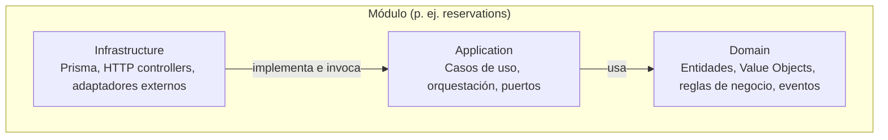
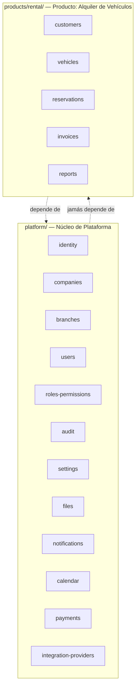
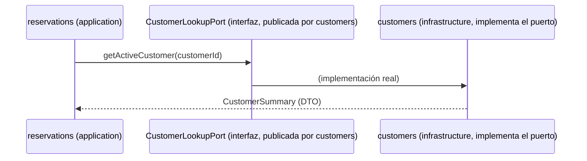

# 02 — Arquitectura

## 1. Decisión raíz: Monolito Modular

### 1.1 Alternativas consideradas

| Opción | Ventaja | Por qué NO hoy |
|---|---|---|
| Microservicios desde el inicio | Escalado independiente, aislamiento de fallos por servicio | Complejidad operativa (orquestación, observabilidad distribuida, transacciones distribuidas) no justificada por la carga real; el equipo pagaría el costo de coordinación antes de tener el problema que la resuelve |
| Monolito clásico (sin fronteras internas) | Máxima velocidad inicial | Se degrada a "big ball of mud" en 2-3 años; es exactamente lo que este proyecto busca evitar |
| **Monolito Modular con límites de bounded context** | Velocidad de un monolito + disciplina de fronteras de microservicios; permite extraer un módulo a servicio independiente el día que el negocio lo justifique | Ninguna relevante a 10 años vista |

**Decisión**: Monolito Modular. Detalle completo en [ADR-0001](ADR/0001-modular-monolith.md).

### 1.2 Qué significa "modular" en la práctica

Cada bounded context (Identity, Companies, Vehicles, Reservations, etc.) es un **módulo con fronteras de compilación reales**, no solo una carpeta por convención:

- Cada módulo expone una **interfaz pública explícita** (contratos, DTOs, eventos). Todo lo demás es privado al módulo.
- Ningún módulo importa código interno de otro módulo. Nx enforced boundaries (`enforce-module-boundaries`) rompe el build si esto ocurre — ver [ADR-0006](ADR/0006-monorepo-nx.md).
- Ningún módulo accede a las tablas de otro módulo directamente. Ver §5.

Esto es, deliberadamente, la misma disciplina que exigiría separar los módulos en microservicios — pero pagada en tiempo de compilación, no en infraestructura de red.

## 2. Clean Architecture por módulo

Cada módulo de negocio (tanto de Plataforma como de Producto) se organiza en 4 capas concéntricas. La regla de dependencia es absoluta: **las flechas de dependencia de código siempre apuntan hacia adentro**.



### 2.1 Domain (núcleo)

- Entidades, Agregados, Value Objects, Servicios de dominio, Eventos de dominio.
- **Cero dependencias externas.** Ni `@nestjs/*`, ni `@prisma/client`, ni `axios`, ni nada que no sea TypeScript puro (y, cuando aporte, una librería de utilidades sin efectos secundarios).
- Define **puertos** (interfaces) para todo lo que necesita del exterior: `VehicleRepository`, `PaymentGateway`, `NotificationSender`. El dominio declara el contrato; no sabe quién lo implementa.

### 2.2 Application

- Casos de uso (Commands/Queries — ver §6 sobre CQRS selectivo).
- Orquesta entidades de dominio y puertos. No contiene reglas de negocio propias: si hay una decisión de negocio, pertenece al Domain.
- Depende de Domain. No depende de Infrastructure (depende de las **interfaces** de puertos, que viven conceptualmente junto al dominio).

### 2.3 Infrastructure

- Implementaciones concretas de los puertos: `PrismaVehicleRepository`, `StripePaymentGateway`, `WhatsAppNotificationSender`.
- Controllers HTTP (NestJS), listeners de eventos, jobs (BullMQ), clientes de APIs externas.
- Depende de Application y de Domain (para conocer las interfaces a implementar). Es la única capa que conoce NestJS y Prisma.

### 2.4 Interface/Presentation

En la práctica, en NestJS esta capa vive integrada con Infrastructure (los Controllers, DTOs de entrada/salida y Guards son "infraestructura de entrada"). Se documenta como capa conceptual separada porque su responsabilidad es distinta (traducir HTTP ↔ casos de uso), aunque físicamente resida en la misma carpeta `infrastructure/http`.

### 2.5 Regla de oro

> El dominio nunca importa de infraestructura. La infraestructura siempre importa del dominio. Nunca al revés.

Si un desarrollador necesita importar `PrismaService` dentro de `domain/`, la pregunta correcta no es "¿cómo lo importo?" sino "¿por qué el dominio necesita saber esto?" — casi siempre la respuesta es que falta un puerto.

## 3. DDD pragmático

Se aplica DDD **táctico** (entidades, agregados, value objects, eventos, bounded contexts) en todos los módulos. Se aplica DDD **estratégico completo** (context mapping formal, anticorruption layers explícitas) solo donde dos bounded contexts tienen modelos genuinamente distintos del mismo concepto.

Se evita deliberadamente: event sourcing, sagas complejas, y CQRS con stores separados, hasta que un caso real lo exija. Justificación completa en [ADR-0002](ADR/0002-ddd-pragmatico.md). El detalle del dominio de Rental está en [03-DOMINIO.md](03-DOMINIO.md).

## 4. Organización de la Plataforma: Core vs. Producto



**Regla estructural**: `platform/*` no importa nunca de `products/*`. La dependencia va en un solo sentido. Esto es lo que garantiza que un segundo producto (`products/workshop/`) pueda montarse sin tocar `platform/`.

### 4.1 ¿Dónde vive qué?

| Pregunta | Respuesta |
|---|---|
| ¿Se usaría igual en un taller mecánico, un hotel o una clínica? | Va en `platform/` |
| ¿Solo tiene sentido en el contexto de "alquilar vehículos"? | Va en `products/rental/` |
| ¿Es un motor genérico de disponibilidad/turnos (Calendar), pero el primer consumidor es Reservations? | Va en `platform/` — el hecho de que hoy solo lo use Rental no lo hace específico de dominio; su diseño ya es genérico (recurso + rango de tiempo) |

### 4.2 Composición de producto por tenant

No todas las companies usan los mismos módulos. `Settings` mantiene, por company, un **registro de módulos/producto activos**. Un middleware/guard de aplicación valida que una company solo pueda operar sobre módulos de producto para los que está habilitada. Esto es lo que permite, en el futuro, que una company use "Rental + Workshop" y otra use solo "Workshop", sin ramas de código condicionales dispersas por el sistema.

## 5. Comunicación entre módulos

Dos mecanismos, sin excepciones:

### 5.1 Síncrona — puertos de aplicación

Cuando un módulo necesita **datos o una operación inmediata** de otro (p. ej., Reservations necesita saber si un Customer existe y está en buen estado), lo hace a través de una interfaz publicada por el módulo dueño (`CustomerLookupPort`), inyectada por DI. El módulo dueño la implementa; el consumidor solo conoce el contrato.



### 5.2 Asíncrona — eventos de dominio

Cuando un módulo necesita **reaccionar** a algo que pasó en otro, sin bloquear el flujo original (p. ej. Notifications reacciona a `ReservationConfirmedEvent`), se usa un **bus de eventos in-process** (emisor de eventos de NestJS como implementación concreta hoy).

- Los eventos son el único mecanismo permitido para que un módulo de Plataforma reaccione a algo de un módulo de Producto sin crear una dependencia de compilación inversa (p. ej., `notifications` no importa `reservations`; simplemente escucha un evento cuyo *shape* está versionado).
- El bus in-process es una elección deliberadamente reemplazable: la interfaz de publicación (`DomainEventPublisher`) es un puerto de plataforma. El día que el volumen justifique un broker real (Redis Streams, Kafka), se cambia el adaptador, no los módulos productores/consumidores. Ver [ADR-0005](ADR/0005-comunicacion-modulos.md).

### 5.3 Prohibido explícitamente

- Un módulo important el `Repository` o el `PrismaService` de otro módulo.
- Un módulo importa una clase de `domain/` o `application/` de otro módulo que no sea parte de su interfaz pública (`index.ts` exportado).
- Transacciones de base de datos que crucen la frontera de dos módulos de forma implícita (ver §5.4).

### 5.4 Consistencia entre módulos

Dentro de un módulo, se usan transacciones ACID de Postgres sin restricción. **Entre módulos**, se acepta **consistencia eventual** coordinada por eventos de dominio (p. ej., "la reserva se confirmó" y "se generó la factura" son dos transacciones separadas, coordinadas por evento, no una transacción distribuida). Cuando una operación de negocio realmente exige atomicidad estricta entre dos módulos, es una señal de que el bounded context está mal cortado y debe revisarse el diseño, no forzarse con una transacción distribuida.

## 6. CQRS: solo donde aporta valor

No se usa CQRS con almacenamiento separado (event sourcing, read models materializados en otro store) en v1.0. Se usa la **separación conceptual Command/Query** dentro de la capa Application de cada módulo:

- **Commands**: casos de uso que cambian estado (`CreateReservationCommand`), pasan por el modelo de dominio completo, publican eventos.
- **Queries**: casos de uso de lectura (`ListAvailableVehiclesQuery`), pueden saltarse el modelo de dominio rico y leer directamente proyecciones optimizadas vía Prisma cuando el caso de uso es puramente de lectura (p. ej., Reports).

Esto da el 80% del beneficio de CQRS (separar la complejidad de escritura de la simplicidad de lectura) sin pagar el 100% del costo (dos modelos de datos sincronizados). Se reevalúa CQRS completo únicamente para el módulo `reports` si el volumen de datos lo exige — ver [ADR-0007](ADR/0007-cqrs-selectivo.md).

## 7. Multi-tenancy

- **Modelo**: tenant = `Company`. Toda entidad de negocio (de Plataforma o de Producto) tiene `companyId` obligatorio, excepto las tablas de plataforma que son globales por diseño (p. ej. catálogos del sistema).
- **Aislamiento**: doble capa de defensa —
  1. Filtro obligatorio de `companyId` en cada repositorio (aplicado por un middleware/extensión de Prisma que inyecta el filtro automáticamente a partir del contexto de request; un desarrollador no puede "olvidarlo").
  2. Row-Level Security (RLS) nativo de PostgreSQL como red de seguridad ante bugs de aplicación.
- **Branches**: sub-unidad de una Company. Algunos módulos son a nivel Company (Customers puede ser compartido entre sucursales), otros a nivel Branch (Vehicles físicamente está en una sucursal). Cada módulo declara explícitamente su nivel de scoping.

Detalle completo en [ADR-0004](ADR/0004-multitenancy.md).

## 8. Organización física del código

```
apps/
  api/                      # NestJS host (composición de módulos, bootstrap)
  web-admin/                # Next.js (administración)
  mobile/                   # Expo/React Native

libs/
  platform/
    identity/
      domain/
      application/
      infrastructure/
    companies/
    branches/
    users/
    roles-permissions/
    audit/
    settings/
    files/
    notifications/
    calendar/
    payments/
    integration-providers/
    shared-kernel/          # Value Objects verdaderamente universales (Money, DateRange, EntityId)

  products/
    rental/
      customers/
      vehicles/
      reservations/
      invoices/
      reports/

  frontend/
    ui-kit/                 # Design System (ver 07-DESIGN-SYSTEM.md)
    data-access/            # Clientes API tipados, hooks compartidos web+mobile

docs/
```

`shared-kernel` merece una advertencia: es el único lugar donde dos módulos comparten tipos de dominio directamente, y por eso su superficie debe mantenerse deliberadamente pequeña (Value Objects sin comportamiento de negocio, como `Money`, `DateRange`, `Email`, `EntityId`). Si un tipo empieza a acumular reglas de negocio específicas de un módulo, debe salir de `shared-kernel`.

## 9. Frontend: consumo de la Plataforma

Next.js (admin) y Expo (mobile) **nunca** acceden a Prisma ni a la base de datos. Consumen exclusivamente la API HTTP pública descrita en [08-API-CONTRACTS.md](08-API-CONTRACTS.md). Comparten:

- `data-access`: clientes HTTP tipados generados/mantenidos junto a los DTOs de la API, hooks de dominio (React Query) reutilizables entre web y mobile donde la lógica de UI-state coincide.
- `ui-kit`: sistema de diseño (ver [07-DESIGN-SYSTEM.md](07-DESIGN-SYSTEM.md)), con primitivas compartidas y adaptación por plataforma donde el rendering difiere (web DOM vs. React Native).

## 10. Evolución prevista

| Si en el futuro... | Entonces... |
|---|---|
| Un módulo (p. ej. Notifications) necesita escalar independientemente | Se extrae a servicio propio; el puerto `DomainEventPublisher` cambia de adaptador in-process a broker real; los módulos consumidores no cambian |
| Se necesita alta consistencia de lectura para Reports a gran escala | Se introduce un read-model materializado solo para `reports`, sin tocar el resto de la Plataforma (ver [ADR-0007](ADR/0007-cqrs-selectivo.md)) |
| Se agrega el producto Taller Mecánico | Se crea `products/workshop/`, reutilizando `platform/*` sin modificarlo; se extiende `Calendar` (ya genérico) para turnos de taller |
| Se agrega un nuevo canal de pago | Se agrega un adaptador en `integration-providers`, sin tocar `application` de `payments` |

Esta tabla es, en esencia, la prueba de que la arquitectura cumple los objetivos de [00-VISION.md](00-VISION.md).
