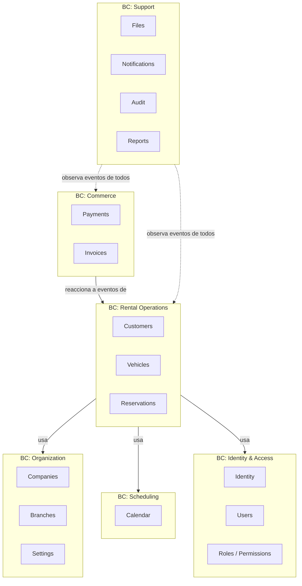
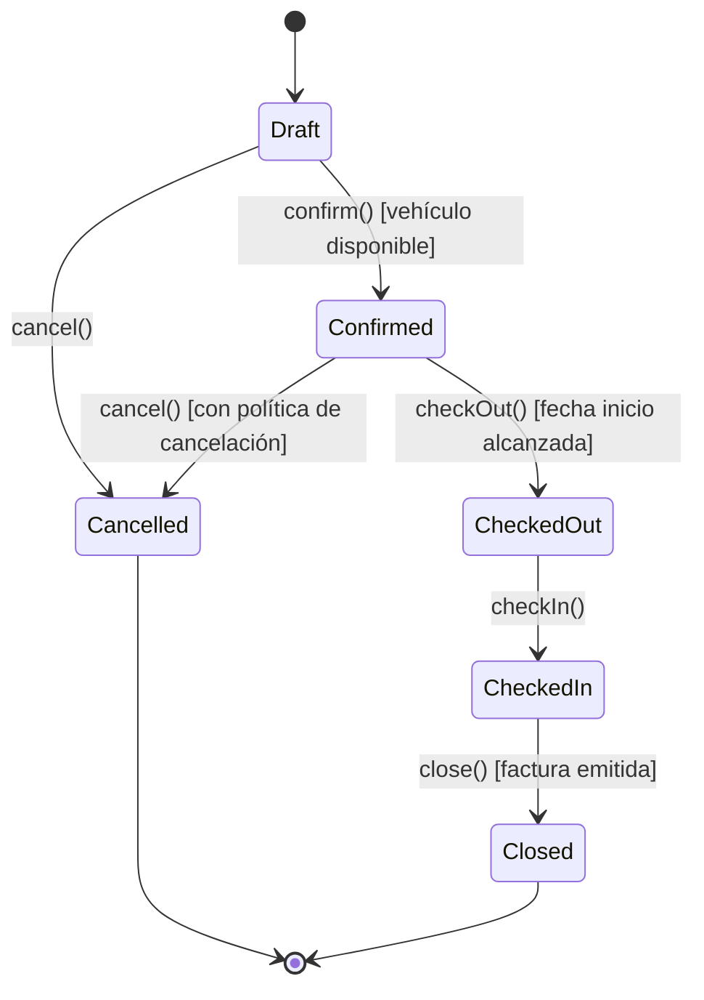
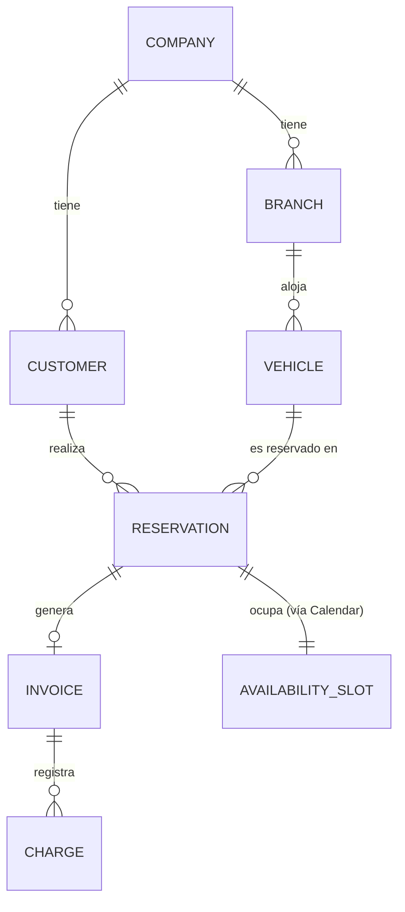

# 03 — Dominio

Este documento cubre el modelado táctico de DDD para los bounded contexts de Plataforma y del producto Rental. No es el modelo de datos (ver [04-MODELO-DATOS.md](04-MODELO-DATOS.md)): un Agregado no es una tabla, y un Value Object no es necesariamente una columna.

## 1. Bounded Contexts

Cada Bounded Context puede contener uno o más módulos técnicos (carpetas en `libs/`), pero comparte lenguaje ubicuo y consistencia interna. La correspondencia BC → módulo no es siempre 1:1 porque algunos BC de plataforma (Organization, Identity) se separan en módulos técnicos más pequeños por razones de cohesión de código, no porque el lenguaje ubicuo difiera.

## 2. Lenguaje ubicuo (glosario, extracto)

| Término | Significado en el dominio | Contexto |
|---|---|---|
| Company | Empresa cliente de la plataforma (tenant) | Organization |
| Branch | Sucursal física/operativa de una Company | Organization |
| Customer | Persona o empresa que alquila vehículos | Rental Operations |
| Vehicle | Unidad de flota disponible para alquiler | Rental Operations |
| Reservation | Compromiso de un Customer sobre un Vehicle en un rango de fechas | Rental Operations |
| Availability Slot | Bloque de tiempo en que un recurso (vehículo) está libre u ocupado | Scheduling |
| Rate | Tarifa aplicable a un Vehicle/categoría en un período | Rental Operations |
| Invoice | Comprobante fiscal/comercial emitido sobre una Reservation | Commerce |
| Charge | Cobro efectivo asociado a una Reservation/Invoice | Commerce |

## 3. Bounded Context: Rental Operations (foco de v1.0)

### 3.1 Agregado: Reservation

**Raíz de agregado.** Es el corazón transaccional del producto.

- **Identidad**: `ReservationId`.
- **Invariantes que protege**:
  - No puede confirmarse sin que el `Vehicle` esté disponible en todo el rango `[startDate, endDate)`.
  - No puede solaparse con otra `Reservation` activa sobre el mismo `Vehicle`.
  - Las transiciones de estado siguen la máquina de estados de §3.1.2; no se permiten saltos arbitrarios.
  - `endDate` > `startDate` siempre (validado por el VO `DateRange`).
- **Entidades internas**: `ReservationLine` (si se permite reservar más de un vehículo por reserva; en v1.0 se mantiene 1:1 Reservation↔Vehicle para simplicidad — ver [ADR](ADR/) si se decide extender).
- **Value Objects que usa**: `DateRange`, `Money` (tarifa acordada), `ReservationStatus`.
- **No contiene**: datos completos del `Customer` ni del `Vehicle` — solo referencias por ID (`CustomerId`, `VehicleId`). Evita que Reservation se convierta en un agregado "dios".

#### 3.1.1 Por qué Reservation es la raíz y no Vehicle

Un `Vehicle` puede existir sin reservas. Una `Reservation` no tiene sentido sin un compromiso puntual entre cliente, vehículo y tiempo. El invariante de "no solapamiento" pertenece naturalmente al agregado que representa el compromiso (Reservation), no al recurso (Vehicle) — el recurso solo expone su disponibilidad a través de `Calendar` (BC de Scheduling), que actúa como colaborador, no como dueño de la regla de negocio de alquiler.

#### 3.1.2 Máquina de estados

### 3.2 Agregado: Vehicle

- **Identidad**: `VehicleId`.
- **Invariantes**: un `Vehicle` en estado `Maintenance` o `OutOfService` no puede ofrecerse en `Calendar` como disponible; el cambio de estado es responsabilidad exclusiva de este agregado (nadie fuera de `Vehicle` decide su disponibilidad estructural — la disponibilidad *transaccional* por reservas la calcula `Calendar`).
- **Value Objects**: `LicensePlate`, `VIN`, `VehicleCategory`, `Odometer`.
- **Relación con Branch**: un `Vehicle` pertenece a una `Branch` (scoping a nivel sucursal, no company completa — dos sucursales de la misma empresa no comparten flota física).

### 3.3 Agregado: Customer

- **Identidad**: `CustomerId`.
- **Invariantes**: un `Customer` con documento de identidad inválido o vencido (según reglas de negocio del país) no puede asociarse a una `Reservation` en estado `Confirmed`.
- **Value Objects**: `TaxId`/`DocumentId`, `ContactInfo`.
- **Scoping**: a nivel `Company` (un cliente puede alquilar en cualquier sucursal de la misma empresa).

### 3.4 Servicios de dominio

- **`AvailabilityService`** (colabora con el puerto `CalendarPort` del BC Scheduling): determina si un `Vehicle` está libre en un `DateRange` dado. Vive en `application` de `reservations` porque orquesta dos agregados de contextos distintos (Vehicle y Calendar) — no es responsabilidad de ningún agregado individual.
- **`PricingService`**: calcula el `Money` total de una reserva a partir de `Rate` vigente, duración y reglas de negocio (descuentos, recargos). Se modela como servicio de dominio porque la regla de precio no "pertenece" únicamente a Reservation ni a Vehicle.

### 3.5 Value Objects transversales (viven en `shared-kernel` de Plataforma)

- `Money` (monto + moneda, aritmética segura, sin floats).
- `DateRange` (inicio/fin validados, operaciones de solapamiento).
- `EntityId<T>` (identidad tipada, evita mezclar `CustomerId` con `VehicleId` por error del compilador).
- `Email`, `PhoneNumber`.

## 4. Eventos de dominio (contrato entre módulos)

Todo evento de dominio lleva `companyId`, `occurredAt`, `eventId` y versión de payload (`v1`), para soportar evolución sin romper consumidores.

| Evento | Emitido por | Consumido por (hoy) |
|---|---|---|
| `ReservationConfirmed.v1` | Reservations | Notifications, Reports |
| `ReservationCancelled.v1` | Reservations | Notifications, Reports |
| `ReservationCheckedOut.v1` | Reservations | Notifications, Vehicles (actualiza estado interno vía puerto) |
| `ReservationCheckedIn.v1` | Reservations | Invoices (dispara emisión), Notifications |
| `InvoiceIssued.v1` | Invoices | Notifications, Payments |
| `PaymentSucceeded.v1` | Payments | Invoices, Notifications, Reports |
| `PaymentFailed.v1` | Payments | Notifications |
| `VehicleStatusChanged.v1` | Vehicles | Reports |
| `UserCreated.v1` | Identity/Users | Audit, Notifications |

## 5. Bounded Context: Scheduling (Calendar) — capacidad de Plataforma

Modelado deliberadamente genérico para ser reutilizable por productos futuros:

- **Agregado `AvailabilitySlot`**: representa un recurso (`resourceType` + `resourceId`, p. ej. `("vehicle", VehicleId)`) bloqueado o disponible en un `DateRange`.
- **No conoce** qué es un "Vehicle" ni una "Reservation". Solo conoce "recurso" y "rango de tiempo". Esta es la razón por la que Taller (turnos de bahía), Hotel (habitaciones) o Clínica (citas médicas) podrán usarlo sin cambios.
- El BC Rental Operations traduce sus conceptos (`Vehicle`, `Reservation`) a los conceptos genéricos de `Calendar` (`resource`, `slot`) en su capa de aplicación — esto es, en sí mismo, una anticorruption layer ligera entre ambos contextos.

## 6. Relaciones entre agregados (resumen)

Nota: este diagrama muestra relaciones de negocio, no claves foráneas físicas — la relación Reservation↔AvailabilitySlot cruza bounded contexts y se resuelve por ID + evento, no por FK de base de datos (ver [04-MODELO-DATOS.md §3](04-MODELO-DATOS.md)).

## 7. Qué queda deliberadamente fuera del dominio de v1.0

- Reservas de múltiples vehículos en una sola transacción comercial (paquetes).
- Tarifas dinámicas basadas en demanda (yield management).
- Mantenimiento predictivo de flota.

Estas son extensiones naturales del BC Rental Operations, no cambios de Plataforma, y se documentarán como nuevos ADRs/extensiones de dominio cuando se prioricen.
