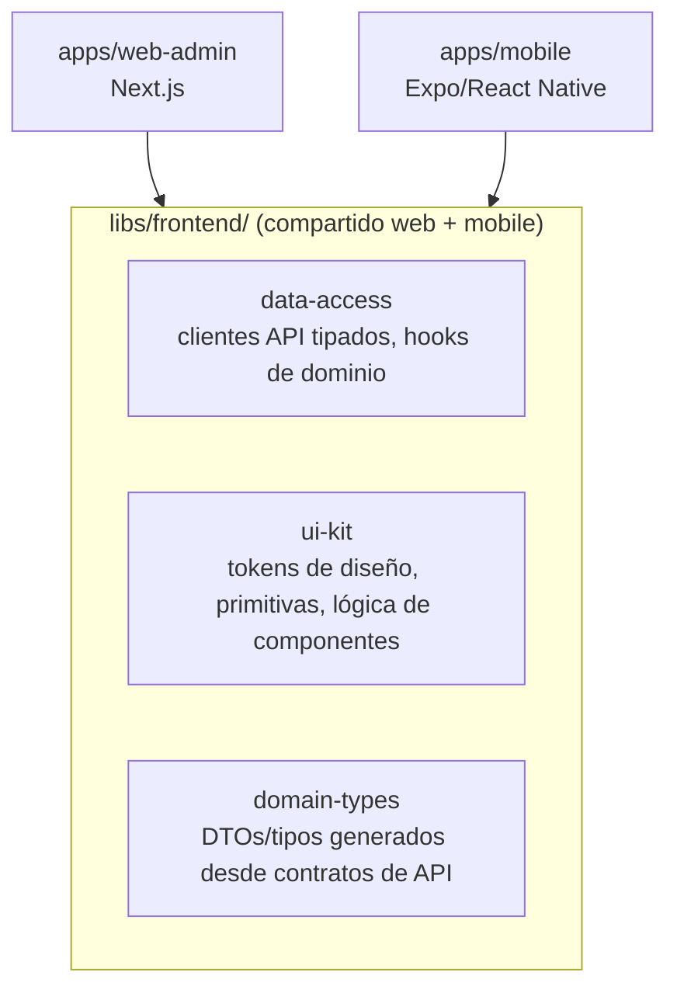

# 06 — Convenciones de Frontend (React, Next.js, React Native, Expo)

## 1. Principio general

El frontend consume la Plataforma exclusivamente vía la API HTTP pública ([08-API-CONTRACTS.md](08-API-CONTRACTS.md)). Nunca conoce Prisma, PostgreSQL, ni la estructura interna de módulos backend. Web (Next.js) y Mobile (Expo) comparten todo lo que **no** depende del sustrato de renderizado (DOM vs. nativo), y divergen explícitamente donde sí depende.

## 2. Arquitectura de capas en frontend

Se aplica la misma disciplina de dependencia unidireccional que en backend, adaptada a UI:

1. **`domain-types`**: tipos/DTOs derivados de los contratos de API (idealmente generados, no escritos a mano dos veces — ver [ADR](ADR/) sobre generación de cliente OpenAPI).
2. **`data-access`**: hooks de datos (React Query) por bounded context (`useReservations`, `useVehicleAvailability`). Encapsulan fetch, cache, invalidación. Ninguna pantalla llama `fetch`/`axios` directamente.
3. **`ui-kit`**: componentes de diseño puros, sin conocimiento de un dominio de negocio específico (ver [07-DESIGN-SYSTEM.md](07-DESIGN-SYSTEM.md)).
4. **Features** (por app): componen `data-access` + `ui-kit` en pantallas/flujos concretos de un módulo de negocio (`features/reservations/`). Las features son las únicas que conocen la forma final de una pantalla.

Regla de dependencia: `features` → `data-access` + `ui-kit` → `domain-types`. Nunca al revés. `ui-kit` no importa `data-access` (un botón no sabe de reservas).

## 3. Next.js (Administración)

- **App Router** (no Pages Router): alineado con el soporte a largo plazo de Next.js y con Server Components donde reducen payload al cliente sin necesidad real de interactividad.
- **Server Components por defecto**, `"use client"` solo donde hay estado/interactividad/hooks de navegador. No se marca un árbol completo como client por comodidad.
- **Organización por feature, no por tipo de archivo**: `app/(admin)/reservations/`, no `components/`, `hooks/`, `pages/` como agrupación de primer nivel a través de todo el proyecto.
- **Mutaciones**: vía Server Actions para formularios simples ligados a una sola pantalla administrativa; vía `data-access` (React Query mutations) cuando el estado debe reflejarse en múltiples partes de la UI o requiere optimistic updates.
- **Autenticación**: sesión validada en middleware de Next.js contra el backend (verificación de JWT/refresh), redirecciones de rutas protegidas centralizadas, nunca repetidas por página.

## 4. React Native / Expo (Móvil)

- **Expo Router** para navegación basada en archivos, consistente con el patrón de organización por feature de Next.js (reduce la carga cognitiva de moverse entre proyectos).
- **Sin dependencias nativas fuera del managed workflow de Expo** salvo necesidad explícita y documentada (mantiene builds reproducibles y actualizaciones OTA viables).
- Las pantallas móviles reutilizan `data-access` sin cambios; solo `ui-kit` provee las implementaciones nativas de las primitivas visuales.

## 5. Estado

| Tipo de estado | Herramienta | Dónde |
|---|---|---|
| Estado de servidor (datos de la API) | React Query | `data-access` |
| Estado de sesión/autenticación | Context ligero + almacenamiento seguro (cookies httpOnly en web, SecureStore en Expo) | `data-access/auth` |
| Estado de UI local (form abierto, tab activo) | `useState`/`useReducer` local al componente | Feature/componente |
| Estado compartido entre features de una misma app, no persistente | Context puntual, evaluado caso por caso | App específica |

**Explícitamente evitado**: una librería global de estado (Redux/Zustand/Recoil) como contenedor único de "todo el estado de la app". El estado de servidor ya lo gestiona React Query; introducir un segundo store duplica la fuente de verdad. Se reevalúa solo si aparece un caso real de estado de cliente complejo y compartido que React Query no cubre.

## 6. Hooks de dominio

- Un hook de dominio (`useReservation(id)`, `useConfirmReservation()`) vive en `data-access/<bounded-context>/` y es la única forma en que una feature toca datos de ese contexto.
- Naming: `use<Recurso>` para lectura, `use<Verbo><Recurso>` para mutación (`useCreateReservation`).
- Los hooks exponen estados de carga/error de forma consistente (`{ data, isLoading, error }`), nunca formas ad-hoc por feature.

## 7. Componentes

- Todo componente de `ui-kit` es **presentacional puro**: recibe props, no hace fetch, no conoce rutas ni el bounded context que lo consume.
- Componentes de feature pueden componer varios de `ui-kit` + un hook de `data-access`, pero no viceversa.
- Tamaño: si un componente de feature supera ~200 líneas o mezcla más de una responsabilidad clara, se descompone. No hay un límite mecánico estricto; el criterio es cohesión, no líneas.

## 8. Navegación

- **Web**: rutas reflejan jerarquía de negocio, no estructura de carpetas técnica (`/reservations/[id]/check-in`, no `/screens/reservation-detail`).
- **Mobile**: misma jerarquía semántica que web donde el flujo de negocio coincide, divergiendo solo donde el patrón de interacción móvil lo exige (p. ej. flujos con tabs inferiores vs. sidebar en web).
- Los parámetros de ruta tipados (IDs, filtros) se validan con el mismo esquema (`zod`) usado para tipar la respuesta de `data-access`, evitando duplicar validación.

## 9. Formularios

- `react-hook-form` + `zod` como estándar en web y mobile, por consistencia y porque ambos soportan RN sin fricción.
- El esquema de validación de un formulario espeja (idealmente reutiliza) el contrato de request de la API — evita que frontend y backend definan reglas de validación divergentes para el mismo caso de uso.

## 10. Internacionalización y formato

- Toda fecha/hora se muestra en la zona horaria de la Branch/Company activa, nunca en la del navegador del usuario sin contexto explícito — coherente con la decisión de `timestamptz` en [04-MODELO-DATOS.md](04-MODELO-DATOS.md).
- Montos siempre formateados desde el VO `Money` recibido de la API (unidad mínima + moneda), nunca operados como float en el cliente.

## 11. Buenas prácticas transversales

- No se hace `any` para "salir del paso" con tipos de API — si el tipo generado no encaja, se corrige el contrato ([08-API-CONTRACTS.md](08-API-CONTRACTS.md)), no se apaga el chequeo.
- No se duplica lógica de negocio (cálculo de precio, reglas de disponibilidad) en frontend más allá de UX optimista/feedback inmediato — la fuente de verdad siempre es el backend; el frontend nunca decide si una operación es válida, solo la anticipa visualmente y confirma con la respuesta real.
- Un componente o hook nuevo que se necesita en dos apps (web y mobile) se sube a `libs/frontend/` de inmediato — no se duplica "por ahora".

## 12. Errores comunes a evitar

| Error común | Corrección |
|---|---|
| Fetch directo dentro de un componente de página | Usar el hook de `data-access` correspondiente |
| Recalcular en frontend si una reserva es válida (fechas, disponibilidad) | Confiar en la respuesta del backend; el frontend solo da feedback optimista |
| Componente de `ui-kit` que importa un hook de `data-access` | Invertir: la feature inyecta los datos al componente vía props |
| Estado de sesión duplicado en Context y en React Query a la vez | Una sola fuente de verdad para sesión, en `data-access/auth` |
| Nueva pantalla mobile que reimplementa una llamada API ya existente en web | Reutilizar el hook de `data-access`, no reescribir la llamada |
