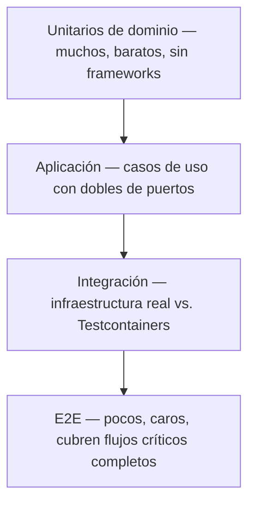

# 10 — Testing

## 1. Principio: la arquitectura define la estrategia de testing

Clean Architecture ([02-ARQUITECTURA.md §2](02-ARQUITECTURA.md)) no es solo una preferencia estética: existe, en gran parte, para que cada capa se pueda testear con el tipo de test más barato posible para esa capa. Si testear una regla de negocio requiere levantar NestJS y Postgres, la arquitectura no se está respetando.

La pirámide se lee de abajo hacia arriba en volumen: la mayoría de los tests son unitarios de dominio; los E2E son deliberadamente pocos.

## 2. Tests unitarios de dominio

- **Objetivo**: probar entidades, agregados, value objects y servicios de dominio en aislamiento total.
- **Sin NestJS, sin Prisma, sin HTTP, sin mocks de infraestructura** — porque el dominio no depende de ellos (§2.1 de [02-ARQUITECTURA.md](02-ARQUITECTURA.md)), sus tests tampoco deberían.
- Ejemplo de lo que se prueba aquí: "una `Reservation` no puede confirmarse si el rango de fechas se solapa con otra reserva activa del mismo vehículo" — se prueba instanciando el agregado directamente, sin base de datos.
- Cobertura objetivo: **alta** (referencia orientativa 90%+), porque es la capa más barata de testear y la que concentra las reglas de negocio que más cuesta corregir en producción si fallan.

## 3. Tests de aplicación (casos de uso)

- **Objetivo**: probar que un Command/Query Handler orquesta correctamente el dominio y los puertos.
- Los puertos (`VehicleRepository`, `PaymentGatewayPort`) se sustituyen por **fakes en memoria**, no por mocks frágiles que solo verifican que "se llamó a X con Y" — un fake in-memory se comporta como la implementación real (guarda, busca, respeta invariantes básicas), lo que hace los tests resilientes a refactors internos del handler.
- Se evita mockear librerías de terceros directamente en este nivel; se mockea el puerto propio.

## 4. Tests de integración

- **Objetivo**: probar que los adaptadores de `infrastructure/` funcionan correctamente contra la tecnología real que envuelven.
- **Testcontainers** (Postgres, Redis) en CI — nunca Postgres mockeado ni SQLite como sustituto "aproximado" para probar queries reales, constraints, RLS o exclusion constraints de rangos de fecha ([04-MODELO-DATOS.md §8](04-MODELO-DATOS.md)).
- Cubren específicamente: repositorios Prisma (incluyendo el filtro automático de `companyId` y las políticas RLS), adaptadores de integración externa contra sandboxes/mocks de proveedor (Stripe test mode, WhatsApp sandbox), serialización de eventos.

## 5. Tests End-to-End (E2E)

- **Objetivo**: validar flujos de negocio completos a través de la API HTTP real, contra una instancia levantada de la aplicación con infraestructura real (Testcontainers o entorno de staging).
- Deliberadamente **pocos**: cubren los flujos críticos de negocio (crear reserva → confirmar → check-out → check-in → factura; login → refresh → acceso protegido), no cada combinación de endpoints.
- Frontend: E2E de UI (Playwright para web) limitado a los golden paths por producto (crear una reserva desde la UI de administración), no a cada estado de cada componente — eso ya lo cubren tests de componente/unitarios de frontend donde aplique.

## 6. Qué NO se hace

- No se persigue 100% de cobertura como meta en sí misma — cobertura alta en dominio, cobertura pragmática en el resto, priorizando valor sobre número.
- No se testea la implementación interna de una librería de terceros (Prisma, NestJS) — se testea el uso que la Plataforma hace de ellas.
- No se usan snapshots de UI como sustituto de tests de comportamiento — un snapshot no falla cuando la lógica se rompe, solo cuando el markup cambia.

## 7. Testing y multi-tenancy

Todo test de integración de un repositorio incluye, como caso obligatorio, un escenario de **fuga cross-tenant**: crear datos en la Company A, autenticar como usuario de la Company B, verificar que no son visibles ni accesibles (`404`, no `403`, según §4 de [08-API-CONTRACTS.md](08-API-CONTRACTS.md)). Este no es un test opcional "si hay tiempo" — es un requisito de aceptación de cualquier módulo nuevo que persista datos con `companyId`.

## 8. CI

- Todo Pull Request corre: lint, type-check, tests unitarios y de aplicación (rápidos, siempre), tests de integración (Testcontainers, en cada PR), tests E2E de los golden paths (en cada PR o en un job diferido, según tiempo de build, a definir en Fase 0 según medición real de duración de pipeline).
- Un PR no es mergeable si reduce la cobertura de `domain/` de un módulo tocado por debajo del umbral vigente, ni si introduce un test que mockea Prisma para lógica de query no trivial (señal de test de integración disfrazado de unitario).

## 9. Testing de eventos de dominio

- Se prueba, a nivel de aplicación, que un Command Handler exitoso **publica** el evento correcto con el payload esperado (usando un fake de `DomainEventPublisher`).
- Se prueba, a nivel de integración, que cada `Listener` reacciona correctamente a un evento dado — de forma aislada, sin encadenar el flujo completo productor→consumidor salvo en el E2E puntual que lo justifique.
