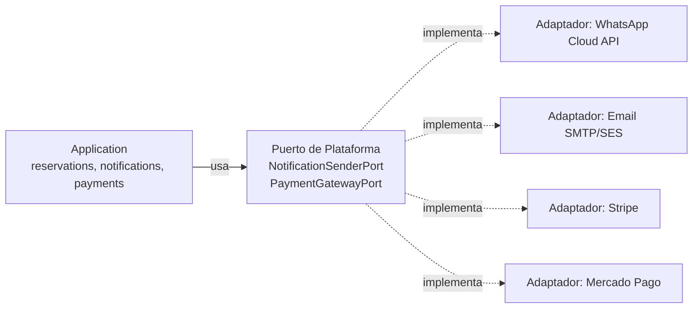

# 11 — Integraciones

## 1. Principio: Provider Pattern (Puertos y Adaptadores)

Toda integración externa se modela como un **puerto** definido por la Plataforma (interfaz, en términos del dominio/aplicación que la necesita) y uno o más **adaptadores** concretos en `infrastructure/providers/` que implementan ese puerto contra un proveedor real. Ningún módulo de dominio conoce el nombre de un SDK, una URL de API externa, o el formato de payload de un proveedor específico.

**Consecuencia directa**: cambiar de Stripe a otro procesador de pagos, o agregar un segundo canal de WhatsApp, es agregar/cambiar un adaptador — cero cambios en `domain/` o `application/` de `payments` o `notifications`.

## 2. Módulo `integration-providers` (Plataforma)

Vive en `platform/integration-providers` y concentra:

- Configuración y credenciales de cada proveedor (leídas de gestor de secretos, nunca hardcodeadas).
- Clientes HTTP/SDKs de terceros, con manejo de reintentos, timeouts y circuit breaking propio de cada integración.
- Traducción entre el modelo de la Plataforma (DTOs de puerto) y el formato específico del proveedor externo.

Los módulos consumidores (`notifications`, `payments`) declaran el puerto que necesitan; el binding a un adaptador concreto de `integration-providers` ocurre en la composición del módulo (§3 de [05-CONVENCIONES-BACKEND.md](05-CONVENCIONES-BACKEND.md)), configurable por entorno/Company si en el futuro una Company necesita un proveedor distinto al default.

## 3. WhatsApp Business Cloud API

- **Puerto**: `NotificationSenderPort` (canal `whatsapp`), consumido por `notifications`.
- **Adaptador**: llama directamente a la Cloud API de Meta (sin proveedores intermediarios adicionales en v1.0), gestiona plantillas de mensaje aprobadas (requisito de la API de WhatsApp para mensajes fuera de ventana de 24h) como configuración versionada, no como texto libre en el dominio.
- **Webhooks entrantes** (confirmaciones de entrega, respuestas del cliente) se reciben en `infrastructure/http` de `integration-providers`, se traducen a eventos internos (`WhatsAppMessageDelivered.v1`) y se publican al bus de eventos — el resto de la plataforma reacciona a un evento propio, nunca al payload crudo de Meta.

## 4. Email y SMS

- Mismo puerto `NotificationSenderPort`, canales `email` y `sms`.
- Adaptador de email desacoplado del proveedor concreto (SES, SendGrid u otro) — la elección de proveedor es un detalle de infraestructura reemplazable, documentado en el ADR de implementación correspondiente cuando se seleccione.
- SMS reservado para notificaciones críticas de baja frecuencia (confirmaciones, códigos MFA) dado su costo por mensaje frente a WhatsApp/Email.

## 5. Push Notifications

- Puerto `PushNotificationSenderPort`, consumido igualmente desde `notifications`.
- Adaptador basado en el servicio de push de Expo (`expo-server-sdk` o equivalente) para la app móvil — coherente con la decisión de Expo en [06-CONVENCIONES-FRONTEND.md](06-CONVENCIONES-FRONTEND.md).

## 6. Pagos: Stripe y Mercado Pago

- **Puerto**: `PaymentGatewayPort` (`authorize`, `capture`, `refund`, `getStatus`), consumido por `payments`.
- Dos adaptadores desde v1.0 (Stripe, Mercado Pago) porque son mercados/monedas objetivo distintos desde el inicio, no una especulación — la Company configura, vía `settings`, qué gateway usa (o ambos, según método de pago del cliente final).
- **Webhooks de proveedor** (confirmación asíncrona de pago) se reciben, verifican firma criptográfica del proveedor, y se traducen a eventos internos (`PaymentSucceeded.v1`, `PaymentFailed.v1`) — el dominio de `payments` nunca procesa el payload crudo del webhook directamente, solo el evento ya traducido y validado.
- Idempotencia obligatoria (§7 de [08-API-CONTRACTS.md](08-API-CONTRACTS.md)) en el flujo de captura de pago, dado el riesgo de doble cobro ante reintentos de red o de webhook duplicado.

## 7. Google Maps

- Puerto `GeolocationPort`/`AddressLookupPort`, usado inicialmente para geocodificación de direcciones de Branches/Customers y cálculo de distancia (relevante para logística de entrega/recogida de vehículos).
- Adaptador aislado en `integration-providers`; el dominio trabaja con un Value Object `Address`/`GeoCoordinates` propio, no con tipos de la librería de Google.

## 8. OCR

- Puerto `DocumentExtractionPort`, consumido por `customers` (extracción de datos de documento de identidad/licencia de conducir al registrar un cliente) y potencialmente por `vehicles` (documentación vehicular).
- El resultado de OCR se trata siempre como **sugerencia editable**, nunca como dato de negocio confirmado automáticamente — el caso de uso de aplicación exige confirmación explícita antes de persistir datos extraídos por OCR como verdad de negocio.

## 9. IA

- No se define un puerto único genérico de "IA" — cada capacidad de IA (p. ej. asistencia en redacción de reportes, clasificación de siniestros/daños en fotos de vehículos) se modela como un puerto específico de su caso de uso (`DamageClassificationPort`, `TextAssistPort`), consumido por el módulo de dominio que lo necesita.
- Ningún módulo de dominio llama directamente a un SDK de proveedor de IA — mismo patrón que el resto de integraciones. Esto es intencionalmente más estricto que "un wrapper genérico de LLM", porque las capacidades de IA cambian de proveedor y de forma de uso con mucha más frecuencia que un gateway de pagos, y un puerto genérico terminaría filtrando detalles de proveedor de todas formas.

## 10. Firma Digital

- Puerto `DocumentSigningPort`, relevante para contratos de alquiler y, a futuro, otros documentos legales de otros productos.
- El estado de firma (`pending`, `signed`, `declined`) se modela como parte del ciclo de vida del documento en `files`/módulo consumidor, actualizado vía evento cuando el proveedor de firma confirma.

## 11. Almacenamiento en la nube (Files)

- Puerto `StorageProviderPort` (`upload`, `getSignedUrl`, `delete`), implementado en desarrollo por **MinIO** (S3-compatible, local, sin costo ni dependencia de red) y en producción por un proveedor S3-compatible real.
- Ningún módulo de dominio genera URLs de storage directamente ni conoce el proveedor — siempre a través del puerto, que retorna URLs firmadas de vida corta.
- Esta es la integración más transversal de todas: Vehicles (fotos), Customers (documentos), Invoices (PDFs) dependen de ella desde Fase 0 (ver [01-ROADMAP.md](01-ROADMAP.md)).

## 12. Reglas comunes a toda integración nueva

1. Se define el puerto antes que el adaptador — el consumidor se implementa y testea contra el puerto (con un fake) antes de que exista integración real.
2. Toda integración soporta **timeout y reintento con backoff** configurados explícitamente; ninguna llamada externa es de espera indefinida.
3. Toda integración con webhook entrante **verifica firma/autenticidad** antes de traducir a evento interno.
4. Toda credencial de proveedor vive en el gestor de secretos del entorno, nunca en código ni en `settings` de base de datos en texto plano.
5. Fallos de un proveedor externo nunca deben poder corromper una transacción de dominio ya confirmada — el patrón es "confirmar el estado de negocio primero, notificar/sincronizar externamente después, vía evento", no al revés.
