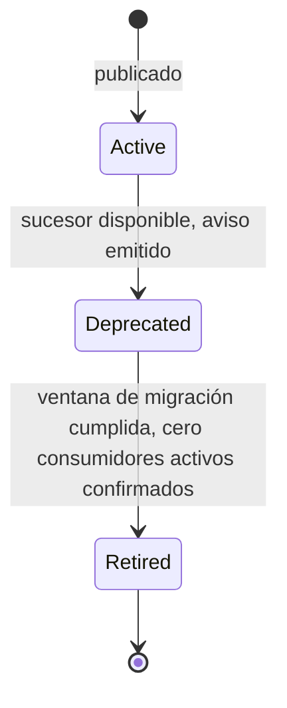

# 08 — Versioning

Consolida, como estrategia **única y transversal**, el versionado de REST ([08-API-CONTRACTS.md §1, §10](../08-API-CONTRACTS.md)), de eventos ([model/06-DOMAIN_EVENTS.md §11](../model/06-DOMAIN_EVENTS.md), [technical/05-EVENTING.md §6](../technical/05-EVENTING.md)), de integraciones ([05-INTEGRATION-CONTRACTS.md](05-INTEGRATION-CONTRACTS.md)) y de webhooks ([06-WEBHOOKS.md §6](06-WEBHOOKS.md)). Ninguna regla de este documento contradice las ya fijadas en esas fuentes — este documento existe porque un desarrollador que versiona un contrato hoy tiene que cruzar cuatro documentos distintos para saber si está siguiendo la misma disciplina en los cuatro casos; aquí se confirma que sí, con un único vocabulario y una única tabla de referencia.

## 1. Principio único de compatibilidad

Un único criterio gobierna los cuatro tipos de contrato de esta Plataforma — REST, eventos, integraciones (puertos), webhooks:

> **Un cambio es compatible si un consumidor existente, que ignora todo lo que no reconoce, sigue funcionando sin modificación.**

De ese único principio se derivan mecánicamente las mismas dos reglas en los cuatro casos:

| Tipo de cambio | ¿Compatible? |
|---|---|
| Agregar un campo opcional a una respuesta/payload/evento | Sí |
| Agregar un endpoint/evento/operación de puerto nuevo | Sí |
| Agregar un valor nuevo a una enumeración **que el consumidor ya trata de forma abierta** (con un `default`/`unknown` explícito) | Sí, si el consumidor está diseñado para eso; no, si el catálogo se documentó como cerrado sin ese contrato — ver §5 |
| Eliminar o renombrar un campo | No |
| Cambiar el tipo de un campo, o su unidad/semántica sin cambiar su nombre | No |
| Cambiar el código de estado HTTP de un caso ya documentado | No |
| Cambiar el orden/cardinalidad esperada de un arreglo de forma que rompa una asunción razonable | No |

## 2. Unidad de versionado — nunca la API completa

Ya fijado para REST en [08-API-CONTRACTS.md §1](../08-API-CONTRACTS.md): se versiona **por recurso**, no toda la API de golpe. Este documento extiende el mismo principio a los otros tres tipos de contrato:

| Tipo de contrato | Unidad que se versiona | Ejemplo |
|---|---|---|
| REST | Un recurso (`/api/v1/reservations` → `/api/v2/reservations`) | Un cambio incompatible en `charges` no afecta la versión de `reservations` |
| Eventos | Un `eventType` (`ReservationConfirmed.v1` → `.v2`) | Un cambio en `PaymentSucceeded.v1` no afecta a `ReservationConfirmed.v1` |
| Integraciones (puertos) | Un puerto (`PaymentGatewayPort` v1 → v2) — solo si el propio **contrato interno** de la Plataforma cambia, nunca por un cambio del lado del proveedor externo (eso se absorbe en el adaptador sin tocar el puerto, ADR-0010) | Ver §4 |
| Webhooks | Hereda la versión del recurso (entrantes, `/webhooks/v1/<proveedor>`) o del evento (salientes, §6 de [06-WEBHOOKS.md](06-WEBHOOKS.md)) — no tiene una unidad de versión propia distinta | — |

**Por qué nunca se versiona "toda la Plataforma" con un único número**: forzar un número de versión global obligaría a coordinar el release de todo cambio incompatible de cualquier módulo con el de todos los demás, contradiciendo directamente la premisa de Monolito Modular de [02-ARQUITECTURA.md §1](../02-ARQUITECTURA.md) — cada Bounded Context evoluciona su propio contrato a su propio ritmo.

## 3. Versionado de REST — desarrollo

Hereda [08-API-CONTRACTS.md §1, §10](../08-API-CONTRACTS.md) sin modificación. Regla operativa de convivencia de versiones:

- Mientras `/api/v1/reservations` tiene consumidores activos, coexiste con `/api/v2/reservations` — nunca se retira `v1` unilateralmente por conveniencia de mantenimiento.
- Un Command/Query Handler de aplicación es, internamente, el mismo para ambas versiones cuando la lógica de negocio no cambió — solo el DTO de entrada/salida (`infrastructure/http`) difiere entre `v1` y `v2`; el cambio de versión de API **no** implica automáticamente un cambio de versión de evento de dominio ni de modelo — son contratos independientes que solo coinciden en versión por coincidencia, nunca por regla.
- Un endpoint deprecado (`v1` con sucesor `v2` ya disponible) responde con la cabecera `Deprecation: true` y `Sunset: <fecha>` (RFC 8594) desde el momento en que se anuncia el retiro — da al consumidor una señal programática, no solo documentación, de que debe migrar.

## 4. Versionado de integraciones (puertos)

Caso distinto de los otros tres porque el puerto es un contrato **interno** (entre un módulo de dominio y `integration-providers`, [ADR-0010](../ADR/0010-provider-pattern-integraciones.md)), nunca expuesto directamente a un consumidor externo de la Plataforma:

- Un cambio en el proveedor externo (Stripe cambia su API) se absorbe siempre en el adaptador, sin tocar el puerto — es, por diseño, el caso que [ADR-0010](../ADR/0010-provider-pattern-integraciones.md) existe para aislar. **Nunca** requiere una nueva versión de puerto.
- Un puerto solo sube de versión cuando la propia Plataforma decide cambiar el **contrato conceptual** que le exige al proveedor (p. ej. `PaymentGatewayPort` empieza a exigir un campo `riskScore` en su operación `authorize` porque un caso de negocio nuevo lo requiere) — en ese caso, es un cambio de diseño de dominio/aplicación, versionado como cualquier interfaz de código (semver de la librería `integration-providers` en el monorepo, [technical/01-MONOREPO.md](../technical/01-MONOREPO.md)), no como un contrato público — no tiene sufijo `.v1`/`.v2` visible fuera del código porque no tiene consumidores fuera del propio backend.

## 5. Enumeraciones cerradas — regla explícita de compatibilidad

Ningún documento previo fijaba si agregar un valor nuevo a una enumeración (`ReservationStatus`, `PaymentMethod`, un `code` de error) es compatible o no — es una ambigüedad real que aparece en la práctica antes que en el diseño. Decisión nueva de este documento — ver [10-DECISIONES.md](10-DECISIONES.md) #6:

- **Un valor nuevo agregado a una enumeración de estado de máquina de estados** ([model/08-STATE_MACHINES.md](../model/08-STATE_MACHINES.md)) **es un cambio incompatible** — un consumidor que hace un `switch`/`if-else` exhaustivo sobre `ReservationStatus` (patrón esperado, dado que las transiciones son una lista cerrada y finita por diseño de dominio) se rompe silenciosamente ante un valor no contemplado. Agregar un estado nuevo exige, como mínimo, una nueva versión del recurso REST que lo expone.
- **Un valor nuevo agregado al catálogo de `code` de error** ([07-ERROR-CATALOG.md](07-ERROR-CATALOG.md)) **es compatible** — un cliente bien construido nunca hace un `switch` exhaustivo sobre todos los `code` posibles; maneja explícitamente los que le interesan y trata el resto de forma genérica (mostrar `detail`, registrar el error). Este es, deliberadamente, el contrato que todo consumidor de la API debe asumir desde el diseño — documentado aquí para que ningún equipo de frontend construya un `switch` exhaustivo de `code` que luego se rompa.
- **Un valor nuevo agregado a `EnabledProductModules`/`PaymentMethodsEnabled`** (conjuntos configurables, no máquinas de estado) **es compatible** — un consumidor los trata como conjuntos abiertos por diseño de dominio ([model/04-VALUE_OBJECTS.md §3](../model/04-VALUE_OBJECTS.md)), nunca como una lista cerrada exhaustiva.

## 6. Versionado de eventos — desarrollo

Hereda [model/06-DOMAIN_EVENTS.md §11](../model/06-DOMAIN_EVENTS.md) y [technical/05-EVENTING.md §6](../technical/05-EVENTING.md) sin modificación. Regla operativa añadida por este documento:

- Durante la ventana de migración de `.v1` a `.v2`, el productor publica **ambos** eventos por cada hecho de negocio (dos filas de Outbox) — nunca uno solo con un campo condicional que cambia de forma según una versión implícita.
- La ventana de migración termina cuando el productor confirma, por inventario de consumidores registrados (§7 de [04-EVENT-CONTRACTS.md](04-EVENT-CONTRACTS.md)), que ya no queda ningún Listener interno suscrito a `.v1` — para un evento con suscriptores externos vía Webhook (§5 de [06-WEBHOOKS.md](06-WEBHOOKS.md)), la ventana no cierra hasta notificar formalmente a cada suscriptor externo con antelación razonable (mismo espíritu que `Sunset`, §3).

## 7. Deprecación — ciclo de vida común

Un mismo ciclo de vida de tres fases aplica a **todo** contrato de este documento (recurso REST, evento, puerto con consumidores externos, suscripción de webhook):

| Fase | Señal | Duración |
|---|---|---|
| `Active` | Contrato vigente, sin aviso | Indefinida |
| `Deprecated` | Cabecera `Deprecation`/`Sunset` (REST), evento marcado en el catálogo (eventos), aviso a suscriptores (webhooks) — el contrato **sigue funcionando exactamente igual**, el aviso es informativo | Mínimo razonable para que todo consumidor conocido migre — no se fija un número de días único para los cuatro tipos de contrato en este documento; se calibra según el tipo de consumidor (interno, con control total de despliegue, vs. externo, sin ese control) |
| `Retired` | El contrato deja de responder/publicarse | — |

**Nunca se salta de `Active` a `Retired` directamente** — todo contrato con al menos un consumidor conocido pasa por `Deprecated` con aviso explícito, sin excepción, incluso si el equipo que lo retira considera el aviso "obvio" por el contexto del cambio.

## 8. Matriz resumen

| Tipo de contrato | Mecanismo de versión | Unidad de versión | Documento de detalle |
|---|---|---|---|
| REST | Path (`/api/v1/...`) | Recurso | [01-REST-STANDARDS.md §3](01-REST-STANDARDS.md) |
| Evento de dominio | Sufijo en `eventType` (`.v1`) | Tipo de evento | [04-EVENT-CONTRACTS.md §6](04-EVENT-CONTRACTS.md) |
| Puerto de integración | Semver de librería interna, sin sufijo público | Puerto | §4 de este documento |
| Webhook entrante | Path (`/webhooks/v1/<proveedor>`) | Proveedor | [06-WEBHOOKS.md §6](06-WEBHOOKS.md) |
| Webhook saliente | Hereda la versión del evento entregado | Evento | [06-WEBHOOKS.md §6](06-WEBHOOKS.md) |

## 9. Qué NO se decide en este documento

- Los plazos exactos (en días) de cada ventana de deprecación por tipo de contrato → se calibran caso a caso según el impacto real de consumidores conocidos en el momento del cambio, no se preasigna un número universal aquí (una deprecación con un único consumidor interno puede resolverse en días; una con integradores externos, en meses).
- El catálogo de qué recursos/eventos están hoy en `Deprecated` — es estado operativo cambiante, se rastrea en el propio [model/06-DOMAIN_EVENTS.md](../model/06-DOMAIN_EVENTS.md) (eventos) y en la documentación OpenAPI generada (recursos REST), no en este documento de reglas.
