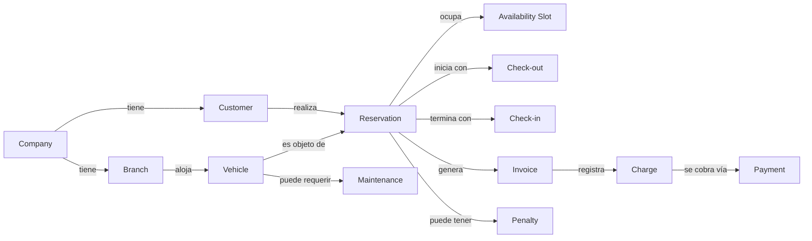

# 02 — Lenguaje Ubicuo (Glosario Oficial del Negocio)

Este es el diccionario **obligatorio** del negocio de alquiler de vehículos. Todo nombre de clase, endpoint, evento, campo o módulo que se construya en fases posteriores debe usar estos términos, exactamente con este significado. Introducir un sinónimo no listado aquí (aunque parezca inocuo) es una violación de lenguaje ubicuo y debe corregirse antes de mezclarse con el código.

Los términos que ya existen en [03-DOMINIO.md §2](../03-DOMINIO.md) se heredan tal cual — este documento los repite para que sea autocontenible, y **agrega** los términos de negocio que la Fase 0 (arquitectura) no necesitaba pero el negocio sí.

## 1. Cómo leer este glosario

Cada término tiene:

- **Definición**: qué significa en el negocio, sin tecnicismo.
- **Contexto (BC)**: a qué Bounded Context de [03-DOMINIO.md](../03-DOMINIO.md) pertenece.
- **Sinónimos prohibidos**: palabras que el equipo NO debe usar como si fueran este término, porque en el negocio real significan otra cosa o generan ambigüedad.

## 2. Actores y organización

| Término                                     | Definición                                                                                    | Contexto          | Sinónimos prohibidos                                                                                                                                                                            |
| ------------------------------------------- | --------------------------------------------------------------------------------------------- | ----------------- | ----------------------------------------------------------------------------------------------------------------------------------------------------------------------------------------------- |
| **Company**                                 | La empresa de alquiler de vehículos, tenant de la Plataforma. Puede tener una o más Branches. | Organization      | "Empresa" es válido como traducción coloquial, pero el nombre de dominio es siempre `Company`. Nunca "Cuenta", "Tenant" en documentos de negocio (ese término es de Plataforma/infraestructura) |
| **Branch**                                  | Sucursal física u operativa donde se entregan y devuelven vehículos.                          | Organization      | "Sede", "Local", "Filial" — elegir uno solo (`Branch`/"Sucursal") y no mezclar                                                                                                                  |
| **Customer**                                | Persona natural o jurídica que alquila vehículos. Titular de la Reservation.                  | Rental Operations | "Arrendatario", "Locatario", "Usuario" (este último se reserva para el actor técnico de Identity)                                                                                               |
| **Additional Driver** (Conductor Adicional) | Persona autorizada a conducir el vehículo sin ser necesariamente el Customer titular.         | Rental Operations | "Segundo conductor", "Copiloto"                                                                                                                                                                 |
| **Operator** (Operador)                     | Personal de sucursal que ejecuta entrega/devolución de vehículos.                             | Rental Operations | "Empleado", "Staff" — demasiado genéricos, no expresan la responsabilidad de negocio                                                                                                            |

## 3. Flota

| Término                           | Definición                                                                                                                                                                | Contexto          | Sinónimos prohibidos                                                                                                                                                                      |
| --------------------------------- | ------------------------------------------------------------------------------------------------------------------------------------------------------------------------- | ----------------- | ----------------------------------------------------------------------------------------------------------------------------------------------------------------------------------------- |
| **Vehicle**                       | Unidad de flota disponible para alquiler, propiedad o gestión de una Branch.                                                                                              | Rental Operations | "Auto", "Carro", "Unidad" en código — válidos en conversación, prohibidos como nombre de entidad                                                                                          |
| **Vehicle Category**              | Clasificación comercial del vehículo (económico, SUV, premium, etc.) que determina tarifa base.                                                                           | Rental Operations | "Tipo de vehículo", "Clase"                                                                                                                                                               |
| **Fleet** (Flota)                 | El conjunto de todos los Vehicles de una Company o Branch. Es un concepto colectivo, no una entidad con identidad propia.                                                 | Rental Operations | —                                                                                                                                                                                         |
| **Odometer** (Kilometraje)        | Lectura de distancia recorrida por el vehículo, registrada en cada Check-out y Check-in.                                                                                  | Rental Operations | "Millaje" salvo en operaciones con unidades imperiales explícitas                                                                                                                         |
| **License Plate** (Placa/Patente) | Identificador legal/registral del vehículo. Su formato varía por país.                                                                                                    | Rental Operations | —                                                                                                                                                                                         |
| **VIN**                           | Número de identificación vehicular, identificador único global del vehículo físico.                                                                                       | Rental Operations | —                                                                                                                                                                                         |
| **Vehicle Status**                | Estado operativo del vehículo: `Available`, `Reserved`, `CheckedOut` (en uso), `Maintenance`, `OutOfService`. Ver máquina de estados en [03-PROCESOS.md](03-PROCESOS.md). | Rental Operations | "Disponibilidad" (ese término se reserva para el resultado calculado por Calendar, no para el estado estructural del vehículo — ver distinción en [03-DOMINIO.md §3.2](../03-DOMINIO.md)) |

## 4. Reserva y ciclo de alquiler

| Término                               | Definición                                                                                                                                                                            | Contexto                       | Sinónimos prohibidos                                                                                                                                                                                     |
| ------------------------------------- | ------------------------------------------------------------------------------------------------------------------------------------------------------------------------------------- | ------------------------------ | -------------------------------------------------------------------------------------------------------------------------------------------------------------------------------------------------------- |
| **Reservation** (Reserva)             | Compromiso de un Customer sobre un Vehicle en un rango de fechas determinado. Raíz de agregado del negocio.                                                                           | Rental Operations              | "Booking", "Renta" (en Latinoamérica "renta" se usa coloquialmente para todo el negocio; como término de dominio se reserva `Rental` solo para el nombre del producto, no para la entidad transaccional) |
| **Quote** (Cotización)                | Cálculo de precio y disponibilidad presentado al Customer _antes_ de que exista una Reservation formal. No compromete al vehículo.                                                    | Rental Operations              | "Presupuesto" — válido en español coloquial, pero no confundir con `Rate`                                                                                                                                |
| **Date Range** (Rango de fechas)      | Par `(startDate, endDate)` que delimita el período de una Reservation. `endDate` siempre posterior a `startDate`.                                                                     | Rental Operations / Scheduling | "Período", "Duración" — usar solo cuando se hable del rango en abstracto, no como nombre de campo                                                                                                        |
| **Check-out** (Entrega)               | Acto de entregar físicamente el vehículo al Customer al inicio del período reservado. Incluye inspección de estado y registro de Odometer.                                            | Rental Operations              | "Retiro", "Pickup"                                                                                                                                                                                       |
| **Check-in** (Devolución)             | Acto de recibir físicamente el vehículo del Customer al final del período. Incluye inspección de estado y cierre de la Reservation.                                                   | Rental Operations              | "Retorno", "Return", "Dropoff"                                                                                                                                                                           |
| **No-show**                           | Situación en la que el Customer no se presenta a realizar el Check-out en la fecha/hora pactada.                                                                                      | Rental Operations              | "Ausencia", "Falta"                                                                                                                                                                                      |
| **Extension** (Extensión)             | Solicitud de prolongar el `endDate` de una Reservation ya en curso (`CheckedOut`). Distinto de crear una nueva Reservation.                                                           | Rental Operations              | "Renovación", "Prórroga"                                                                                                                                                                                 |
| **Vehicle Swap** (Cambio de vehículo) | Sustitución del Vehicle asignado a una Reservation ya `Confirmed` o `CheckedOut`, manteniendo el mismo Customer y compromiso comercial.                                               | Rental Operations              | "Reemplazo", "Cambio de unidad"                                                                                                                                                                          |
| **Reservation Status**                | Estado del ciclo de vida de la Reservation: `Draft`, `Confirmed`, `CheckedOut`, `CheckedIn`, `Closed`, `Cancelled`. Definido formalmente en [03-DOMINIO.md §3.1.2](../03-DOMINIO.md). | Rental Operations              | —                                                                                                                                                                                                        |
| **Overlap** (Solapamiento)            | Situación en la que dos Reservations activas comparten parte de su Date Range sobre el mismo Vehicle. Está prohibido por invariante de negocio.                                       | Rental Operations              | "Doble reserva" es aceptable como sinónimo coloquial de la _excepción_ resultante (ver [07-EXCEPCIONES.md](07-EXCEPCIONES.md)), no del concepto técnico                                                  |

## 5. Disponibilidad y calendario

| Término                           | Definición                                                                                                                                                                            | Contexto   | Sinónimos prohibidos                                                                       |
| --------------------------------- | ------------------------------------------------------------------------------------------------------------------------------------------------------------------------------------- | ---------- | ------------------------------------------------------------------------------------------ |
| **Availability** (Disponibilidad) | Condición calculada (no almacenada) de si un Vehicle puede aceptar una nueva Reservation en un Date Range dado. Resultado de combinar Vehicle Status + Availability Slots existentes. | Scheduling | "Estado" (ver Vehicle Status, son conceptos relacionados pero distintos)                   |
| **Availability Slot**             | Bloque de tiempo en que un recurso (p. ej. un Vehicle) está reservado/bloqueado. Ver [03-DOMINIO.md §5](../03-DOMINIO.md).                                                            | Scheduling | "Turno", "Bloqueo"                                                                         |
| **Blackout** (Bloqueo manual)     | Período en que un Vehicle se marca deliberadamente como no disponible sin que exista una Reservation (p. ej. mantenimiento programado, uso interno de la empresa).                    | Scheduling | "Reserva interna" — un Blackout no es una Reservation, no tiene Customer ni genera Invoice |

## 6. Comercial y financiero

| Término                                     | Definición                                                                                                                                       | Contexto          | Sinónimos prohibidos                                                                                                                                     |
| ------------------------------------------- | ------------------------------------------------------------------------------------------------------------------------------------------------ | ----------------- | -------------------------------------------------------------------------------------------------------------------------------------------------------- |
| **Rate** (Tarifa)                           | Precio aplicable a una Vehicle Category en un período, expresado como unidad de tiempo (día, semana). Vigente según fecha, no fija en el tiempo. | Rental Operations | "Precio" en abstracto — usar `Rate` cuando se hable del valor configurado, `Money`/monto cuando se hable del resultado calculado                         |
| **Security Deposit** (Depósito de garantía) | Monto retenido (no cobrado) al Customer como garantía frente a daños, multas o incumplimientos, liberado total o parcialmente al Check-in.       | Commerce          | "Fianza", "Garantía" — aceptables en conversación, el término de dominio es `Security Deposit`                                                           |
| **Charge** (Cargo)                          | Cobro efectivo asociado a una Reservation o Invoice: puede ser el alquiler mismo, combustible faltante, daño, extensión o penalización.          | Commerce          | "Cobro" es sinónimo válido en español; el término de dominio en inglés es `Charge`                                                                       |
| **Penalty** (Penalización)                  | Charge adicional aplicado por incumplimiento de una regla de negocio (devolución tardía, combustible faltante, daño no declarado).               | Commerce          | "Multa" — reservar "multa" para sanciones de tránsito impuestas por autoridad, que son un concepto distinto (ver [07-EXCEPCIONES.md](07-EXCEPCIONES.md)) |
| **Invoice** (Factura)                       | Comprobante fiscal/comercial emitido sobre una Reservation cerrada.                                                                              | Commerce          | "Recibo", "Comprobante" — reservar "comprobante" para el concepto genérico, `Invoice` es específicamente el documento fiscal                             |
| **Payment** (Pago)                          | Transacción de cobro procesada por una pasarela externa contra un Charge o Invoice.                                                              | Commerce          | "Transacción" en abstracto                                                                                                                               |

## 7. Mantenimiento

| Término                                               | Definición                                                                                                                                   | Contexto          | Sinónimos prohibidos                                                                              |
| ----------------------------------------------------- | -------------------------------------------------------------------------------------------------------------------------------------------- | ----------------- | ------------------------------------------------------------------------------------------------- |
| **Maintenance** (Mantenimiento)                       | Intervención mecánica sobre un Vehicle, preventiva o correctiva, que requiere sacarlo de disponibilidad.                                     | Rental Operations | "Service", "Revisión"                                                                             |
| **Preventive Maintenance** (Mantenimiento preventivo) | Maintenance programado según kilometraje o tiempo transcurrido, no motivado por una falla.                                                   | Rental Operations | "Mantenimiento de rutina"                                                                         |
| **Corrective Maintenance** (Mantenimiento correctivo) | Maintenance motivado por una falla, avería o daño detectado.                                                                                 | Rental Operations | "Reparación" es sinónimo aceptable                                                                |
| **Damage Report** (Reporte de daño)                   | Registro formal de un daño detectado en Check-in, Check-out, o durante el uso, que puede o no derivar en Penalty y/o Corrective Maintenance. | Rental Operations | "Incidencia" — reservar para el concepto general que incluye daños y otras anomalías no mecánicas |

## 8. Comunicación

| Término                                | Definición                                                                                                                                                                                                                                                                           | Contexto | Sinónimos prohibidos                                                                                                               |
| -------------------------------------- | ------------------------------------------------------------------------------------------------------------------------------------------------------------------------------------------------------------------------------------------------------------------------------------ | -------- | ---------------------------------------------------------------------------------------------------------------------------------- |
| **Notification** (Notificación)        | Mensaje enviado a un Customer o personal interno como consecuencia de un evento de negocio, por cualquier canal.                                                                                                                                                                     | Support  | "Alerta" — reservar para notificaciones internas de operación (p. ej. mantenimiento vencido), no para comunicación con el Customer |
| **Channel** (Canal)                    | Medio de envío de una Notification: WhatsApp, Email, SMS, Push.                                                                                                                                                                                                                      | Support  | —                                                                                                                                  |
| **Reminder** (Recordatorio)            | Notification proactiva enviada antes de un evento esperado (p. ej. antes del Check-out programado), sin que haya ocurrido un evento de negocio disparador.                                                                                                                           | Support  | —                                                                                                                                  |
| **SecurityCode** (Código de seguridad) | Notification que transporta un código de un solo uso para verificar la identidad del Customer (p. ej. OTP de login vía WhatsApp, docs/persistence/10-DECISIONES.md #109). Distinto de Reminder/Confirmation/Receipt y explícitamente no "Alerta" (reservada para operación interna). | Support  | —                                                                                                                                  |

## 9. Relaciones clave entre términos

## 10. Reglas de uso del glosario

1. Ningún documento de negocio, y ningún nombre técnico posterior (clase, tabla, endpoint), puede usar un sinónimo prohibido listado arriba.
2. Si el negocio necesita un término nuevo que no está aquí, se agrega a este glosario **antes** de usarse en cualquier otro documento — nunca al revés.
3. Cuando el mismo término signifique cosas distintas en dos países/mercados donde opera la Company, se documenta la variante en [05-REGLAS-NEGOCIO.md](05-REGLAS-NEGOCIO.md), pero el nombre de dominio permanece único (p. ej. `Security Deposit` es el término universal aunque localmente se le llame "fianza" o "garantía" en la interfaz de usuario — la traducción de UI no es una variante de dominio).
