# 03 — Procesos de Negocio

Este documento describe **cómo ocurren** los procesos operativos del negocio de alquiler de vehículos, de punta a punta, desde la perspectiva de quien los ejecuta — no desde la perspectiva del sistema que los soporta. Usa el lenguaje definido en [02-LENGUAJE-UBICUO.md](02-LENGUAJE-UBICUO.md) y los actores de [01-ACTORES.md](01-ACTORES.md).

Los diagramas usan Mermaid en formato de flujo simplificado (equivalente BPMN informal: rombos = decisión, rectángulos = actividad, óvalos = inicio/fin).

## 1. Alta de vehículo

**Objetivo:** incorporar una unidad a la Flota de una Branch para que pueda ofrecerse en alquiler.

**Actor principal:** Administrador de Empresa (decide incorporar la unidad), ejecutado operativamente por quien la empresa designe a nivel de sucursal.

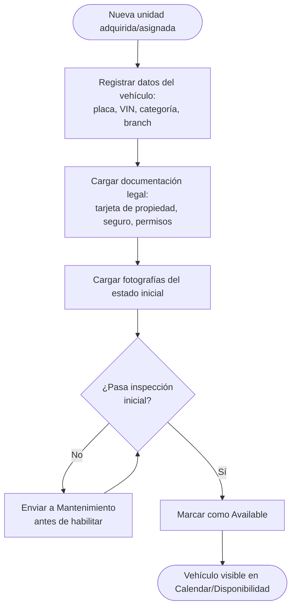

**Notas de negocio:**
- Un vehículo nunca queda `Available` sin documentación legal vigente cargada — es una decisión de negocio, no solo un requisito de datos (ver [05-REGLAS-NEGOCIO.md](05-REGLAS-NEGOCIO.md)).
- Las fotografías del estado inicial son la línea base contra la que se compara cualquier Damage Report futuro.

## 2. Alta de cliente

**Objetivo:** registrar a un Customer con la información y documentación mínima necesaria para poder realizar una Reservation.

**Actor principal:** Cliente (autogestión) o Agente de Reservas (asistido), con apoyo de Proveedor de OCR.

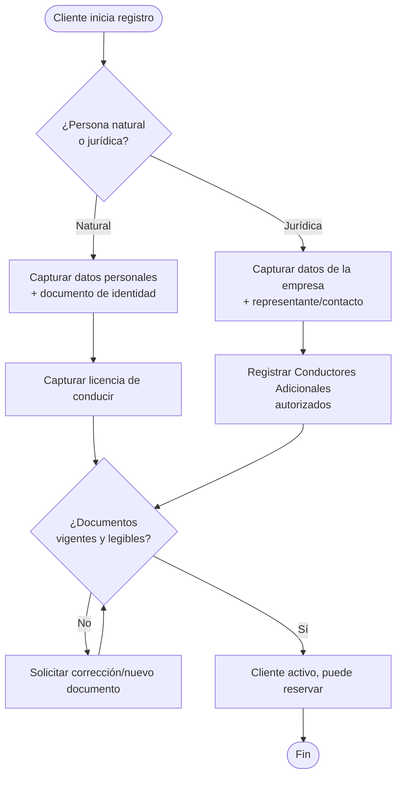

**Notas de negocio:**
- El resultado de OCR (si se usa) es siempre una sugerencia editable; el Cliente o el Agente de Reservas confirma los datos antes de activarse (ver [11-INTEGRACIONES.md §8](../11-INTEGRACIONES.md)).
- Un Customer con documento de identidad o licencia vencida puede registrarse, pero no puede pasar a una Reservation `Confirmed` (invariante ya definido en [03-DOMINIO.md §3.3](../03-DOMINIO.md)).

## 3. Cotización y reserva

**Objetivo:** convertir una consulta de disponibilidad en una Reservation confirmada.

**Actor principal:** Cliente, Agente de Reservas, Motor de Disponibilidad.

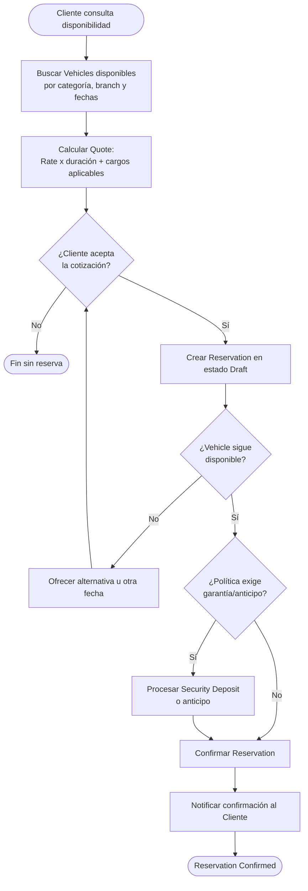

**Notas de negocio:**
- La re-verificación de disponibilidad entre "aceptar cotización" y "confirmar" existe porque puede transcurrir tiempo suficiente para que otro Cliente tome el mismo Vehicle — es la manifestación de negocio del invariante de no-solapamiento.
- El requisito de garantía/anticipo es una política configurable por Company (ver [05-REGLAS-NEGOCIO.md](05-REGLAS-NEGOCIO.md)), no universal.

## 4. Entrega (Check-out)

**Objetivo:** transferir la posesión física del vehículo al Customer al inicio del período reservado.

**Actor principal:** Operador de Sucursal, Cliente, Conductor Adicional (si aplica).

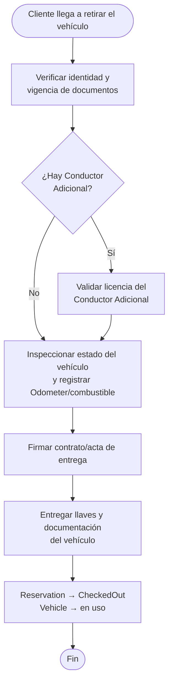

**Notas de negocio:**
- La inspección de estado en Check-out es la línea base contra la que se compara el Check-in — sin ella, no existe forma legítima de imputar un daño al Cliente.
- Un Vehicle en `Maintenance` u `OutOfService` no puede completar este proceso, sin excepción (invariante crítico, ver [05-REGLAS-NEGOCIO.md](05-REGLAS-NEGOCIO.md)).

## 5. Devolución (Check-in)

**Objetivo:** recibir el vehículo de vuelta y cerrar el ciclo transaccional de la Reservation.

**Actor principal:** Operador de Sucursal, Cliente.

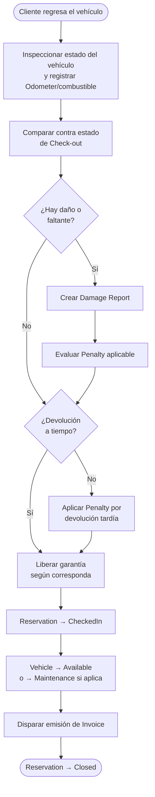

**Notas de negocio:**
- El Vehicle vuelve a `Available` solo si la inspección no detecta necesidad de Maintenance — la devolución puede, en sí misma, disparar el proceso de mantenimiento.
- El cierre de la Reservation (`Closed`) ocurre cuando la Invoice ya fue emitida, no antes — ver máquina de estados en [03-DOMINIO.md §3.1.2](../03-DOMINIO.md).

## 6. Cancelación

**Objetivo:** terminar una Reservation antes de que se complete, a solicitud del Cliente o por decisión operativa.

**Actor principal:** Cliente, Agente de Reservas, Operador de Sucursal.

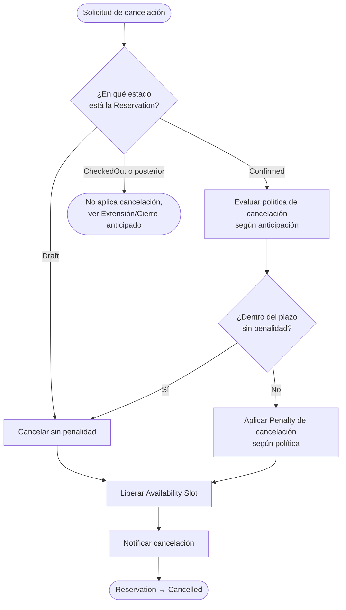

**Notas de negocio:**
- La política de cancelación (plazos, porcentaje de penalidad) es configurable por Company — ver [05-REGLAS-NEGOCIO.md](05-REGLAS-NEGOCIO.md).
- Una Reservation en `CheckedOut` no se cancela: el vehículo ya está en poder del Cliente. Ese escenario se gestiona como excepción (ver [07-EXCEPCIONES.md](07-EXCEPCIONES.md)).

## 7. Reprogramación y extensión

**Objetivo:** modificar el Date Range de una Reservation sin crear una nueva.

```mermaid
flowchart TD
    Start([Cliente solicita cambio de fechas]) --> TipoCambio{¿La reserva ya<br/>tuvo Check-out?}
    TipoCambio -->|No, es reprogramación| VerificarNuevaFecha[Verificar disponibilidad<br/>en el nuevo Date Range]
    TipoCambio -->|Sí, es extensión| VerificarContinuidad[Verificar que el vehículo<br/>siga disponible después de endDate actual]
    VerificarNuevaFecha --> Disponible1{¿Disponible?}
    VerificarContinuidad --> Disponible2{¿Disponible?}
    Disponible1 -->|No| Ofrecer[Ofrecer alternativa]
    Disponible2 -->|No| OfrecerSwap[Ofrecer Vehicle Swap<br/>o negar extensión]
    Disponible1 -->|Sí| Recalcular[Recalcular Rate/monto]
    Disponible2 -->|Sí| Recalcular
    Recalcular --> Confirmar[Actualizar Date Range<br/>y Availability Slot]
    Confirmar --> End([Fin])
```

**Notas de negocio:**
- Una extensión que colisiona con otra Reservation ya confirmada sobre el mismo Vehicle no puede aprobarse simplemente "porque el cliente ya lo tiene" — obliga a ofrecer Vehicle Swap o rechazar. Este es un caso explícito de tensión entre satisfacción del cliente y el invariante de no-solapamiento, y el negocio resuelve a favor del invariante.

## 8. Pago

**Objetivo:** cobrar al Customer los Charges asociados a una Reservation (alquiler, garantía, cargos adicionales).

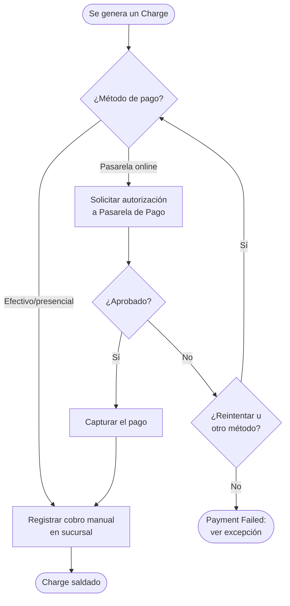

**Notas de negocio:**
- El estado de negocio de la Reservation nunca depende de que el pago se procese síncronamente: primero se confirma el compromiso, luego se concilia el cobro — coherente con el principio de integraciones de [11-INTEGRACIONES.md §12](../11-INTEGRACIONES.md) ("confirmar el estado de negocio primero, sincronizar externamente después").

## 9. Facturación

**Objetivo:** emitir el comprobante fiscal/comercial correspondiente a una Reservation cerrada.

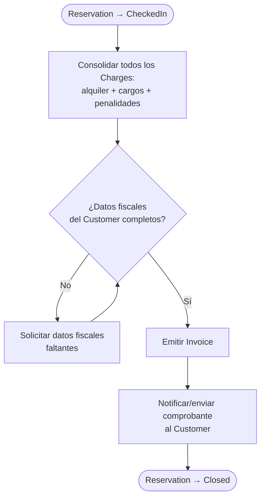

**Notas de negocio:**
- Los requisitos fiscales exactos de una Invoice (tipo de comprobante, numeración, impuestos aplicables) varían por país — este proceso describe el flujo de negocio, no el formato legal, que se documenta como regla configurable/dependiente de país en [05-REGLAS-NEGOCIO.md](05-REGLAS-NEGOCIO.md).

## 10. Mantenimiento

**Objetivo:** mantener la flota en condiciones operativas y seguras, preventiva o correctivamente.

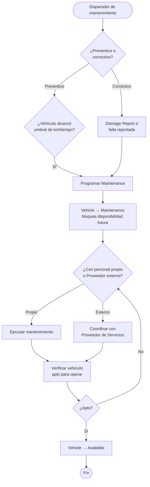

**Notas de negocio:**
- Un Vehicle bajo Maintenance bloquea su disponibilidad *futura* inmediatamente al programarse, no solo durante la intervención física — evita que se confirme una Reservation que luego colisione con el mantenimiento.
- El Responsable de Mantenimiento es el único actor de negocio habilitado para devolver un vehículo a `Available` tras una intervención (ver [01-ACTORES.md §2.4](01-ACTORES.md)).

## 11. Relación entre procesos

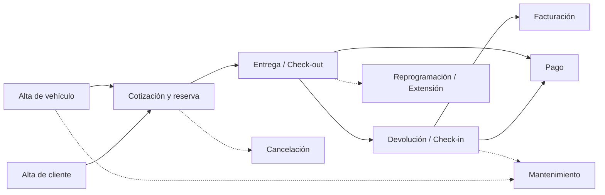

Los procesos con línea punteada son condicionales (no ocurren en todo ciclo de alquiler); los de línea sólida son parte del camino principal del negocio.
