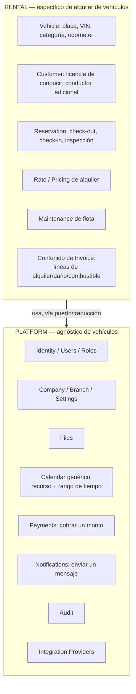

# 08 — Boundary: Rental vs. Platform

Este documento traza la frontera de negocio entre lo que pertenece al dominio **Rental** (el producto de alquiler de vehículos) y lo que pertenece a la **Plataforma** (capacidades transversales reutilizables por futuros productos). No redefine la arquitectura — esa frontera técnica ya está fijada en [00-VISION.md §1](../00-VISION.md) y [03-DOMINIO.md §1](../03-DOMINIO.md). Este documento explica **por qué**, desde la lógica del negocio (no de la implementación), cada capacidad cae de un lado o del otro, para que quien diseñe el segundo producto (Taller Mecánico, Hotel, etc.) entienda el criterio y no lo rompa por accidente.

## 1. El criterio de negocio detrás del límite

Una capacidad pertenece a **Platform** cuando su lógica de negocio no menciona ni depende de que exista un "vehículo", un "alquiler" o una "reserva" — solo depende de conceptos genéricos como "empresa", "usuario", "recurso", "rango de tiempo", "documento", "mensaje", "cobro".

Una capacidad pertenece a **Rental** cuando su lógica de negocio **solo tiene sentido** en el contexto de alquilar vehículos: no existiría, o sería irreconocible, en una clínica o un hotel.

Este criterio es de negocio, no técnico: no se trata de "qué tan reutilizable es el código", sino de "¿esta regla la entiende alguien que jamás alquiló un vehículo, si le hablo en términos de su propio negocio?". Si la respuesta es sí (adaptando los sustantivos), es Platform. Si la respuesta es no, es Rental.

## 2. Capacidades que pertenecen a Platform

| Capacidad | Por qué es de Plataforma (criterio de negocio) |
|---|---|
| Identity / autenticación | "Iniciar sesión" no es un concepto de alquiler de vehículos, es un concepto de cualquier negocio con usuarios |
| Company / Branch | "Una empresa tiene sucursales" es cierto para una clínica, un hotel o un taller, no es exclusivo del alquiler |
| Users / Roles / Permissions | "Un empleado tiene un rol con permisos" no depende de qué vende la empresa |
| Audit | "Quién hizo qué y cuándo" es una necesidad de cualquier negocio regulado, no una regla de alquiler |
| Settings | "Configuración por empresa/sucursal" es genérico |
| Files | "Guardar y recuperar un archivo" no sabe si el archivo es una foto de un vehículo o una radiografía |
| Notifications | "Enviar un mensaje a un cliente por WhatsApp" no depende de qué se le está confirmando |
| Calendar (Scheduling) | "Un recurso está ocupado en un rango de fechas" aplica igual a un vehículo, una habitación de hotel, una bahía de taller o un turno médico — ver la justificación de negocio original en [03-DOMINIO.md §5](../03-DOMINIO.md) |
| Payments | "Cobrar un monto por un medio de pago" no sabe si el cobro es por un alquiler o por una consulta médica |
| Integration Providers (WhatsApp, pasarelas, OCR, firma digital, geolocalización) | Son capacidades de conectividad con terceros, agnósticas del negocio que las usa |

## 3. Capacidades que pertenecen a Rental

| Capacidad | Por qué es del dominio Rental (criterio de negocio) |
|---|---|
| Vehicle (y su ciclo de vida: disponible, en mantenimiento, fuera de servicio) | Un "vehículo" y sus estados operativos (kilometraje, placa, categoría de vehículo) no existen en un hotel ni en una clínica |
| Reservation (y su máquina de estados: Draft → Confirmed → CheckedOut → CheckedIn → Closed) | El compromiso "un cliente sobre un vehículo en un rango de fechas", con inspección física de entrega/devolución, es específico del alquiler — una reserva de hotel no tiene "Odometer" ni "nivel de combustible" |
| Customer (en su forma específica de Rental: documento de identidad, licencia de conducir, Conductor Adicional) | Aunque "cliente" es un concepto genérico, los atributos que el negocio de alquiler necesita de un cliente (licencia de conducir vigente, conductores adicionales autorizados) son propios de este producto |
| Rate / Pricing de alquiler | El cálculo de precio por categoría de vehículo y duración de alquiler es una regla de este dominio, no una regla financiera genérica (Payments solo sabe "cobrar un monto", no "cómo se calculó") |
| Maintenance (mantenimiento de flota) | Programar y ejecutar mantenimiento de vehículos es una necesidad exclusiva de quien opera una flota |
| Invoice y Charge en su contenido específico (qué se factura: alquiler, combustible, daño, penalidad) | La *emisión* de un comprobante es capacidad de Commerce, pero *qué conceptos* se facturan (un día de alquiler, un tanque de combustible faltante) es conocimiento de Rental |
| Damage Report, Penalty por devolución tardía o daño | Reglas de negocio que solo existen porque hay un vehículo físico que se entrega y se devuelve |

## 4. Casos ambiguos y cómo se resolvieron

### 4.1 Invoice / Charge: ¿Platform o Rental?

Ambiguo porque "facturar" suena genérico. Se resuelve así: el **mecanismo** de facturación (numerar, emitir PDF, cumplir requisitos fiscales de un país) es de Commerce/Platform — cualquier producto futuro necesitará emitir comprobantes fiscales de la misma manera. Pero **qué conceptos entran en la factura** de un alquiler de vehículos (línea de alquiler, línea de combustible, línea de penalidad) es conocimiento exclusivo de Rental, que se lo entrega a Commerce ya traducido a "líneas de cobro genéricas". Esta es la misma anticorruption layer que ya describe [03-DOMINIO.md §5](../03-DOMINIO.md) para Calendar, aplicada aquí a Commerce.

### 4.2 Calendar / Availability: ¿por qué no es parte de Rental si "disponibilidad de vehículo" suena específico?

Porque el concepto de negocio subyacente — "¿está libre este recurso en este rango de tiempo?" — es idéntico para un vehículo, una habitación de hotel o una bahía de taller. Lo que sí es específico de Rental es *cómo se traduce* "vehículo reservado" a "recurso ocupado": esa traducción vive en Rental, el motor de cálculo vive en Platform. Ver justificación original en [03-DOMINIO.md §5](../03-DOMINIO.md).

### 4.3 Documentación de identidad del Customer: ¿Platform (Files/Identity) o Rental?

El **almacenamiento** del archivo (la foto del documento) es de Platform (Files). La **regla de negocio** de qué documentos son obligatorios, cuándo se consideran vencidos, y qué efecto tiene sobre una Reservation (RN-08 en [05-REGLAS-NEGOCIO.md](05-REGLAS-NEGOCIO.md)) es de Rental — un hotel no exige licencia de conducir a su huésped.

### 4.4 OCR: ¿Platform o Rental?

El **puerto de extracción de documentos** (`DocumentExtractionPort`, ver [11-INTEGRACIONES.md §8](../11-INTEGRACIONES.md)) es de Platform: extraer texto de una imagen no sabe de alquiler de vehículos. Pero la decisión de negocio de **qué campos importan** (número de licencia, categoría de licencia, fecha de vencimiento) y **qué se hace con ellos** (bloquear una Reservation si vencen) es de Rental.

## 5. Señal de alerta: contaminación del dominio

Estas son señales concretas de que una capacidad de Rental se está filtrando indebidamente hacia Platform, o viceversa — útiles para revisar diseño en la Fase 2 (Domain Modeling):

- Si una entidad de Platform (p. ej. `AvailabilitySlot` de Calendar) empieza a tener un campo como `licensePlate` o `odometer`, el dominio Rental se filtró hacia Platform — eso rompe la reutilización para Taller/Hotel.
- Si una regla de negocio de Rental (p. ej. "no se puede confirmar sin licencia vigente") se intenta resolver dentro de Payments o Notifications en lugar de en Reservations, se perdió la propiedad de la regla — el módulo equivocado terminaría "sabiendo" reglas de alquiler que no le corresponden.
- Si agregar el segundo producto (Taller Mecánico) obliga a modificar Calendar, Payments o Notifications para que "entiendan" un concepto de vehículos, la frontera falló — el criterio de éxito completo de la Plataforma, tal como lo define [00-VISION.md §6](../00-VISION.md) y [01-ROADMAP.md §10](../01-ROADMAP.md), es que el segundo producto se construya sin tocar el núcleo.

## 6. Resumen visual

Esta frontera es la misma que ya sostiene [03-DOMINIO.md §1](../03-DOMINIO.md) y [00-VISION.md §1](../00-VISION.md); este documento solo la explica desde la óptica de negocio para que el criterio sea reproducible al diseñar el próximo producto.
