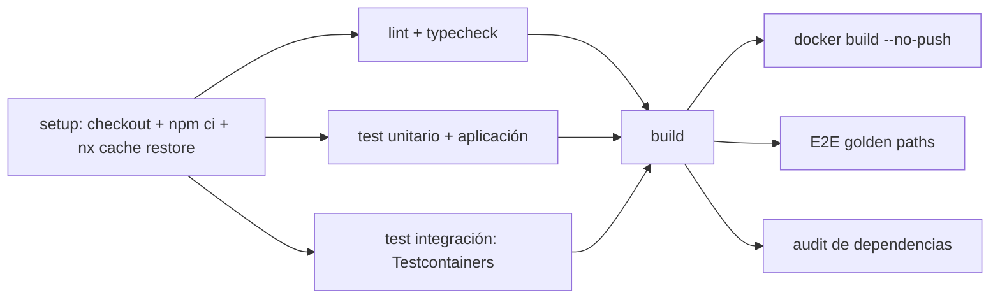

# 05 — CI/CD

Traduce [technical/08-DEVOPS.md §2-3](../technical/08-DEVOPS.md) a workflows concretos de GitHub Actions. No redefine el contenido de cada etapa del pipeline (ya fijado ahí) — fija los archivos de workflow, sus jobs, el cache remoto de Nx, los artefactos que se publican, y cierra la única decisión que ese documento dejó explícitamente abierta: la herramienta de versionado semántico.

## 1. Workflows

| Archivo | Disparador | Contenido |
|---|---|---|
| `.github/workflows/pr.yml` | `pull_request` contra `main` | Pipeline de PR completo (§1.1 de [technical/08-DEVOPS.md](../technical/08-DEVOPS.md)) |
| `.github/workflows/main.yml` | `push` a `main` (post-merge) | Pipeline de rama principal (§1.2), build/publicación de imágenes, migración de staging, despliegue |
| `.github/workflows/nightly-e2e.yml` | `schedule` (cron diario) | E2E completo si §1.1 diferido lo requiere (ver §2) |

Un único archivo compuesto de jobs reutilizables (`workflow_call`) para los pasos comunes a `pr.yml` y `main.yml` (lint, test, build) — `main.yml` no duplica esos jobs, los reinvoca y añade los propios de publicación/deploy.

## 2. `pr.yml` — jobs y orden

- Todo job usa `nx affected` con `--base=origin/main` — requiere `fetch-depth: 0` (o suficiente para incluir el merge-base) en el `actions/checkout`, precondición ya anotada en [technical/10-DECISIONES.md #7](../technical/10-DECISIONES.md).
- Cache remoto de Nx (Nx Cloud o backend equivalente autoalojado) configurado vía variable de entorno de acceso (secreto de repositorio, §5) — sin él, cada job de `nx affected` recalcularía desde cero.
- **E2E en cada PR por defecto**: se ejecuta siempre a menos que el tiempo total de pipeline (medido en las primeras semanas de Fase 0 con datos reales) exceda un umbral que el equipo considere disruptivo para el flujo de PR — en ese caso, se mueve a `nightly-e2e.yml` y `pr.yml` solo ejecuta un subconjunto mínimo (login + un flujo de negocio representativo). Esta es la decisión que [10-TESTING.md §8](../10-TESTING.md) y [technical/08-DEVOPS.md §2.1](../technical/08-DEVOPS.md) dejaron explícitamente para "Fase 0 con datos reales" — este documento fija el mecanismo (`nightly-e2e.yml` ya existe, listo para recibir el subconjunto diferido) sin fijar el umbral numérico.
- Auditoría de dependencias (`npm audit --audit-level=high` o equivalente) bloqueante solo ante severidad alta/crítica con parche disponible — no bloqueante ante una vulnerabilidad sin fix publicado (bloquear ahí no protege nada, solo detiene el equipo).

## 3. `main.yml` — jobs adicionales tras `pr.yml`

1. Build + tag de imágenes Docker de los proyectos `apps/*` afectados por el merge — tag = SHA del commit (inmutable).
2. Publicación al registro de contenedores configurado (GitHub Container Registry por defecto, salvo que el proveedor de hosting elegido en implementación exija uno propio).
3. Job de migración: aplica el historial de Prisma Migrate contra staging, como job **separado** del despliegue de la app (mismo orden ya fijado en [technical/08-DEVOPS.md §6](../technical/08-DEVOPS.md)) — este job usa el mismo wrapper `tooling/scripts/db/migrate.ts` de [02-DEVELOPER-EXPERIENCE.md §2](02-DEVELOPER-EXPERIENCE.md), no un comando distinto para CI.
4. Despliegue a staging (automático).
5. Despliegue a producción — gateado por `environment: production` de GitHub Actions con *required reviewers* (aprobación manual), configurable a automático más adelante sin cambiar la estructura del workflow (mismo criterio de flexibilidad ya fijado en [technical/08-DEVOPS.md §2.2](../technical/08-DEVOPS.md)).

## 4. Versionado — Changesets

Cierra la decisión abierta en [technical/08-DEVOPS.md §3](../technical/08-DEVOPS.md) ("herramienta tipo `changesets`/`release-please`, a elegir en implementación"):

**Decisión**: **Changesets**. Cada PR que modifica el comportamiento de una app desplegable (`api`, `web-admin`) incluye un archivo de changeset (`.changeset/*.md`, generado con `npx changeset` y revisado como cualquier otro archivo del PR) declarando el tipo de bump (`patch`/`minor`/`major`) y una descripción en lenguaje natural — más explícito que derivar el bump únicamente del `type:` de Conventional Commits (que agrupa commits heterogéneos de un PR bajo un único prefijo), y con mejor soporte nativo para versionado independiente por proyecto en un monorepo Nx que `release-please` en este momento de madurez de ambas herramientas.

- Un job en `main.yml` (`changesets/action`) abre/actualiza automáticamente un "Version PR" acumulando los changesets pendientes; al mergear ese PR, se generan los tags de versión semántica y el changelog por app.
- El tag de imagen Docker por SHA (§3.1) es independiente de este versionado semántico — ambos coexisten sin conflicto, tal como ya fijado en [technical/08-DEVOPS.md §3](../technical/08-DEVOPS.md).

## 5. Secretos de CI

| Secreto | Uso |
|---|---|
| `NX_CLOUD_ACCESS_TOKEN` (o equivalente del backend de cache elegido) | Cache remoto (§2) |
| Credenciales de sandbox de cada proveedor (`STRIPE_TEST_*`, `WHATSAPP_SANDBOX_*`, ...) | Tests de integración que ejercitan un adaptador real contra sandbox, nunca contra producción del proveedor |
| Credenciales del registro de contenedores | Publicación de imágenes (§3.2) |
| Credenciales de despliegue (staging/producción) | Jobs de deploy, scoped por `environment` de GitHub Actions — el secreto de producción no es legible desde un job disparado por PR |

Gestionados como *secrets* de GitHub Actions, scoped al repositorio o al `environment` correspondiente — nunca en un archivo versionado, coherente con [technical/07-SECURITY.md §3](../technical/07-SECURITY.md) y [technical/10-DECISIONES.md #10](../technical/10-DECISIONES.md).

## 6. Artefactos publicados por el pipeline

- Reporte de cobertura (por proyecto, §7 de [04-TESTING-FOUNDATION.md](04-TESTING-FOUNDATION.md)) — publicado como artefacto descargable y, opcionalmente, comentado en el PR vía acción de terceros solo si no introduce una dependencia de red no auditada.
- Trazas/capturas de Playwright en fallo (§5 de [04-TESTING-FOUNDATION.md](04-TESTING-FOUNDATION.md)).
- Reporte de `nx affected --graph` cuando un job falla por límite de boundaries — facilita depurar sin reproducir localmente.
- Retención: 14 días, suficiente para depurar un PR reciente sin acumular costo de almacenamiento indefinido.

## 7. Ownership y revisión

`CODEOWNERS` (raíz del repositorio) mapea cada `.prisma` de `prisma/schema/`, cada proyecto Nx por su tag `module:*`, y cada workflow de `.github/workflows/` a su equipo dueño — el detalle de la matriz completa se mantiene en el propio archivo `CODEOWNERS`, no duplicado en este documento (una sola fuente de verdad, evita divergencia). Un cambio a un workflow de CI exige revisión del equipo de plataforma/DevOps como *status check* obligatorio, mismo principio ya fijado en [technical/08-DEVOPS.md §2.3](../technical/08-DEVOPS.md).

## 8. Qué se decide en otro documento

- Contenido exacto de cada etapa del pipeline (qué valida lint/test/build) → [technical/08-DEVOPS.md §2](../technical/08-DEVOPS.md) (sin cambios).
- Build multi-stage de cada imagen Docker → [06-DOCKER.md](06-DOCKER.md).
- Rollback de código y de base de datos → [technical/08-DEVOPS.md §7](../technical/08-DEVOPS.md) (sin cambios).
- Flujo de Git, PRs y Definition of Done → [09-CONTRIBUTING.md](09-CONTRIBUTING.md).
