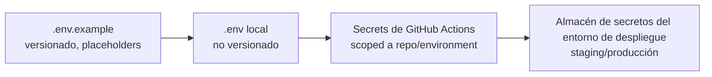

# 07 — Configuration

[technical/03-BACKEND-ARCHITECTURE.md §3](../technical/03-BACKEND-ARCHITECTURE.md) ya fija que `ConfigModule` es el único punto de lectura de configuración, con validación *fail-fast* por namespace; [technical/07-SECURITY.md §3](../technical/07-SECURITY.md) ya fija que ningún secreto vive en el repositorio ni se lee de `process.env` fuera de `ConfigModule`. Este documento cierra el detalle que ambos dejaron abierto: el catálogo real de variables por namespace, su jerarquía de fuentes, y por qué la Plataforma no tiene (ni necesita) un sistema genérico de feature flags.

## 1. Namespaces de configuración

Un namespace por responsabilidad transversal o por módulo con configuración propia, cada uno con su propio esquema de validación (`registerAs` de `@nestjs/config` o equivalente), consumido vía inyección tipada — nunca `process.env.X` disperso:

| Namespace | Variables (ejemplo representativo, no exhaustivo) | Secreto |
|---|---|---|
| `app` | `NODE_ENV`, `PORT`, `LOG_LEVEL`, `CORS_ORIGINS` | No |
| `database` | `DATABASE_URL` | Sí (credenciales embebidas en la URL) |
| `redis` | `REDIS_URL` | Sí |
| `jwt` | `JWT_PRIVATE_KEY`, `JWT_PUBLIC_KEY`, `JWT_ACTIVE_KID`, `JWT_ACCESS_TTL` | Sí (claves), No (`kid`/TTL) |
| `storage` | `STORAGE_ENDPOINT`, `STORAGE_BUCKET`, `STORAGE_ACCESS_KEY`, `STORAGE_SECRET_KEY`, `STORAGE_REGION` | Sí (credenciales) |
| `payments` | `STRIPE_SECRET_KEY`, `MERCADOPAGO_ACCESS_TOKEN` | Sí |
| `notifications` | `WHATSAPP_API_TOKEN`, `EMAIL_PROVIDER_API_KEY`, `EXPO_PUSH_ACCESS_TOKEN` | Sí |
| `observability` | `OTEL_EXPORTER_OTLP_ENDPOINT`, `OTEL_SERVICE_NAME` | No |
| `throttler` | `THROTTLE_REDIS_URL` (puede reutilizar `redis`) | Sí (comparte credencial) |

Cada namespace corresponde 1:1 a un módulo dinámico `forRootAsync` (§4 de [technical/03-BACKEND-ARCHITECTURE.md](../technical/03-BACKEND-ARCHITECTURE.md)). Un módulo de negocio nuevo que necesite configuración propia declara su propio namespace siguiendo esta misma tabla — no reutiliza el namespace de otro módulo aunque el nombre de variable "se parezca".

## 2. Clasificación: secreto vs. no secreto

- **Secreto**: cualquier valor que, si se filtra, permite acceso no autorizado a un sistema (credenciales, claves privadas, tokens de proveedor) — nunca en `.env.example` con un valor real, solo con un placeholder (`STRIPE_SECRET_KEY=sk_test_...` o vacío) y un comentario de dónde obtenerlo (sandbox del proveedor).
- **No secreto**: configuración de comportamiento sin riesgo de exposición (`LOG_LEVEL`, `PORT`, TTLs) — puede tener un valor por defecto funcional directamente en `.env.example`.
- La clasificación de esta tabla es la misma que consume `tooling/eslint` para la regla de redacción de logs ya fijada en [technical/06-OBSERVABILITY.md §1](../technical/06-OBSERVABILITY.md) ("una lista de campos sensibles se mantiene centralizada") — un campo marcado secreto aquí es el mismo que el serializador de logs redacta, una única fuente de verdad, no dos listas mantenidas por separado.

## 3. Jerarquía de fuentes

- **Local**: `.env` (raíz), no versionado (`.gitignore`), copiado de `.env.example` en el bootstrap (§1 de [02-DEVELOPER-EXPERIENCE.md](02-DEVELOPER-EXPERIENCE.md)). `apps/web-admin` usa `.env.local` (convención de Next.js) para variables exclusivas de frontend (`NEXT_PUBLIC_*`); `apps/mobile` usa `app.config.ts` + variables de EAS para build — ambos leen, cuando corresponde, las mismas variables no-`NEXT_PUBLIC` que expone el backend vía su propio contrato de API, nunca duplicando un secreto de backend en el bundle de cliente.
- **CI**: nunca lee `.env` local — los tests de integración que necesitan una credencial de sandbox la reciben como secreto de GitHub Actions (§5 de [05-CI-CD.md](05-CI-CD.md)).
- **Staging/Producción**: variables inyectadas por el orquestador de contenedores del entorno de despliegue en el momento del arranque (§5 de [technical/08-DEVOPS.md](../technical/08-DEVOPS.md)) — nunca embebidas en la imagen (§10 de [technical/10-DECISIONES.md](../technical/10-DECISIONES.md)).

Ninguna fuente inferior de esta cadena puede sobrescribir configuración crítica de seguridad de una fuente superior por accidente — no existe fallback implícito de "si no está en el almacén de secretos, usa el valor de `.env.example`" en ningún entorno remoto; `ConfigModule` falla al arrancar si una variable requerida está ausente (§3 de [technical/03-BACKEND-ARCHITECTURE.md](../technical/03-BACKEND-ARCHITECTURE.md)), en cualquier entorno.

## 4. Validación

- Cada namespace expone un schema (`zod` o `class-validator`, misma librería usada para DTOs de entrada HTTP y payloads de evento por consistencia de herramientas, [technical/09-CODING-STANDARDS.md §4](../technical/09-CODING-STANDARDS.md) / [technical/05-EVENTING.md §4](../technical/05-EVENTING.md)) con: tipo, formato (URL, JWT válido, etc.), y si es requerido u opcional con default explícito.
- La validación corre una única vez al arrancar el proceso (`ConfigModule.forRoot({ validate })`) — nunca de forma perezosa en el primer uso, coherente con el principio *fail-fast* ya fijado.
- Un valor por defecto solo existe cuando es seguro en todo entorno (`LOG_LEVEL=info`) — nunca un default de secreto (`JWT_PRIVATE_KEY` no tiene default; su ausencia es un error de arranque, no una clave generada al vuelo, que sería impredecible entre réplicas).

## 5. Feature flags: por qué no hay una plataforma genérica

[technical/08-DEVOPS.md §7](../technical/08-DEVOPS.md) ya fija que la Plataforma **no** introduce un sistema de *feature flags* de terceros — `EnabledProductModules` de `CompanySettings` (dominio, ya modelado) ya cubre la necesidad real de "activar/desactivar una capacidad de negocio por tenant", y una plataforma de flags genérica adicional sería resolver un problema que el dominio ya resuelve, contradiciendo el principio anti-sobreingeniería de [00-VISION.md §3](../00-VISION.md).

Lo único que este documento reconoce como "flag" de configuración (distinto, por naturaleza, de un feature flag de negocio) son *toggles de infraestructura por entorno*, siempre en el namespace `app` (§1) — no un mecanismo separado:

| Variable | Efecto |
|---|---|
| `SWAGGER_ENABLED` | Monta `/api/docs` — `true` solo en desarrollo/CI, `false` en staging/producción ([technical/03-BACKEND-ARCHITECTURE.md §2](../technical/03-BACKEND-ARCHITECTURE.md)) |
| `CACHE_INTERCEPTOR_ENABLED` | Permite desactivar el `CacheInterceptor` opt-in ([technical/03-BACKEND-ARCHITECTURE.md §8](../technical/03-BACKEND-ARCHITECTURE.md)) durante depuración sin redeploy de código |

Ningún toggle de esta tabla activa/desactiva una regla de negocio — eso es, por diseño, responsabilidad exclusiva de `EnabledProductModules`.

## 6. Qué se decide en otro documento

- Quién es el único punto de lectura de esta configuración en runtime (`ConfigModule`) → [technical/03-BACKEND-ARCHITECTURE.md §3](../technical/03-BACKEND-ARCHITECTURE.md) (sin cambios).
- Gestión de secretos por entorno de despliegue (mecanismo de inyección) → [technical/08-DEVOPS.md §5](../technical/08-DEVOPS.md) (sin cambios).
- `EnabledProductModules` como modelo de dominio → [model/](../model/README.md) (sin cambios).
