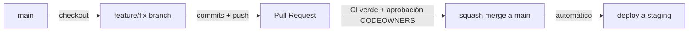

# 09 — Contributing

Guía oficial para cualquier desarrollador que abre un Pull Request contra este repositorio. Construye sobre las políticas ya fijadas en [03-CODE-QUALITY.md](03-CODE-QUALITY.md) (gates automáticos) y [05-CI-CD.md](05-CI-CD.md) (pipeline) — este documento fija el flujo humano alrededor de esos mecanismos: ramas, PRs, revisión, Definition of Done y cuándo escribir un ADR.

## 1. Flujo de Git: GitHub Flow

Ramas de vida corta desde `main`, sin ramas `develop`/`release` intermedias — coherente con que CI valida cada PR contra `main` con `nx affected` ([05-CI-CD.md §2](05-CI-CD.md)) y con que el despliegue a staging ocurre automáticamente tras cada merge ([technical/08-DEVOPS.md §2.2](../technical/08-DEVOPS.md)). Un modelo GitFlow con ramas de release de larga vida introduciría divergencia que `nx affected` no está pensado para reconciliar, y que el principio de "misma imagen se promueve sin reconstruir" ([technical/08-DEVOPS.md §4](../technical/08-DEVOPS.md)) haría redundante.

## 2. Nombres de rama

`<tipo>/<módulo-o-alcance>-<descripción-corta-kebab>` — el `<tipo>` es el mismo vocabulario de Conventional Commits (§3 de [03-CODE-QUALITY.md](03-CODE-QUALITY.md)): `feat/reservations-overlap-validation`, `fix/identity-refresh-token-race`, `chore/ci-cache-tuning`. El `<módulo-o-alcance>` facilita identificar de un vistazo qué `CODEOWNERS` aplica antes de abrir el PR.

## 3. Pull Requests

- **Tamaño**: acotado a un cambio revisable en una sesión (guía, no regla dura) — un PR que toca simultáneamente `domain` de dos módulos no relacionados es señal de que debería dividirse, salvo que el propio cambio arquitectónico lo exija (p. ej. introducir un puerto nuevo consumido por ambos).
- **Descripción obligatoria**: qué cambia y por qué (el "por qué" es lo que el diff no puede explicar por sí solo) — no una relatoría de "qué archivos se tocaron", eso ya lo muestra el diff.
- **Checklist de PR** (plantilla en `.github/PULL_REQUEST_TEMPLATE.md`):
  - [ ] `nx affected --target=lint,typecheck,test` pasa localmente (o se confía en CI para el veredicto final, pero no se abre un PR sabiendo que falla).
  - [ ] Si el cambio afecta a un agregado o regla de negocio: tests unitarios de dominio nuevos/actualizados ([10-TESTING.md §2](../10-TESTING.md)).
  - [ ] Si el cambio afecta a un adaptador de infraestructura: test de integración con Testcontainers ([04-TESTING-FOUNDATION.md §2](04-TESTING-FOUNDATION.md)).
  - [ ] Si el cambio persiste datos nuevos con `companyId`: incluye el escenario de fuga cross-tenant obligatorio ([10-TESTING.md §7](../10-TESTING.md)).
  - [ ] Changeset agregado si el cambio afecta a `apps/api` o `apps/web-admin` en comportamiento visible ([05-CI-CD.md §4](05-CI-CD.md)).
  - [ ] Documentación de `docs/` actualizada si el cambio contradice o extiende una decisión ya escrita (nunca una edición silenciosa de una regla vigente sin justificar el cambio, §6).

## 4. Revisión

- **`CODEOWNERS` como gate obligatorio**, no como sugerencia — un PR que toca un archivo `.prisma`, un proyecto `module:*` o un workflow de CI requiere aprobación explícita del equipo dueño mapeado ahí (§2.3 de [technical/08-DEVOPS.md](../technical/08-DEVOPS.md), §7 de [05-CI-CD.md](05-CI-CD.md)) antes de poder mergear, sin excepción manual.
- Un revisor rechaza un PR que introduce un `eslint-disable` sin justificación (§6 de [03-CODE-QUALITY.md](03-CODE-QUALITY.md)) o que mockea Prisma para lógica de query no trivial (señal de test de integración disfrazado, [10-TESTING.md §8](../10-TESTING.md)) — estos dos criterios son motivo de rechazo directo, no de discusión de estilo.
- El autor del PR nunca aprueba su propio cambio, incluso si técnicamente el repositorio lo permitiera — regla de proceso, reforzada por configuración de branch protection de `main` (revisión mínima requerida, status checks de CI obligatorios, no fast-forward sin PR).

## 5. Definition of Done

Un cambio se considera terminado cuando, y solo cuando:

1. CI está verde (`lint`, `typecheck`, `test` unitario/aplicación/integración, `build`, y E2E si aplica al alcance del cambio).
2. Cobertura del proyecto tocado no cae por debajo de su umbral vigente ([04-TESTING-FOUNDATION.md §7](04-TESTING-FOUNDATION.md)).
3. Aprobación de `CODEOWNERS` obtenida (§4).
4. Si el cambio introduce o modifica un endpoint: el contrato OpenAPI/DTOs coherente con [08-API-CONTRACTS.md](../08-API-CONTRACTS.md) — no hay endpoint sin contrato documentado.
5. Si el cambio introduce un evento de dominio nuevo: registrado en el catálogo de [model/06-DOMAIN_EVENTS.md](../model/06-DOMAIN_EVENTS.md) antes del merge, no después.
6. Mergeado con *squash* (historial de `main` legible, un commit por PR con el mensaje Conventional Commit del título del PR) — el detalle de commits intermedios de la rama de trabajo no se preserva en `main`.

No forma parte de la Definition of Done: 100% de cobertura, cero deuda técnica, o que el PR resuelva un problema no relacionado que el autor "de paso" notó — eso es un PR aparte (mismo principio de alcance acotado de las instrucciones de ingeniería de este proyecto).

## 6. Flujo de ADR — cuándo y dónde documentar una decisión

Tres niveles ya existen en el repositorio, cada uno con su propio criterio de "cuándo crear una entrada":

| Nivel | Ubicación | Cuándo |
|---|---|---|
| Arquitectura de plataforma | [docs/ADR/](../ADR/README.md) | Decisión difícil/costosa de revertir, afecta a toda la Plataforma o a más de un producto ([docs/ADR/README.md](../ADR/README.md)) |
| Construcción técnica | [technical/10-DECISIONES.md](../technical/10-DECISIONES.md) | Decisión de construcción (no de diseño) que afecta a más de un módulo/proyecto, dentro de un ADR ya aceptado |
| Contratos de integración/API | [contracts/10-DECISIONES.md](../contracts/10-DECISIONES.md), [persistence/10-DECISIONES.md](../persistence/10-DECISIONES.md) | Mismo criterio, acotado al alcance de cada fase |

Una decisión de **tooling de ingeniería** (cambiar de Changesets a otra herramienta, introducir un plugin Nx nuevo, cambiar el backend de cache remoto) que sea costosa de revertir o afecte a todo el workspace se documenta como una entrada nueva dentro del documento de `docs/engineering/` correspondiente (p. ej. una entrada adicional en [05-CI-CD.md §4](05-CI-CD.md) si se reemplaza Changesets), siguiendo el mismo formato narrativo (contexto, alternativas, decisión, consecuencias) ya usado en [technical/10-DECISIONES.md](../technical/10-DECISIONES.md) — no se abre un documento `11-DECISIONES.md` separado mientras el volumen de decisiones de esta fase no lo justifique; si en el futuro ese volumen crece lo suficiente para dificultar la navegación, se extrae a un documento propio siguiendo el mismo patrón ya usado por las fases anteriores, no antes (mismo criterio anti-sobreingeniería de [00-VISION.md §3](../00-VISION.md)).

Nunca se edita en silencio una decisión ya tomada en cualquiera de estos niveles — se abre una entrada nueva que la reemplaza y referencia explícitamente la anterior, igual que ya exige [technical/README.md — Regla de consistencia](../technical/README.md).

## 7. Qué se decide en otro documento

- Gates automáticos de calidad que un PR debe pasar → [03-CODE-QUALITY.md](03-CODE-QUALITY.md).
- Pipeline exacto de CI/CD → [05-CI-CD.md](05-CI-CD.md).
- Ownership por módulo (`CODEOWNERS`) → [technical/08-DEVOPS.md §2.3](../technical/08-DEVOPS.md) (sin cambios).
