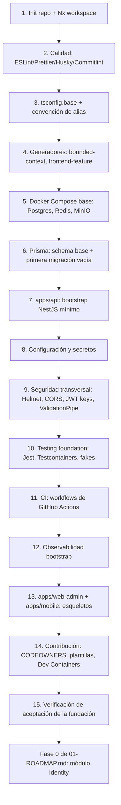

# 10 — Bootstrap Plan

Orden exacto de construcción de la Engineering Foundation descrita en [01-WORKSPACE.md](01-WORKSPACE.md) a [09-CONTRIBUTING.md](09-CONTRIBUTING.md). Cada paso depende únicamente de pasos anteriores — ninguno asume la existencia de algo que un paso posterior construye. Al completar el paso 15, el criterio de salida de este documento coincide con el inicio de "Fase 0 — Fundaciones de Plataforma" de [01-ROADMAP.md §2](../01-ROADMAP.md): un desarrollador puede empezar a escribir el módulo `Identity` sin tomar ninguna decisión de infraestructura adicional.

## Paso 1 — Inicializar repositorio y workspace Nx

**Depende de**: nada (punto de partida).

- Crear repositorio Git, `npm init` de la raíz, instalar Nx (`create-nx-workspace` o `nx init` sobre estructura vacía) con los plugins de [01-WORKSPACE.md §2](01-WORKSPACE.md).
- Producir el árbol raíz completo de [01-WORKSPACE.md §1](01-WORKSPACE.md) (carpetas vacías con `.gitkeep` donde aún no hay proyectos).
- Configurar `nx.json` (named inputs, target defaults, cache) según [01-WORKSPACE.md §3](01-WORKSPACE.md) y conectar el backend de cache remoto.
- Configurar `tsconfig.base.json` con `strict: true` (§4 de [01-WORKSPACE.md](01-WORKSPACE.md)), sin alias todavía (no hay proyectos que necesiten uno).

**Criterio de salida**: `nx graph` corre sin error sobre un workspace vacío; `npm install` reproducible desde cero.

## Paso 2 — Calidad de código

**Depende de**: paso 1 (necesita `package.json` y estructura de `tooling/`).

- `tooling/eslint/` con las capas de [03-CODE-QUALITY.md §1](03-CODE-QUALITY.md) (base TypeScript + boundaries + import order + naming) — los `depConstraints` de boundaries se dejan con la matriz completa de [technical/01-MONOREPO.md §5](../technical/01-MONOREPO.md) aunque todavía no existan proyectos que los violen.
- Prettier (`.prettierrc`, `.prettierignore`), Husky (`pre-commit`, `commit-msg`, `pre-push`), `lint-staged`, Commitlint — configuración completa de [03-CODE-QUALITY.md §2-5](03-CODE-QUALITY.md).

**Criterio de salida**: un commit con un mensaje no conforme a Conventional Commits es rechazado localmente; `git commit` con un archivo mal formateado se auto-corrige vía `lint-staged`.

## Paso 3 — Convención de alias

**Depende de**: paso 1 (workspace) y paso 2 (regla de lint que la hace cumplir).

- Documentar y preconfigurar en `tsconfig.base.json` el patrón de `paths` (§4 de [01-WORKSPACE.md](01-WORKSPACE.md)), sin entradas aún (se generan en el paso 4 en adelante).

**Criterio de salida**: la regla `no-relative-import-across-lib-boundary` está activa y verificable (aunque sin proyectos que la ejerciten todavía).

## Paso 4 — Generadores

**Depende de**: pasos 1-3 (necesita la convención de tags, alias y lint ya definidas para que lo que el generador produzca sea correcto por construcción).

- Implementar `tooling/generators/bounded-context` y `tooling/generators/frontend-feature` con el contrato de entrada/salida de [01-WORKSPACE.md §5](01-WORKSPACE.md).
- Validar el generador creando y luego **eliminando** un módulo de prueba (`platform-scaffolding-test-domain`) — confirma que produce tags, `index.ts` y `tsconfig` correctos antes de usarlo para código real.

**Criterio de salida**: `npm run generate:module` produce un módulo con lint, test y tags correctos sin edición manual posterior.

## Paso 5 — Docker Compose base

**Depende de**: paso 1 (estructura raíz para `docker-compose.yml`).

- `docker-compose.yml` con `postgres`, `redis`, `minio`, `minio-init` (§3 de [06-DOCKER.md](06-DOCKER.md)), healthchecks, volúmenes nombrados.
- `docker-compose.override.yml` con puertos publicados y credenciales de desarrollo (§4 de [06-DOCKER.md](06-DOCKER.md)).
- `.env.example` inicial con las variables de `database`, `redis`, `storage` (§1 de [07-CONFIGURATION.md](07-CONFIGURATION.md)) — el resto de namespaces se agregan en pasos posteriores, a medida que existe código que los consume.

**Criterio de salida**: `docker compose up -d` levanta los tres servicios con estado `healthy`.

## Paso 6 — Prisma: schema base

**Depende de**: paso 5 (necesita `DATABASE_URL` de Postgres corriendo).

- `prisma/schema/base.prisma` (datasource + generator) según [technical/04-PERSISTENCE.md §1](../technical/04-PERSISTENCE.md), sin modelos todavía — los `.prisma` por Bounded Context (`identity.prisma`, `organization.prisma`, etc.) se crean vacíos, listos para que Fase 0 de [01-ROADMAP.md](../01-ROADMAP.md) agregue sus primeros modelos.
- Primera migración (`prisma migrate dev`) que solo crea los schemas de PostgreSQL nombrados (`identity`, `organization`, `scheduling`, `rental`, `commerce`, `support`) sin tablas — confirma que el mecanismo de migración multi-schema funciona antes de que exista el primer modelo real.
- Wrapper `tooling/scripts/db/migrate.ts` y `seed.ts` (§1 de [02-DEVELOPER-EXPERIENCE.md](02-DEVELOPER-EXPERIENCE.md)) — `seed.ts` queda con estructura vacía hasta que exista al menos `Company`/`User` que sembrar (Fase 0).

**Criterio de salida**: `npm run db:migrate` aplica limpiamente sobre una base vacía; `npx prisma studio` conecta y muestra los seis schemas sin tablas.

## Paso 7 — `apps/api`: bootstrap NestJS mínimo

**Depende de**: pasos 4 (generador de librerías, aunque `apps/api` no lo usa directamente) y 6 (Prisma disponible).

- Generar `apps/api` con `@nx/nest`. `main.ts` con la secuencia de bootstrap de [technical/03-BACKEND-ARCHITECTURE.md §2](../technical/03-BACKEND-ARCHITECTURE.md) — en este paso, sin los módulos de negocio aún (`AppModule` vacío salvo `ConfigModule` global).
- `/health/live` y `/health/ready` (`@nestjs/terminus`, [technical/03-BACKEND-ARCHITECTURE.md §10](../technical/03-BACKEND-ARCHITECTURE.md)) — `/health/ready` ya verifica Postgres/Redis reales desde este paso.

**Criterio de salida**: `nx serve api` arranca; `curl localhost:<puerto>/health/ready` responde `ok`.

## Paso 8 — Configuración y secretos

**Depende de**: paso 7 (necesita `ConfigModule` ya montado).

- Completar los namespaces de [07-CONFIGURATION.md §1](07-CONFIGURATION.md) que ya tienen consumidor en este punto (`app`, `database`, `redis`, `storage`) con su schema de validación *fail-fast* (§4 de [07-CONFIGURATION.md](07-CONFIGURATION.md)).
- `.env.example` actualizado con cada variable nueva y su comentario de propósito.

**Criterio de salida**: arrancar `apps/api` sin `DATABASE_URL` falla inmediatamente con un mensaje claro, antes de aceptar cualquier request.

## Paso 9 — Seguridad transversal

**Depende de**: pasos 7-8 (necesita bootstrap y `ConfigModule` para leer orígenes CORS, claves JWT).

- Helmet + CORS explícito (§2 de [technical/03-BACKEND-ARCHITECTURE.md](../technical/03-BACKEND-ARCHITECTURE.md), detalle en [technical/07-SECURITY.md §4](../technical/07-SECURITY.md)).
- `ValidationPipe` global (§5 de [technical/03-BACKEND-ARCHITECTURE.md](../technical/03-BACKEND-ARCHITECTURE.md)).
- `DomainExceptionFilter`/`AllExceptionsFilter` (§6) con el registro declarativo de errores vacío (se llena a medida que cada módulo de negocio declara los suyos, [technical/09-CODING-STANDARDS.md §3](../technical/09-CODING-STANDARDS.md)).
- Script de generación de par de claves RS256 de desarrollo (`tooling/scripts/db/../security/generate-jwt-keys.ts` o ubicación equivalente) — produce un par no productivo para `.env` local; en CI/producción las claves vienen del almacén de secretos (§3 de [technical/07-SECURITY.md](../technical/07-SECURITY.md)). `JwtAuthGuard`/`PermissionGuard` se implementan aquí como mecanismo, sin permisos de negocio reales todavía (esos llegan con el módulo `Identity` de Fase 0).

**Criterio de salida**: una request sin `Authorization` a un endpoint protegido de prueba responde `401` con el formato RFC 7807 ya fijado en [08-API-CONTRACTS.md §4](../08-API-CONTRACTS.md).

## Paso 10 — Testing foundation

**Depende de**: pasos 5-6 (Postgres/Redis) y 7 (`apps/api` existente para `api-e2e`).

- `tooling/testing/testcontainers/` (§2 de [04-TESTING-FOUNDATION.md](04-TESTING-FOUNDATION.md)), `tooling/testing/fakes/` (§4).
- Configuración base de Jest (`tooling/jest/base.config.ts`) y su aplicación por tipo de proyecto (§1 de [04-TESTING-FOUNDATION.md](04-TESTING-FOUNDATION.md)).
- `apps/api-e2e` generado (Jest + Supertest) con un único test de humo (`/health/ready` responde `ok`) — el primer golden path real de negocio se agrega en Fase 0/1.
- `apps/web-admin-e2e` generado con Playwright, sin tests todavía (no hay UI que probar hasta el paso 13).

**Criterio de salida**: `nx affected --target=test` corre sobre un proyecto de prueba con Testcontainers y pasa en CI local (antes de que exista el workflow de CI del paso 11).

## Paso 11 — CI

**Depende de**: pasos 1-10 (todo lo que el pipeline valida debe existir para que el primer PR de prueba tenga algo que ejecutar).

- `.github/workflows/pr.yml`, `main.yml`, `nightly-e2e.yml` según [05-CI-CD.md §1-3](05-CI-CD.md).
- Secretos de CI iniciales (§5 de [05-CI-CD.md](05-CI-CD.md)): token de cache remoto como mínimo indispensable; credenciales de proveedor se agregan cuando exista el primer adaptador que las use (Fase 2+ de [01-ROADMAP.md](../01-ROADMAP.md)).
- Changesets inicializado (`npx changeset init`) — §4 de [05-CI-CD.md](05-CI-CD.md).

**Criterio de salida**: un PR de prueba contra `main` dispara `pr.yml`, todos los jobs pasan en verde, y el cache remoto reporta un *hit* en la segunda ejecución.

## Paso 12 — Observabilidad bootstrap

**Depende de**: paso 7 (necesita `apps/api` emitiendo algo que observar) y paso 5 (perfil de Docker Compose se agrega junto al resto).

- `docker-compose.observability.yml` y provisioning de Grafana (§1-2 de [08-OBSERVABILITY-BOOTSTRAP.md](08-OBSERVABILITY-BOOTSTRAP.md)).
- Instrumentación OTel del SDK en `apps/api` (auto-instrumentación HTTP/Prisma/Redis, aún sin BullMQ porque no hay colas hasta que exista el primer `Processor` de negocio).
- Logger estructurado (`pino`/`nestjs-pino`, [technical/10-DECISIONES.md #4](../technical/10-DECISIONES.md)) ya conectado desde el paso 7, verificado aquí contra Loki.

**Criterio de salida**: una request a `/health/ready` aparece como traza en Tempo y como log estructurado en Loki, visibles desde el dashboard de salud provisionado.

## Paso 13 — `apps/web-admin` y `apps/mobile`: esqueletos

**Depende de**: pasos 1-4 (workspace, generadores) y 9 (necesita saber contra qué API autenticarse, aunque sea un esqueleto).

- Generar `apps/web-admin` (`@nx/next`) y `apps/mobile` (`@nx/expo`), junto con `libs/frontend/*` (`domain-types`, `data-access`, `ui-kit-core`, `ui-kit-web`, `ui-kit-mobile`) vacíos con su `index.ts` y tags, usando el generador `frontend-feature` para la primera feature de prueba (una pantalla de login mínima, sin lógica de negocio real todavía).
- `apps/design-system-docs` (Storybook) generado, catalogando los primeros tokens de `ui-kit-core`.

**Criterio de salida**: `nx serve web-admin` y `nx start mobile` levantan una pantalla mínima que hace un `fetch`/`fetch`-equivalente exitoso a `/health/ready` de `apps/api`.

## Paso 14 — Contribución

**Depende de**: todo lo anterior (necesita que existan módulos/carpetas reales para que `CODEOWNERS` tenga algo que mapear).

- `CODEOWNERS` con el mapeo inicial (equipo de plataforma como dueño por defecto de todo hasta que existan equipos de módulo dedicados, [technical/08-DEVOPS.md §2.3](../technical/08-DEVOPS.md)).
- `.github/PULL_REQUEST_TEMPLATE.md` con el checklist de [09-CONTRIBUTING.md §3](09-CONTRIBUTING.md).
- `.vscode/` (extensions.json, settings.json) y `.devcontainer/devcontainer.json` según [02-DEVELOPER-EXPERIENCE.md §5-6](02-DEVELOPER-EXPERIENCE.md).
- Branch protection de `main` configurada en GitHub (status checks obligatorios de `pr.yml`, revisión mínima, sin force-push).

**Criterio de salida**: un PR de prueba sin aprobación de `CODEOWNERS` no puede mergearse desde la UI de GitHub, aunque CI esté verde.

## Paso 15 — Verificación de aceptación de la fundación

**Depende de**: pasos 1-14 completos.

Checklist final, ejecutado por una persona distinta a quien construyó la fundación (validación de que la documentación, no la memoria de quien la construyó, es suficiente):

- [ ] `git clone` + pasos de [02-DEVELOPER-EXPERIENCE.md §1](02-DEVELOPER-EXPERIENCE.md) llevan a un entorno funcional en menos de 30 minutos, sin ayuda externa.
- [ ] `npm run generate:module` produce un módulo listo para recibir código de dominio real, con lint/test/tags correctos.
- [ ] Un PR de prueba pasa el pipeline completo de `pr.yml` y queda bloqueado por `CODEOWNERS` hasta recibir aprobación.
- [ ] `/health/ready` es visible en Grafana (traza + log) con el perfil de observabilidad activo.
- [ ] Ningún paso del bootstrap requirió una decisión de infraestructura no documentada en `docs/engineering/`.

**Criterio de salida de todo el documento**: al marcar el último ítem, la Engineering Foundation está completa. El siguiente trabajo es la Fase 0 de [01-ROADMAP.md §2](../01-ROADMAP.md) — el primer módulo de dominio real (`Identity`) se construye con `npm run generate:module`, sin volver a tocar ningún archivo de `tooling/`, `docker-compose.yml` ni `.github/workflows/`.
