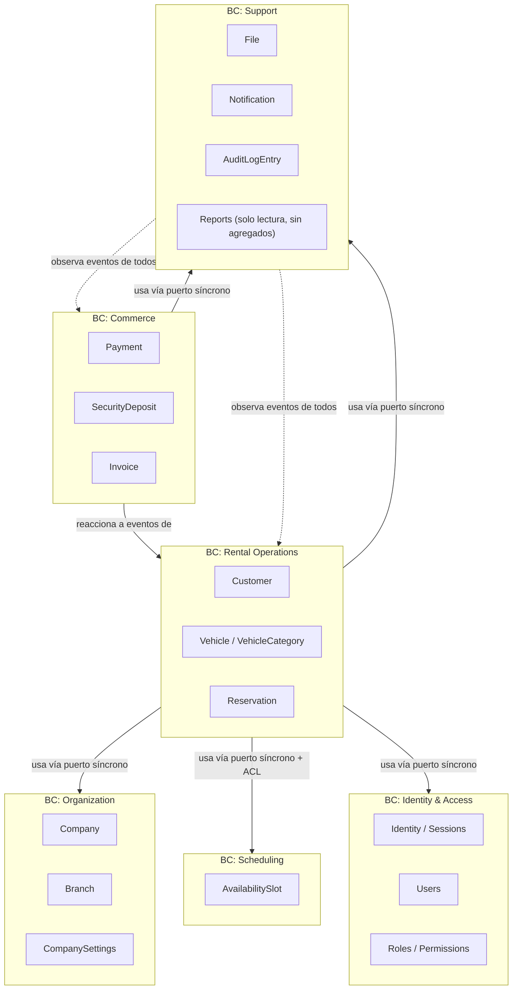
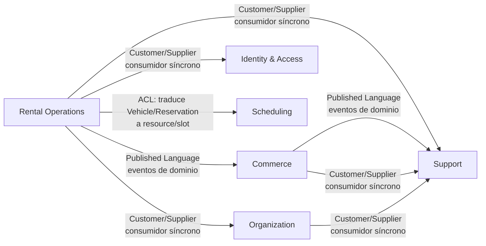
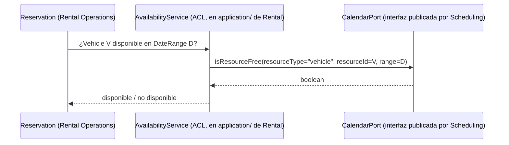

# 01 — Bounded Contexts (Modelo de Dominio Definitivo)

Este documento fija los Bounded Contexts definitivos de la Plataforma. No redefine la frontera ya trazada en [03-DOMINIO.md §1](../03-DOMINIO.md) ni en [domain/08-BOUNDARY.md](../domain/08-BOUNDARY.md) — los hereda como dato fijo y los profundiza al nivel de modelado táctico completo (agregados, entidades, value objects, eventos) que el resto de `docs/model/` desarrolla.

**Regla de lectura de todo `docs/model/`**: cuando este documento (o cualquier otro de esta carpeta) parece repetir algo ya dicho en `docs/` o `docs/domain/`, es intencional — el modelo de dominio debe ser autocontenible para quien vaya a implementar directamente desde aquí, sin tener que reconstruir decisiones cruzando ocho documentos distintos. Donde haya una aparente discrepancia, `docs/` y `docs/domain/` son la fuente de verdad de arquitectura y descubrimiento de negocio; este documento es la fuente de verdad de **modelado**.

## 1. Los seis Bounded Contexts

Cada Bounded Context es una frontera de **lenguaje ubicuo y consistencia de modelo**, no necesariamente una carpeta física 1:1 (ver §5). Dentro de un BC, un mismo término significa siempre lo mismo; cruzando la frontera, el mismo sustantivo puede requerir traducción explícita (Anti-Corruption Layer, §4).

## 2. Por qué existen exactamente estos seis

El criterio de corte es el mismo que ya fija [domain/08-BOUNDARY.md §1](../domain/08-BOUNDARY.md): un concepto pertenece a un BC si su regla de negocio **solo tiene sentido dentro de ese lenguaje**. Aplicado con rigor de modelado:

| BC | Pregunta que responde | Por qué no se funde con otro |
|---|---|---|
| **Identity & Access** | "¿Quién es este actor y qué puede hacer técnicamente?" | Autenticación y RBAC no comparten invariantes ni ciclo de vida con "empresa" (Organization) — un usuario puede existir, cambiar de contraseña o rotar sesión sin que nada de la empresa cambie, y viceversa |
| **Organization** | "¿Qué empresa es esta, qué sucursales tiene, qué política eligió?" | Es el contexto que da *identidad de tenant* a todo lo demás; ninguna otra capacidad puede resolver "¿a qué company pertenece esto?" por sí misma |
| **Scheduling** | "¿Está libre este recurso en este rango de tiempo?" | Deliberadamente ciego a qué es un "recurso" — ver §4.2. Fusionarlo con Rental Operations le haría heredar vocabulario de vehículos, rompiendo la reutilización que ya exige [00-VISION.md §1](../00-VISION.md) |
| **Rental Operations** | "¿Qué compromiso de alquiler existe entre un cliente y un vehículo?" | Es el único BC cuyo lenguaje incluye `Vehicle`, `Odometer`, `Check-out`, `Conductor Adicional` — nada de esto es transferible a un segundo producto sin traducción |
| **Commerce** | "¿Cuánto se debe, se cobró y se documentó fiscalmente?" | El vocabulario de dinero (`Charge`, `Invoice`, `Payment`, `SecurityDeposit`) tiene sus propias reglas (numeración fiscal, conciliación, reintentos de cobro) independientes de qué generó la deuda |
| **Support** | "¿Qué pasó, quién debe enterarse, y dónde vive el archivo?" | Archivos, notificaciones y auditoría son servicios de infraestructura de negocio transversales: ninguno tiene reglas propias de alquiler, cobro o identidad — solo reaccionan a lo que ocurre en los demás |

## 3. Responsabilidades por Bounded Context

### 3.1 Identity & Access

**Responsabilidad**: autenticar actores humanos y de sistema, y decidir *qué acción está técnicamente permitida* (RBAC). No decide *si el dato al que se accede pertenece al tenant correcto* — eso es responsabilidad de scoping/RLS (plataforma transversal, no de este BC ni de ningún otro modelado en `docs/model/`, ver [09-SEGURIDAD.md](../09-SEGURIDAD.md)).

**Agregados**: `User`, `Role`, `Session` (ver [02-AGGREGATES.md](02-AGGREGATES.md)).

**No responsabilidad**: no conoce `Company` como concepto de negocio (solo un `companyId` opaco de pertenencia), no conoce `Branch`, no conoce ningún concepto de Rental o Commerce.

### 3.2 Organization

**Responsabilidad**: modelar la empresa cliente (`Company`), sus unidades operativas (`Branch`) y su configuración de política de negocio (`CompanySettings`, que incluye el registro de módulos/producto activos ya descrito en [02-ARQUITECTURA.md §4.2](../02-ARQUITECTURA.md)).

**Agregados**: `Company`, `Branch`, `CompanySettings`.

**Por qué `CompanySettings` es un agregado propio y no parte de `Company`**: cambia con una frecuencia y por actores distintos (política de cancelación, tabla de penalización por tardanza, umbrales de mantenimiento) frente a los datos fundacionales de la empresa (razón social, datos fiscales), que cambian raramente. Forzarlos al mismo agregado generaría contención transaccional innecesaria y un agregado con dos razones de cambio — violación directa de cohesión (ver justificación completa en [02-AGGREGATES.md §3](02-AGGREGATES.md)).

### 3.3 Scheduling

**Responsabilidad única**: responder "¿está libre el recurso `R` en el rango `[start, end)`?" y reservar/liberar ese rango. No sabe qué es un vehículo, ni una reserva, ni un cliente — solo conoce `resourceType` + `resourceId` + `DateRange`.

**Agregado**: `AvailabilitySlot`.

Esta es la capacidad de Plataforma más deliberadamente genérica de todas — ver §4.2 sobre su ACL con Rental Operations, y [domain/09-FUTURAS-CAPACIDADES.md](../domain/09-FUTURAS-CAPACIDADES.md) para por qué Taller (bahías), Hotel (habitaciones) y Clínica (turnos médicos) la reutilizarán sin cambios.

### 3.4 Rental Operations

**Responsabilidad**: todo el ciclo de negocio de alquiler de vehículos — desde que un vehículo entra a la flota hasta que una reserva se cierra. Es el único BC de producto en v1.0 (los demás son de Plataforma).

**Agregados**: `Vehicle`, `VehicleCategory`, `Customer`, `Reservation`.

Es el BC con más invariantes críticos (no-solapamiento, disponibilidad estructural, documentación vigente) porque es el corazón transaccional del producto — ver [02-AGGREGATES.md](02-AGGREGATES.md) y [07-INVARIANTS.md](07-INVARIANTS.md).

### 3.5 Commerce

**Responsabilidad**: representar el dinero que se debe, se retiene, se cobra y se documenta fiscalmente, con independencia de qué originó la deuda.

**Agregados**: `Invoice`, `Payment`, `SecurityDeposit`.

**Nota de empaquetado físico** (importante, ver §5): a nivel de Bounded Context (lenguaje, reglas, consistencia), Commerce es un contexto único. A nivel de librería física ([02-ARQUITECTURA.md §8](../02-ARQUITECTURA.md)), `payments` vive en `platform/` (genuinamente genérico desde el día uno: "cobrar un monto por un medio de pago" no sabe si el motivo es un alquiler o una consulta médica) mientras que `invoices` vive hoy en `products/rental/` (su motor de emisión fiscal no se ha extraído todavía a Plataforma porque no existe aún un segundo producto que lo demande — extraerlo prematuramente sería la sobreingeniería que [00-VISION.md §3](../00-VISION.md) prohíbe explícitamente). El Bounded Context Commerce como lenguaje ubicuo es el mismo en ambos lugares; su futura consolidación física es mecánica el día que un segundo producto la necesite, precisamente porque el modelo de dominio (este documento) ya la trata como un único contexto de reglas.

### 3.6 Support

**Responsabilidad**: capacidades de infraestructura de negocio transversal que ningún otro BC debe reimplementar: almacenamiento de archivos, envío de notificaciones multi-canal, y registro inmutable de auditoría.

**Agregados**: `File`, `Notification`, `AuditLogEntry`.

**`Reports` no tiene agregados**: es intencional. Por decisión ya fijada en [ADR-0007](../ADR/0007-cqrs-selectivo.md), Reports es puramente de lectura — lee proyecciones optimizadas de otros BC vía Query Handlers, nunca modela sus propias reglas de negocio ni publica eventos. Un documento de modelado de dominio no le asigna agregados porque no protege ningún invariante: es un consumidor, no un productor de verdad de negocio. Se documenta aquí por completitud de BC, no porque tenga modelo táctico propio.

## 4. Relaciones entre Bounded Contexts

### 4.1 Mapa de relaciones (Context Mapping)

Vocabulario de Context Mapping (DDD estratégico) usado en este diagrama:

- **Customer/Supplier**: el consumidor (Customer, en el sentido de patrón, no de la entidad `Customer` del dominio) depende de un contrato publicado por el proveedor (Supplier), sin que el proveedor conozca al consumidor. Así se relacionan `Rental Operations` con `Organization`, `Identity & Access` y `Support`: consume `CustomerLookupPort`-like ports publicados por el dueño, nunca al revés.
- **Published Language**: el proveedor publica un contrato versionado y estable (los eventos de dominio, ver [06-DOMAIN_EVENTS.md](06-DOMAIN_EVENTS.md)) que cualquier consumidor interpreta sin acoplarse al modelo interno del proveedor. Así se relacionan `Rental Operations` → `Commerce` y `Commerce`/`Rental Operations` → `Support`.
- **Anti-Corruption Layer (ACL)**: un consumidor traduce activamente el modelo de un proveedor a su propio lenguaje para no dejar que conceptos ajenos contaminen su dominio. Es el caso de `Rental Operations` → `Scheduling` (detalle en §4.2) y de la traducción de `Reservation` hacia `Invoice` (detalle en §4.3).

Ningún BC de Plataforma (`Identity & Access`, `Organization`, `Scheduling`, `Commerce`, `Support`) depende jamás de `Rental Operations` — es la misma regla estructural de [02-ARQUITECTURA.md §4](../02-ARQUITECTURA.md) (`platform/` nunca importa de `products/`), reafirmada aquí a nivel de Bounded Context y no solo de carpeta.

### 4.2 ACL: Rental Operations ↔ Scheduling

**Por qué existe**: `Scheduling` modela `AvailabilitySlot` en términos de `resourceType` (string genérico) + `resourceId` + `DateRange`. `Rental Operations` modela `Vehicle` y `Reservation`. Son, literalmente, dos modelos distintos del mismo hecho físico ("este vehículo está ocupado estas fechas") — el caso de manual de ACL según [ADR-0002](../ADR/0002-ddd-pragmatico.md).

**Dónde vive la traducción**: en la capa de aplicación de `Rental Operations` (el `AvailabilityService` descrito en [03-DOMINIO.md §3.4](../03-DOMINIO.md) y detallado en [05-DOMAIN_SERVICES.md](05-DOMAIN_SERVICES.md)), nunca en `Scheduling`. Concretamente:

**Regla de alarma explícita** (heredada de [domain/08-BOUNDARY.md §5](../domain/08-BOUNDARY.md)): si `AvailabilitySlot` alguna vez adquiere un campo como `licensePlate` o `odometer`, la ACL falló y `Scheduling` se contaminó de Rental — es un defecto de diseño que debe corregirse antes de mezclarse con código, no una variante aceptable.

### 4.3 ACL: Rental Operations → Commerce (traducción de facturación)

**Por qué existe**: dentro de `Reservation` (Rental Operations), los ajustes de precio se modelan con vocabulario propio del alquiler (`PriceAdjustment` de tipo `Extension`, `LateReturnPenalty`, `DamagePenalty`, `FuelDifference` — ver [04-VALUE_OBJECTS.md](04-VALUE_OBJECTS.md)). Dentro de `Invoice` (Commerce), el concepto equivalente es `Charge`, con su propio catálogo de tipos y sin ningún conocimiento de "por qué" se generó desde el punto de vista de negocio de alquiler.

**Dónde vive la traducción**: en el `Listener` de `Invoices` que reacciona a `ReservationCheckedIn.v1` (ver [06-DOMAIN_EVENTS.md](06-DOMAIN_EVENTS.md)). El evento transporta un DTO de "líneas de cobro" ya aplanado (Published Language), y es la capa de aplicación de `Invoices` quien decide cómo mapear cada `PriceAdjustment.kind` a un `Charge.kind` de su propio catálogo — nunca al revés, y `Reservation` nunca conoce la existencia de `Invoice`.

Esta es, en esencia, la misma disciplina que [domain/08-BOUNDARY.md §4.1](../domain/08-BOUNDARY.md) ya exige para "qué se factura es de Rental, cómo se emite es de Commerce".

### 4.4 Consistencia entre Bounded Contexts

Dentro de un BC (y dentro de un agregado), consistencia transaccional ACID estricta. Entre Bounded Contexts, consistencia eventual coordinada por eventos — ya fijado en [02-ARQUITECTURA.md §5.4](../02-ARQUITECTURA.md) y heredado sin modificación. Ejemplo concreto: `Reservation` pasa a `CheckedIn` en una transacción; `Invoice` se emite en una transacción separada, disparada por el evento `ReservationCheckedIn.v1`. Nunca existe una transacción distribuida que abarque ambos agregados.

## 5. Bounded Context vs. módulo físico — por qué no siempre es 1:1

Este documento distingue deliberadamente dos preguntas que se responden distinto:

| Pregunta | Quién la responde | Puede diferir de la otra? |
|---|---|---|
| ¿A qué Bounded Context (lenguaje, reglas, consistencia) pertenece este concepto? | Este documento y [03-DOMINIO.md §1](../03-DOMINIO.md) | — |
| ¿En qué carpeta/librería física vive el código hoy? | [02-ARQUITECTURA.md §8](../02-ARQUITECTURA.md) | Sí, y es aceptable — ver Commerce en §3.5 |

Un futuro arquitecto no debe interpretar una diferencia entre ambas respuestas como un error de este documento: es una decisión consciente de empaquetado pragmático (no construir una extracción de plataforma antes de que exista la necesidad real de un segundo producto), consistente con [ADR-0002](../ADR/0002-ddd-pragmatico.md) y con el principio rector #5 de [00-VISION.md §5](../00-VISION.md) ("¿Estamos resolviendo un problema real y presente, o uno hipotético?").

## 6. Qué se descarta explícitamente a este nivel de modelado

- **Context mapping formal con "Conformist" o "Shared Kernel" ampliado**: `shared-kernel` ya existe y se mantiene deliberadamente pequeño ([02-ARQUITECTURA.md §8](../02-ARQUITECTURA.md)) — `Money`, `DateRange`, `EntityId<T>`, `Email`, `PhoneNumber`. Ningún Bounded Context nuevo debe ampliar `shared-kernel` con un Value Object que tenga reglas de negocio específicas de su contexto; ver [04-VALUE_OBJECTS.md §6](04-VALUE_OBJECTS.md).
- **Un séptimo Bounded Context "Integrations"**: los adaptadores de integración (`integration-providers`) no son un Bounded Context de negocio — no tienen lenguaje ubicuo propio ni invariantes de dominio, son infraestructura de conectividad detrás de puertos ya definidos por el BC consumidor ([11-INTEGRACIONES.md](../11-INTEGRACIONES.md), [ADR-0010](../ADR/0010-provider-pattern-integraciones.md)). No se modelan agregados para ellos en este directorio.
