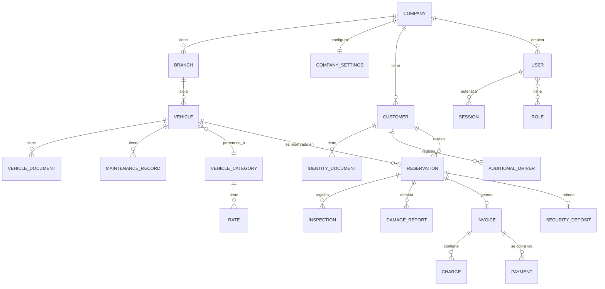

# 03 — Entities

Este documento identifica todas las entidades del dominio: tanto las raíces de agregado (que ya son entidades por definición) como las entidades internas de cada agregado descritas en [02-AGGREGATES.md](02-AGGREGATES.md). Aquí el foco es la entidad en sí misma — identidad, ciclo de vida, relaciones, propiedades conceptuales — no el límite transaccional (eso ya está resuelto en el documento de agregados).

**Criterio de entidad usado en todo este modelo**: algo es una entidad, y no un Value Object, cuando (a) tiene una identidad que persiste a través de cambios de sus atributos, (b) su ciclo de vida importa por sí mismo (se crea, transiciona, eventualmente se archiva, independientemente de que sus valores cambien), y (c) dos instancias con los mismos valores en un momento dado siguen siendo cosas distintas. Cuando ninguna de estas tres condiciones aplica, el concepto es un Value Object (ver [04-VALUE_OBJECTS.md](04-VALUE_OBJECTS.md)).

## 1. Identity & Access

### 1.1 `User`

- **Responsabilidad**: representar a un actor humano con credenciales de acceso.
- **Identidad**: `UserId` (UUID), estable de por vida, independiente de si cambia su email o su nombre.
- **Ciclo de vida**: `Invited`/`Active` → `Disabled`. No se elimina físicamente mientras existan registros de auditoría o `Reservation` que lo referencien como actor (`operatorId`).
- **Relaciones**: pertenece a un `CompanyId` (obligatorio), opcionalmente a un `BranchId` (scoping operativo); referencia N `RoleId`. Es referenciado desde `AuditLogEntry.ActorRef`, desde `Reservation.Inspection.inspectedBy`, y desde `Vehicle.MaintenanceRecord` como responsable.
- **Propiedades conceptuales**: nombre, email, estado, credencial (como VO), rol(es) asignados por referencia.

### 1.2 `Role`

- **Responsabilidad**: agrupar permisos con nombre.
- **Identidad**: `RoleId`, estable aunque cambie su conjunto de permisos.
- **Ciclo de vida**: `Active` (los roles `System` no se desactivan; los `Custom` sí).
- **Relaciones**: referenciado por `User.roles`; no referencia a `User` (relación unidireccional para evitar que asignar un rol sea una escritura sobre `Role`).
- **Propiedades conceptuales**: nombre, alcance (`System`/`Custom`), conjunto de `Permission` (VO).

### 1.3 `Session`

- **Responsabilidad**: representar una sesión autenticada activa o históricamente rotada/revocada.
- **Identidad**: `SessionId`, distinta en cada login — dos sesiones del mismo `User` son entidades completamente independientes, nunca la "misma cosa en dos estados".
- **Ciclo de vida**: `Active` → `Rotated` | `Revoked` (terminal cada rama).
- **Relaciones**: referencia `UserId`. No es referenciada desde ningún otro agregado (es un extremo hoja del grafo de dominio).
- **Propiedades conceptuales**: hash del refresh token, contexto de dispositivo, timestamps de emisión/rotación.

## 2. Organization

### 2.1 `Company`

- **Responsabilidad**: representar la identidad fundacional del tenant.
- **Identidad**: `CompanyId`, la identidad raíz de la que depende el aislamiento multi-tenant de toda la Plataforma ([ADR-0004](../ADR/0004-multitenancy.md)).
- **Ciclo de vida**: `Active` ↔ `Suspended`. No se elimina mientras tenga cualquier dato de negocio asociado (retención regulatoria/contractual).
- **Relaciones**: es la raíz de referencia (`companyId`) de prácticamente toda otra entidad de la Plataforma, pero no contiene esas relaciones dentro de su propio agregado — son referencias inversas por convención de columna, no por navegación de objeto.
- **Propiedades conceptuales**: razón social, identificación fiscal propia, contacto de facturación de la suscripción SaaS, estado de cuenta.

### 2.2 `Branch`

- **Responsabilidad**: representar una sucursal operativa.
- **Identidad**: `BranchId`, estable aunque cambie de dirección u horario.
- **Ciclo de vida**: `Active` ↔ `Closed`.
- **Relaciones**: pertenece a un `CompanyId` inmutable; es referenciada por `Vehicle.branchId` y, operativamente, por `User.branchId`.
- **Propiedades conceptuales**: dirección, horario de operación, estado.

### 2.3 `CompanySettings`

- **Responsabilidad**: representar el conjunto vigente de políticas configurables de una `Company`.
- **Identidad**: coincide 1:1 con `CompanyId` — no tiene una identidad propia distinta, es la única entidad de este modelo cuya identidad es directamente la de otra entidad (relación de "configuración de", no de "pertenencia a" en el sentido de composición jerárquica).
- **Ciclo de vida**: creada junto con `Company`, editada indefinidamente, nunca eliminada mientras la `Company` exista.
- **Relaciones**: leída síncronamente por `Reservation`, `Vehicle` e `Invoice` al momento de aplicar cada política.
- **Propiedades conceptuales**: cada política como Value Object propio (ver [02-AGGREGATES.md §6](02-AGGREGATES.md)).

## 3. Scheduling

### 3.1 `AvailabilitySlot`

- **Responsabilidad**: representar la ocupación de un recurso genérico en un rango de tiempo.
- **Identidad**: `AvailabilitySlotId`, independiente del recurso que ocupa (dos slots del mismo recurso en momentos distintos son entidades distintas, nunca el mismo slot "movido").
- **Ciclo de vida**: `Active` → `Released` (terminal; un cambio de fechas siempre crea un slot nuevo y libera el viejo, nunca edita el rango de uno existente).
- **Relaciones**: referencia un `ResourceRef` (`resourceType` + `resourceId`) genérico y, si `SlotKind = Booking`, un `referenceId` opaco (en la práctica, un `ReservationId`, pero `Scheduling` no lo tipa como tal — ver ACL en [01-BOUNDED_CONTEXTS.md §4.2](01-BOUNDED_CONTEXTS.md)).
- **Propiedades conceptuales**: rango de fechas, tipo de slot (reserva/bloqueo manual).

## 4. Rental Operations

### 4.1 `VehicleCategory`

- **Responsabilidad**: representar la clasificación comercial que determina tarifa.
- **Identidad**: `VehicleCategoryId`.
- **Ciclo de vida**: `Active` indefinidamente (no se "cierra"; se deja de asociar a vehículos nuevos).
- **Relaciones**: referenciada por `Vehicle.vehicleCategoryId`; contiene internamente N `Rate`.
- **Propiedades conceptuales**: nombre, descripción comercial.

### 4.2 `Rate` (entidad interna de `VehicleCategory`)

- **Responsabilidad**: representar el precio vigente en un período determinado.
- **Identidad**: `RateId`, distinta para cada versión histórica de tarifa — nunca se sobrescribe un `Rate` existente, se crea uno nuevo con su propia vigencia.
- **Ciclo de vida**: `Scheduled`/`Active` según su `validFrom`/`validTo` — el estado es derivado de la fecha actual respecto al rango, no un campo mutable independiente.
- **Relaciones**: pertenece a exactamente una `VehicleCategory`.
- **Propiedades conceptuales**: monto, unidad (día/semana), rango de vigencia.

### 4.3 `Vehicle`

- **Responsabilidad**: representar una unidad física de flota y su disponibilidad estructural.
- **Identidad**: `VehicleId`, estable a través de cambios de estado, kilometraje, e incluso de `Branch` (en el caso excepcional de reasignación, [domain/07-EXCEPCIONES.md §11](../domain/07-EXCEPCIONES.md)).
- **Ciclo de vida**: ver máquina de estados completa en [08-STATE_MACHINES.md §2](08-STATE_MACHINES.md).
- **Relaciones**: pertenece a un `BranchId` (y transitivamente a un `CompanyId`); pertenece a una `VehicleCategoryId`; contiene internamente N `VehicleDocument` y N `MaintenanceRecord`; es referenciado por `Reservation.vehicleId`.
- **Propiedades conceptuales**: placa, VIN, kilometraje, estado operativo.

### 4.4 `VehicleDocument` (entidad interna de `Vehicle`)

- **Responsabilidad**: representar un documento legal vigente o vencido asociado al vehículo.
- **Identidad**: `DocumentId`, distinta para cada documento cargado — renovar un seguro crea un `VehicleDocument` nuevo, no edita el vencido (preserva el histórico legal).
- **Ciclo de vida**: `Pending` (cargado, no verificado) → `Valid` → `Expired` (transición automática por fecha, no por acción de un actor).
- **Relaciones**: pertenece a un `Vehicle`; referencia un `FileId` (el archivo escaneado).
- **Propiedades conceptuales**: tipo de documento, fecha de vigencia, referencia de archivo.

### 4.5 `MaintenanceRecord` (entidad interna de `Vehicle`)

- **Responsabilidad**: representar una intervención de mantenimiento, programada o ejecutada.
- **Identidad**: `MaintenanceId`, distinta por cada intervención — el histórico completo de mantenimientos de un vehículo es una colección de estas entidades, nunca un único registro mutado.
- **Ciclo de vida**: `Scheduled` → `InProgress` → `Completed` (con resultado de aptitud) — ver detalle en [08-STATE_MACHINES.md §5](08-STATE_MACHINES.md).
- **Relaciones**: pertenece a un `Vehicle`; opcionalmente referencia a un `Proveedor de Servicios` (dato de contacto, no un agregado modelado en este directorio — ver [domain/01-ACTORES.md §3.3](../domain/01-ACTORES.md), es un tercero mayormente offline) y, si es correctivo, a un `DamageReport` de origen (referencia cross-aggregate por ID, nunca embebido).
- **Propiedades conceptuales**: tipo (preventivo/correctivo), ventana programada, resultado de verificación de aptitud.

### 4.6 `Customer`

- **Responsabilidad**: representar a quien alquila vehículos.
- **Identidad**: `CustomerId`, estable a través de cambios de estado de bloqueo o de renovación documental.
- **Ciclo de vida**: `Registered` → `Active` ↔ `Blocked`.
- **Relaciones**: pertenece a un `CompanyId` (compartido entre todas sus `Branch`, a diferencia de `Vehicle`); contiene internamente N `IdentityDocument` y N `AdditionalDriver`; es referenciado por `Reservation.customerId`.
- **Propiedades conceptuales**: tipo (natural/jurídico), datos de contacto, identificación fiscal/personal, estado de bloqueo.

### 4.7 `IdentityDocument` (entidad interna de `Customer` y de `AdditionalDriver`)

- **Responsabilidad**: representar un documento de identidad o licencia de conducir.
- **Identidad**: `DocumentId`, distinta por cada documento — la misma lógica que `VehicleDocument`: renovar no edita, crea uno nuevo.
- **Ciclo de vida**: `Pending` (posiblemente recién extraído por OCR, sin confirmar) → `Verified` → `Expired`.
- **Relaciones**: pertenece a un `Customer` o a un `AdditionalDriver`; referencia un `FileId`.
- **Propiedades conceptuales**: tipo, fecha de vigencia, origen del dato (`extractedByOcr` sí/no), estado de verificación.

### 4.8 `AdditionalDriver` (entidad interna de `Customer`)

- **Responsabilidad**: representar a una persona autorizada a conducir sin ser el `Customer` titular.
- **Identidad**: `DriverId`, estable a través de su historial de validación y de las múltiples `Reservation` en las que participa.
- **Ciclo de vida**: `Registered` → `Validated` ↔ `Revoked`.
- **Relaciones**: pertenece a un `Customer`; contiene un `IdentityDocument` (su licencia); es referenciado por `Reservation` mediante una lista de `driverId` autorizados para ese alquiler puntual.
- **Propiedades conceptuales**: nombre, estado de validación.

### 4.9 `Reservation`

- **Responsabilidad**: representar el compromiso transaccional cliente–vehículo–tiempo.
- **Identidad**: `ReservationId`, estable a través de toda su máquina de estados, incluidas extensiones y cambios de vehículo.
- **Ciclo de vida**: ver [08-STATE_MACHINES.md §1](08-STATE_MACHINES.md).
- **Relaciones**: referencia `CustomerId`, `VehicleId`, un subconjunto de `driverId` autorizados; contiene internamente N `Inspection` y N `DamageReport`; es la causa (por evento) de exactamente una `Invoice` en Commerce.
- **Propiedades conceptuales**: rango de fechas, estado, tarifa acordada, desglose de precio.

### 4.10 `Inspection` (entidad interna de `Reservation`)

- **Responsabilidad**: representar el registro físico de estado del vehículo en un momento del ciclo (entrega o devolución).
- **Identidad**: `InspectionId`, distinta para cada inspección — una `Reservation` normalmente tiene exactamente dos (`CheckOut`, `CheckIn`), cada una inmutable tras registrarse.
- **Ciclo de vida**: `Recorded` (estado único, terminal — una inspección no se edita, es evidencia).
- **Relaciones**: pertenece a una `Reservation`; referencia el `UserId` del Operador que la registró y N `FileId` de fotos.
- **Propiedades conceptuales**: tipo (check-out/check-in), kilometraje, nivel de combustible, timestamp.

### 4.11 `DamageReport` (entidad interna de `Reservation`)

- **Responsabilidad**: representar un daño detectado, con su evidencia y su calificación de imputabilidad.
- **Identidad**: `DamageReportId`, distinta por cada daño detectado.
- **Ciclo de vida**: `Recorded` (terminal — el daño en sí no cambia; lo que puede evolucionar es la resolución comercial derivada, modelada en Commerce como `Charge`/`SecurityDeposit`, referenciando este `DamageReportId`).
- **Relaciones**: pertenece a una `Reservation`; referencia la `Inspection` que lo detectó y N `FileId` de fotos; puede ser el origen de un `MaintenanceRecord` correctivo en `Vehicle` (referencia cross-aggregate por ID).
- **Propiedades conceptuales**: descripción, severidad, imputabilidad al cliente.

## 5. Commerce

### 5.1 `SecurityDeposit`

- **Responsabilidad**: representar la garantía retenida sobre una `Reservation`.
- **Identidad**: `SecurityDepositId`.
- **Ciclo de vida**: `Held` → resolución terminal (`ReleasedFully`/`RetainedPartially`/`RetainedFully`).
- **Relaciones**: referencia `ReservationId`; opcionalmente referencia un `GatewayHoldReference` (si el mecanismo es preautorización de tarjeta).
- **Propiedades conceptuales**: monto retenido, estado de resolución.

### 5.2 `Payment`

- **Responsabilidad**: representar un intento de cobro.
- **Identidad**: `PaymentId`, distinta por cada intento — un reintento tras un `PaymentFailed` es un `Payment` nuevo (correlacionado, no el mismo registro reescrito), salvo que la idempotencia lo deduplique al mismo intento de red.
- **Ciclo de vida**: ver [08-STATE_MACHINES.md §3](08-STATE_MACHINES.md).
- **Relaciones**: referencia opaca a `Charge`/`Invoice` (o a `SecurityDeposit` si es una preautorización de garantía).
- **Propiedades conceptuales**: monto, método, estado, referencia de pasarela.

### 5.3 `Invoice`

- **Responsabilidad**: representar el comprobante fiscal/comercial de una `Reservation` cerrada.
- **Identidad**: `InvoiceId` (y, para efectos fiscales externos, `InvoiceNumber` como identificador legal correlativo — dos identificadores con propósitos distintos: uno técnico/interno, otro fiscal/externo).
- **Ciclo de vida**: `Issued` → `Voided` (excepcional, terminal).
- **Relaciones**: referencia `ReservationId` (origen) y `CustomerId` (destinatario fiscal); contiene internamente N `Charge`.
- **Propiedades conceptuales**: numeración, detalle impositivo, estado.

### 5.4 `Charge` (entidad interna de `Invoice`)

- **Responsabilidad**: representar una línea de cobro individual dentro de una factura.
- **Identidad**: `ChargeId`, distinta por cada línea — inmutable tras la emisión de la `Invoice` que la contiene.
- **Ciclo de vida**: `Issued` (estado único y terminal, heredado del estado de su `Invoice` contenedora).
- **Relaciones**: pertenece a una `Invoice`; es la traducción (ACL) de un `PriceAdjustment` de `Reservation` — ver [01-BOUNDED_CONTEXTS.md §4.3](01-BOUNDED_CONTEXTS.md).
- **Propiedades conceptuales**: tipo de cargo, monto, descripción.

## 6. Support

### 6.1 `File`

- **Responsabilidad**: representar la metadata de un archivo almacenado.
- **Identidad**: `FileId`.
- **Ciclo de vida**: `Uploaded` → `Deleted`.
- **Relaciones**: referenciado (nunca referencia hacia afuera) desde `VehicleDocument`, `IdentityDocument`, `Inspection`, `DamageReport`, `Invoice` (PDF).
- **Propiedades conceptuales**: referencia de storage, tipo de contenido, estado.

### 6.2 `Notification`

- **Responsabilidad**: representar el envío de un mensaje disparado por un evento de negocio.
- **Identidad**: `NotificationId`.
- **Ciclo de vida**: `Pending` → `Sent` → `Delivered`/`Failed`.
- **Relaciones**: no referencia formalmente al agregado que la originó más allá del payload de contexto necesario para componer el mensaje — deliberadamente débil, para no acoplar `Support` a los modelos de otros BC.
- **Propiedades conceptuales**: canal, destinatario, tipo, estado de entrega.

### 6.3 `AuditLogEntry`

- **Responsabilidad**: registrar de forma inmutable un hecho relevante de seguridad o negocio.
- **Identidad**: `AuditLogEntryId`.
- **Ciclo de vida**: `Created` (único, terminal).
- **Relaciones**: referencia de forma genérica el tipo y ID del agregado auditado (`Subject`), sin relación tipada fuerte (evita que `Audit` dependa de conocer el modelo interno de cada BC que audita).
- **Propiedades conceptuales**: actor, acción, sujeto, timestamp, snapshot mínimo.

## 7. Resumen de relaciones entre entidades

Nota: como en [03-DOMINIO.md §6](../03-DOMINIO.md), este es un diagrama de relaciones de negocio, no de claves foráneas físicas — toda relación que cruza Bounded Context (p. ej. `RESERVATION` → `INVOICE`, `VEHICLE` → `RESERVATION` vía disponibilidad) se resuelve por ID + evento, nunca por FK ([04-MODELO-DATOS.md §3](../04-MODELO-DATOS.md)).
