# 08 — State Machines

Este documento modela todas las máquinas de estado del dominio, con foco especial en las cinco de mayor complejidad de negocio (`Reservation`, `Vehicle`, `Payment`, `Invoice`, `Maintenance`), y documenta explícitamente las transiciones válidas e inválidas de cada una — una transición "inválida" listada aquí no es una omisión, es una prohibición documentada para que un futuro desarrollador no la reintroduzca por accidente.

**Regla transversal de modelado de estados en este documento**: en todo agregado con entidades internas append-only (`Inspection`, `DamageReport`, `Rate`, `VehicleDocument`, `IdentityDocument`, `MaintenanceRecord`), un "cambio de estado que en apariencia retrocede" nunca reabre el registro anterior — crea uno nuevo. Esto ya se justificó individualmente en [02-AGGREGATES.md](02-AGGREGATES.md) y [03-ENTITIES.md](03-ENTITIES.md); aquí se aplica de forma consistente a cada máquina de estados correspondiente.

## 1. `Reservation` (Rental Operations)

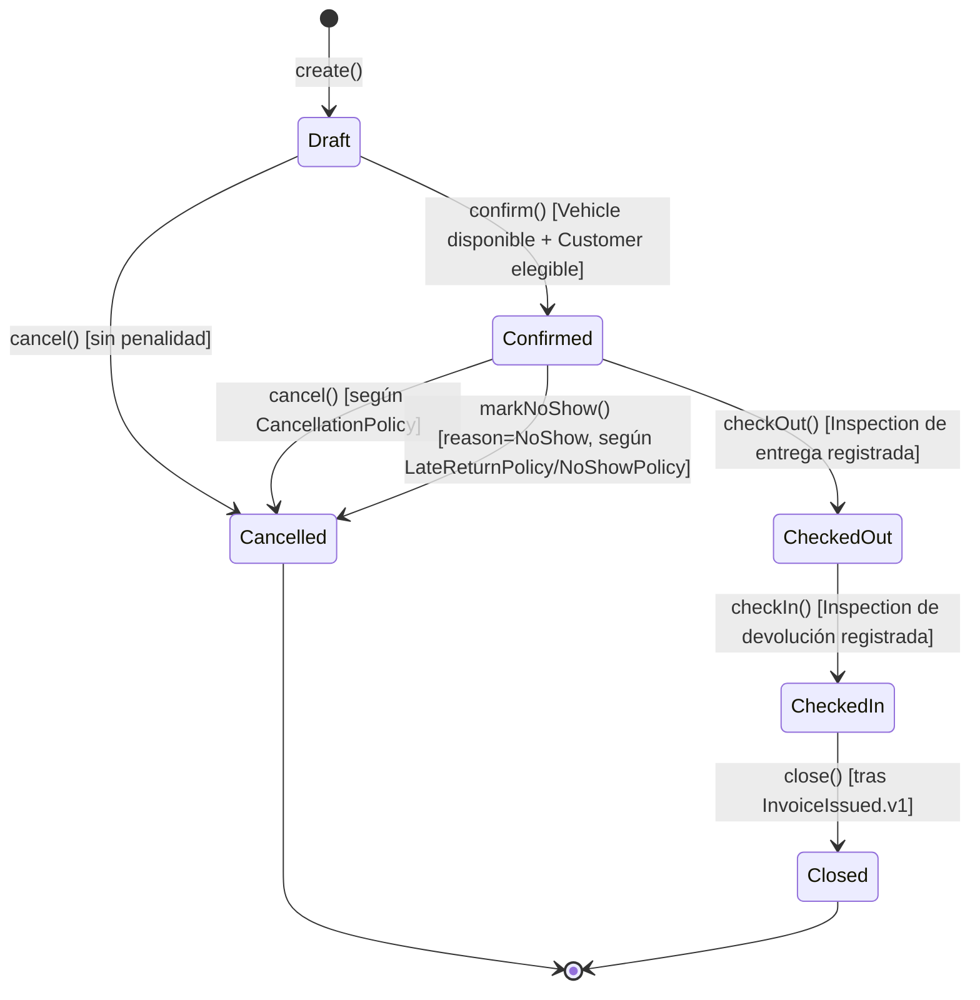

Nota: `reschedule()` (antes del `CheckOut`) y `requestExtension()`/`approveExtension()`/`swapVehicle()` (después del `CheckOut`) son transiciones internas que **no cambian** `ReservationStatus` — modifican el `DateRange`/`VehicleId` permaneciendo en `Confirmed` o `CheckedOut` respectivamente (auto-transiciones, omitidas del diagrama por claridad visual, documentadas en la tabla de §1.2).

### 1.1 Tabla de transiciones válidas

| Desde | Comando | Hacia | Precondición |
|---|---|---|---|
| — | `create()` | `Draft` | — |
| `Draft` | `confirm()` | `Confirmed` | `Vehicle` disponible en todo el `DateRange` (INV-101); `Customer` elegible (INV-104); todo `AdditionalDriver` declarado está `Validated` |
| `Draft` | `cancel()` | `Cancelled` | Ninguna (cancelación libre, sin penalidad) |
| `Confirmed` | `checkOut()` | `CheckedOut` | `Inspection` de tipo `CheckOut` completa (INV-003); `Vehicle` no está en `Maintenance`/`OutOfService` (INV-103) |
| `Confirmed` | `cancel()` | `Cancelled` | Evalúa `CancellationPolicy` vigente; puede generar `PriceAdjustment` de penalidad |
| `Confirmed` | `markNoShow()` | `Cancelled` (reason=`NoShow`) | Vencido el margen de tolerancia sin `CheckOut` |
| `CheckedOut` | `checkIn()` | `CheckedIn` | `Inspection` de tipo `CheckIn` completa y comparada contra la de `CheckOut` (INV-004) |
| `CheckedIn` | `close()` | `Closed` | Evento `InvoiceIssued.v1` ya recibido (INV-005, INV-108) |

### 1.2 Auto-transiciones (no cambian `ReservationStatus`)

| Estado | Comando | Efecto | Precondición |
|---|---|---|---|
| `Draft`/`Confirmed` | `reschedule()` | Reemplaza `DateRange`, recalcula `PriceBreakdown` | Nuevo rango disponible (re-verificado vía `AvailabilityService`) |
| `CheckedOut` | `requestExtension()` → `approveExtension()` | Reemplaza `DateRange.endDate`, agrega `PriceAdjustment(Extension)` | Rango extendido disponible; si colisiona, exige `swapVehicle()` o rechazo (INV-106) |
| `CheckedOut` | `swapVehicle()` | Reemplaza `VehicleId` | Nuevo `Vehicle` disponible en el rango restante; libera el `AvailabilitySlot` del vehículo original y ocupa el del nuevo, atómicamente |

### 1.3 Transiciones explícitamente inválidas

| Desde | Intento | Por qué es inválida |
|---|---|---|
| `Draft` | `checkOut()` | Salta `Confirmed` — nunca se entrega un vehículo sin confirmación previa (verificación de disponibilidad y elegibilidad) |
| `Confirmed` | `close()` | Salta `CheckedOut`/`CheckedIn` — no puede facturarse un alquiler que nunca se entregó ni devolvió |
| `CheckedOut` | `cancel()` | El vehículo ya está en poder del `Customer` — no existe "cancelación" de un hecho físico ya ocurrido; el escenario correspondiente se gestiona como excepción operativa ([domain/07-EXCEPCIONES.md §2](../domain/07-EXCEPCIONES.md)), nunca revirtiendo a `Cancelled` |
| `CheckedIn` | `checkOut()` | No hay vuelta atrás en el ciclo físico de entrega/devolución |
| `Cancelled` | cualquier comando | Terminal — un intento de reactivar una reserva cancelada crea una `Reservation` nueva, nunca reabre la existente |
| `Closed` | cualquier comando | Terminal — una corrección posterior a un alquiler cerrado se gestiona vía `InvoiceVoided.v1` + nueva `Invoice` en Commerce, nunca reabriendo `Reservation` |

**Por qué `NoShow` no es un estado propio**: se evaluó agregar un séptimo estado `NoShow` (alternativa considerada) y se descartó para no modificar la máquina de estados ya fijada en [03-DOMINIO.md §3.1.2](../03-DOMINIO.md) (que este documento hereda como decisión arquitectónica no reabierta). El No-show se modela como una razón (`reason: NoShow`) de llegar a `Cancelled`, consistente con RN-19 ("se gestiona según la misma política de cancelación tardía").

## 2. `Vehicle` (Rental Operations)

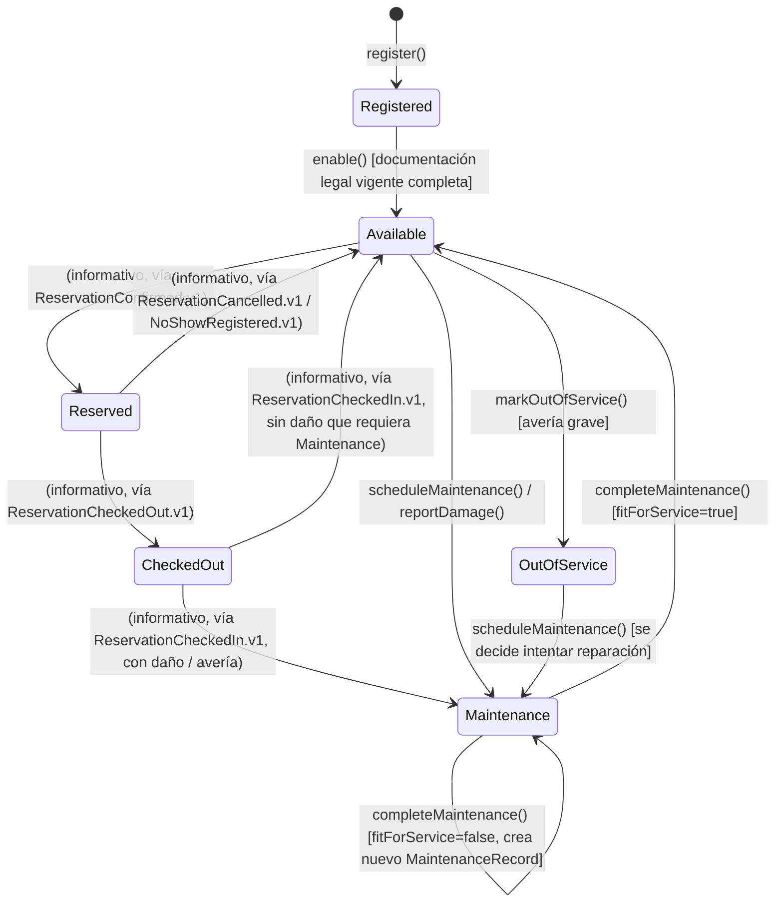

### 2.1 Tabla de transiciones válidas

| Desde | Comando/Evento | Hacia | Precondición |
|---|---|---|---|
| — | `register()` | `Registered` | — |
| `Registered` | `enable()` | `Available` | Al menos un `VehicleDocument` vigente por cada tipo legalmente obligatorio (INV-007) |
| `Available` | `ReservationConfirmed.v1` (comando derivado) | `Reserved` | Solo informativo — la fuente de verdad de la ocupación es `AvailabilitySlot` (Scheduling), no este campo |
| `Reserved` | `ReservationCheckedOut.v1` (comando derivado) | `CheckedOut` | — |
| `Reserved` | `ReservationCancelled.v1`/`NoShowRegistered.v1` (comando derivado) | `Available` | — |
| `CheckedOut` | `ReservationCheckedIn.v1` (comando derivado) | `Available` u `Maintenance` | Según si la inspección de devolución detecta daño que afecte operatividad |
| `Available` | `scheduleMaintenance()` | `Maintenance` | — |
| `Available` | `reportDamage()` con severidad que afecta operatividad | `Maintenance` u `OutOfService` | Decisión del Responsable de Mantenimiento según severidad |
| `Maintenance` | `completeMaintenance(fitForService=true)` | `Available` | Verificación de aptitud aprobada |
| `Maintenance` | `completeMaintenance(fitForService=false)` | `Maintenance` (nuevo `MaintenanceRecord`) | Verificación de aptitud rechazada — nunca reabre el `MaintenanceRecord` anterior |
| `OutOfService` | `scheduleMaintenance()` | `Maintenance` | Decisión de intentar reparación en lugar de dar de baja |

### 2.2 Transiciones explícitamente inválidas

| Desde | Intento | Por qué es inválida |
|---|---|---|
| `Maintenance` | `Reserved`/`CheckedOut` directo | Un vehículo en mantenimiento nunca puede aparecer como reservable — viola RN-04/INV-103 de forma directa |
| `OutOfService` | `Available` directo | No puede saltar la verificación de aptitud de `Maintenance` — ningún camino permite volver a `Available` sin pasar por una intervención verificada |
| `Registered` | `Reserved`/`CheckedOut` | Un vehículo no habilitado no puede ser objeto de ninguna `Reservation` — no existe en el resultado de `AvailabilityService` hasta `enable()` |
| Cualquier estado | Cambio de `VehicleStatus` iniciado directamente por `Reservation` sin pasar por un comando explícito sobre `Vehicle` | Viola RN-28/INV-006: el cambio de estado es responsabilidad exclusiva del agregado `Vehicle` |

## 3. `Payment` (Commerce)

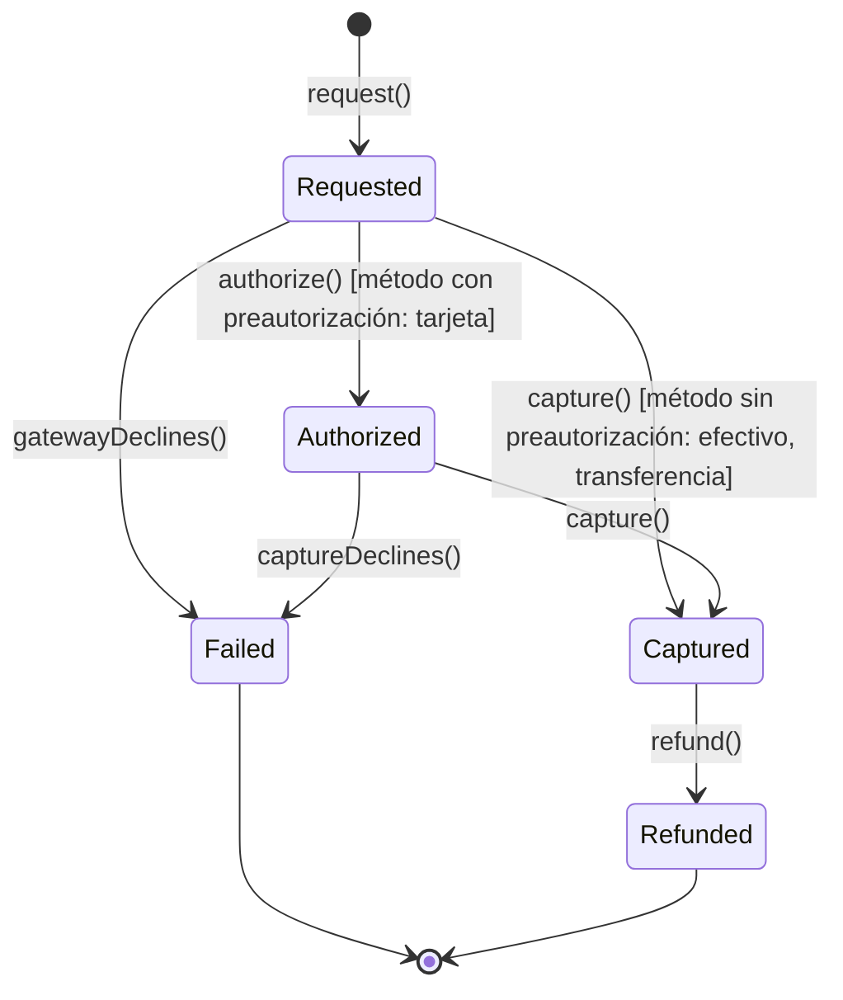

### 3.1 Tabla de transiciones válidas

| Desde | Comando | Hacia | Precondición |
|---|---|---|---|
| — | `request()` | `Requested` | `IdempotencyKey` no usada previamente (INV-021) |
| `Requested` | `authorize()` | `Authorized` | Solo aplica a métodos con preautorización (tarjeta vía pasarela) |
| `Requested`/`Authorized` | `capture()` | `Captured` | Confirmación del proveedor (webhook verificado, [11-INTEGRACIONES.md §12](../11-INTEGRACIONES.md)) o registro manual (efectivo) |
| `Requested`/`Authorized` | fallo de proveedor | `Failed` | Traducido desde `PaymentFailed.v1` — el payload crudo del webhook nunca muta el agregado directamente |
| `Captured` | `refund()` | `Refunded` | Autorizado por Responsable Comercial/Financiero |

### 3.2 Transiciones explícitamente inválidas

| Desde | Intento | Por qué es inválida |
|---|---|---|
| `Captured` | `Authorized` (retroceso) | Un cobro ya capturado no puede "desautorizarse" — la única vía posterior es `refund()`, un hecho nuevo, no una reversión de estado |
| `Failed` | cualquier transición | Terminal — un reintento de cobro crea un `Payment` nuevo (con su propia `IdempotencyKey`), nunca reabre el fallido |
| `Refunded` | cualquier transición | Terminal |
| Cualquier estado | Mutación directa por payload crudo de webhook sin verificación de firma | Viola la regla de integridad de integraciones ([11-INTEGRACIONES.md §12](../11-INTEGRACIONES.md)) |

## 4. `Invoice` (Commerce)

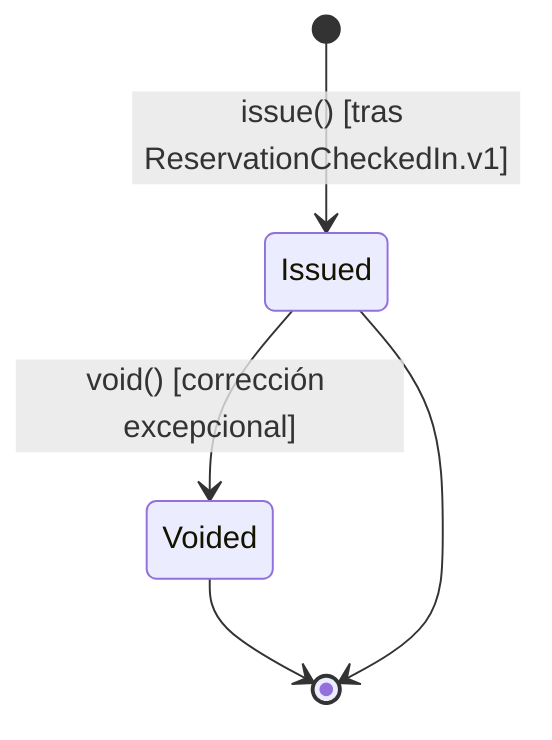

### 4.1 Tabla de transiciones válidas

| Desde | Comando | Hacia | Precondición |
|---|---|---|---|
| — | `issue()` | `Issued` | Reacciona a `ReservationCheckedIn.v1`; crea `Invoice` + todos sus `Charge` atómicamente (INV-023) |
| `Issued` | `void()` | `Voided` | Autorizado por Responsable Comercial/Financiero; motivo obligatorio |

### 4.2 Transiciones explícitamente inválidas

| Desde | Intento | Por qué es inválida |
|---|---|---|
| `Issued` | Edición de cualquier `Charge` existente | Viola INV-022 (inmutabilidad fiscal) — una corrección exige `void()` + nueva `Invoice` |
| `Voided` | Vuelta a `Issued` | Terminal — una reemisión crea una `Invoice` nueva que referencia la anulada, nunca revive la original |
| — | `issue()` sin `ReservationCheckedIn.v1` previo | Viola INV-108/RN-22: no puede existir una `Invoice` sin una `Reservation` que la origine |

## 5. `MaintenanceRecord` (entidad interna de `Vehicle`, Rental Operations)

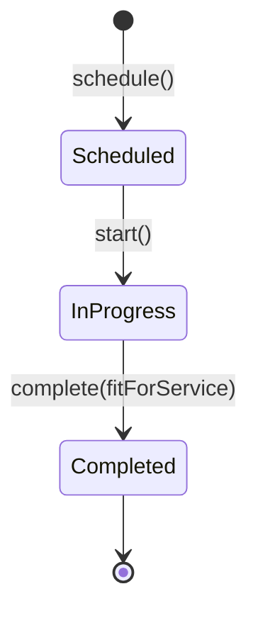

### 5.1 Tabla de transiciones válidas

| Desde | Comando | Hacia | Precondición | Efecto sobre `Vehicle` |
|---|---|---|---|---|
| — | `schedule()` | `Scheduled` | Bloquea disponibilidad futura del `Vehicle` desde este momento, no solo durante la intervención (INV-009) | `Vehicle → Maintenance` (si no lo estaba ya) |
| `Scheduled` | `start()` | `InProgress` | Fecha de inicio de la intervención alcanzada | Sin cambio adicional |
| `InProgress` | `complete(fitForService=true)` | `Completed` | Verificación de aptitud aprobada por Responsable de Mantenimiento | `Vehicle → Available` |
| `InProgress` | `complete(fitForService=false)` | `Completed` | Verificación de aptitud rechazada | `Vehicle` permanece en `Maintenance`; se crea un **nuevo** `MaintenanceRecord` en `Scheduled` para la intervención siguiente |

### 5.2 Transiciones explícitamente inválidas

| Desde | Intento | Por qué es inválida |
|---|---|---|
| `Completed` | Cualquier transición, incluida "reabrir" tras un resultado `fitForService=false` | `MaintenanceRecord` es una entidad histórica append-only, igual que `Inspection`/`DamageReport`/`Rate` — nunca se edita un registro cerrado, se crea uno nuevo |
| `Scheduled` | `complete()` directo | Salta `InProgress` — no puede haber un resultado de verificación de aptitud sin que la intervención haya ocurrido |

## 6. Otras máquinas de estado (resumen)

Se documentan de forma más breve por tener significativamente menos complejidad de negocio que las cinco anteriores; sus invariantes de transición ya están fijados en [02-AGGREGATES.md](02-AGGREGATES.md).

### 6.1 `User` (Identity & Access)

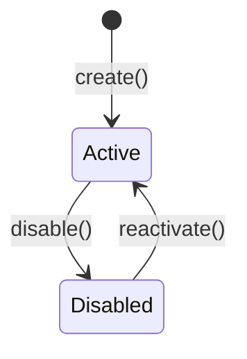

Inválida: ninguna transición borra el `User` mientras existan `AuditLogEntry`/`Reservation.Inspection.inspectedBy` que lo referencien.

### 6.2 `Session` (Identity & Access)

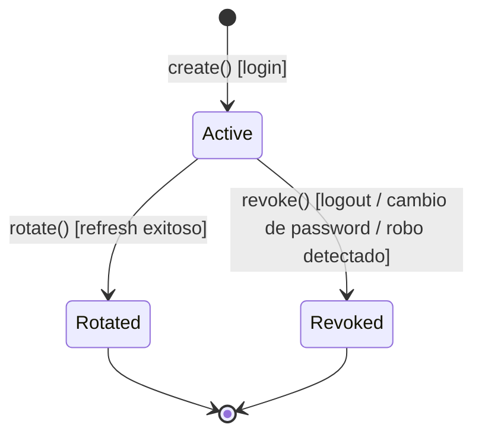

Inválida: `Rotated`/`Revoked` → `Active` (terminal en ambos casos; un nuevo login o refresh crea una `Session` nueva).

### 6.3 `Company` (Organization)

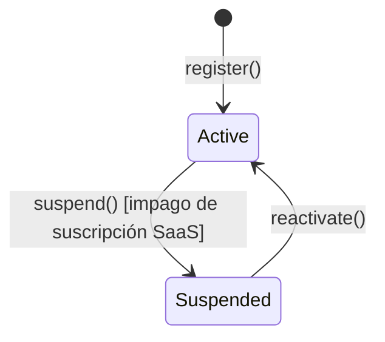

Inválida: ninguna operación de negocio de ningún BC se ejecuta mientras `Company` está `Suspended` (INV aplicada transversalmente, no una transición en sí).

### 6.4 `Branch` (Organization)

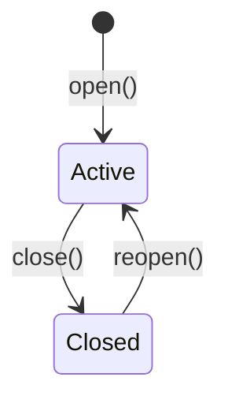

Inválida: `Closed` no admite nuevas asignaciones de `Vehicle` ni `CheckOut` (INV-112).

### 6.5 `Customer` (Rental Operations)

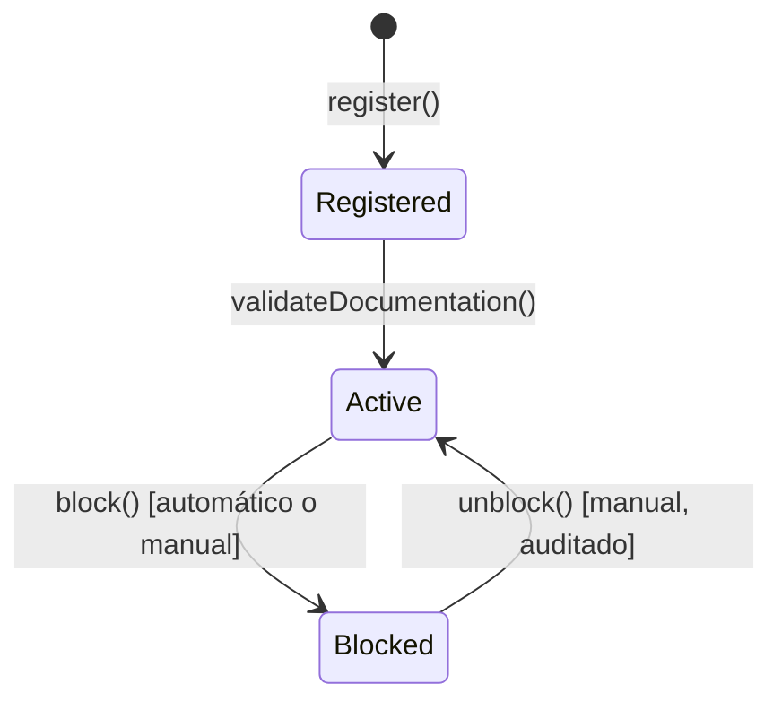

Inválida: `Registered` (sin documentación validada) no puede asociarse a una `Reservation` `Confirmed` (INV-104).

### 6.6 `AdditionalDriver` (entidad interna de `Customer`)

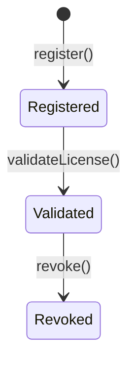

Inválida: `Revoked` → `Validated` directo (requiere volver a `Registered` y re-validar con documentación vigente).

### 6.7 `VehicleDocument` / `IdentityDocument` (entidades internas)

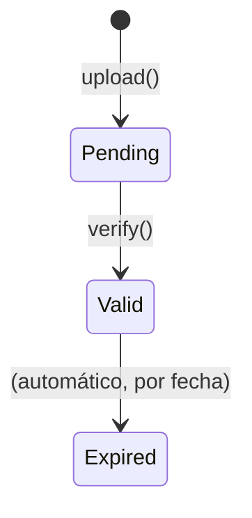

Inválida: `Expired` → `Valid` (una renovación crea un documento nuevo, nunca revive el vencido — mismo patrón append-only).

### 6.8 `AvailabilitySlot` (Scheduling)

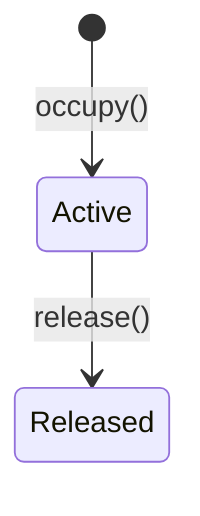

Inválida: edición del `DateRange` de un slot `Active` (un cambio de fechas siempre libera y crea uno nuevo, atómicamente — ver [02-AGGREGATES.md §7](02-AGGREGATES.md)).

### 6.9 `SecurityDeposit` (Commerce)

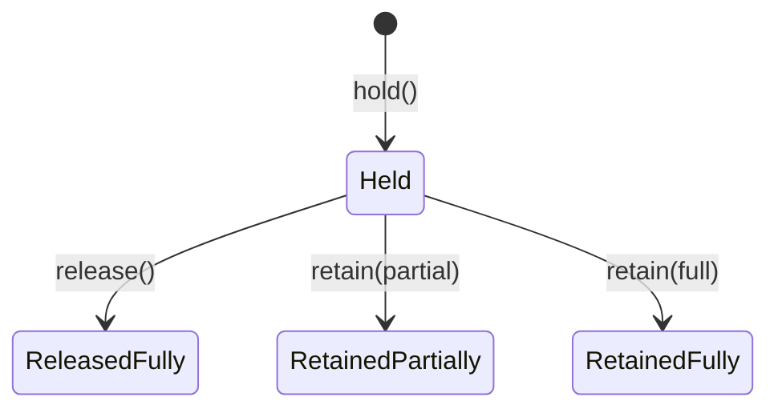

Inválida: cualquier transición desde los tres estados terminales (`ReleasedFully`, `RetainedPartially`, `RetainedFully`) — resolución única (INV-020).

### 6.10 `Notification` (Support)

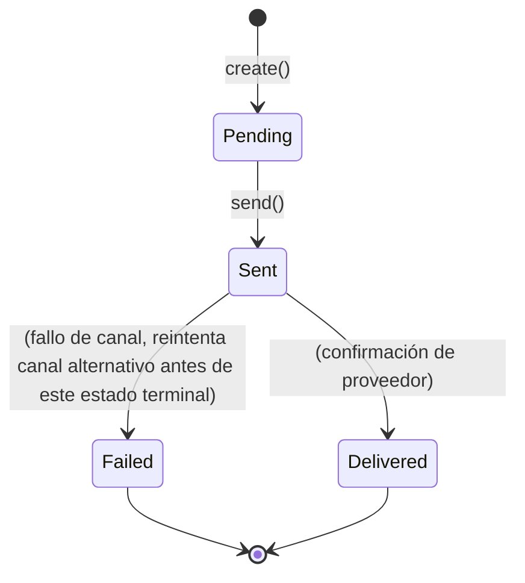

Inválida: `Failed` no es alcanzable sin haber agotado el reintento por canal alternativo (RN-34) — la transición directa `Sent → Failed` sin ese intento previo es una violación de la política de reintento, no una transición del diagrama.
