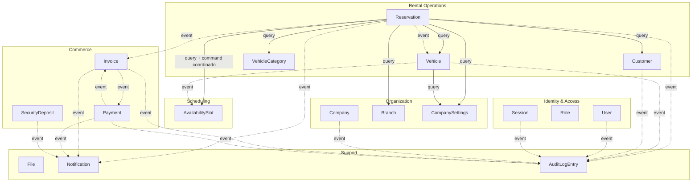

# 09 — Dependencies entre Aggregates

[01-BOUNDED_CONTEXTS.md §4](01-BOUNDED_CONTEXTS.md) ya fija cómo se relacionan los Bounded Contexts entre sí. Este documento baja ese mismo principio un nivel más: cómo interactúan los **agregados individuales** de [02-AGGREGATES.md](02-AGGREGATES.md), qué llamadas son válidas, cuáles están prohibidas, y qué evento reemplaza a cada dependencia directa que se evitó deliberadamente.

## 1. Principio heredado, aplicado a nivel de agregado

[ADR-0005](../ADR/0005-comunicacion-modulos.md) fija dos mecanismos exclusivos de comunicación entre módulos: puertos síncronos y eventos de dominio. A nivel de agregado, esto se traduce en una regla de decisión más fina que este documento hace explícita por primera vez:

| Pregunta | Mecanismo | Ejemplo |
|---|---|---|
| ¿Necesito **leer** un dato de otro agregado para decidir algo *ahora mismo*? | Puerto síncrono (query) | `Reservation` lee elegibilidad de `Customer` antes de confirmar |
| ¿Necesito **coordinar una acción con confirmación inmediata** de otro agregado porque mi propia operación depende de que esa acción haya tenido éxito? | Puerto síncrono (command), como transacción separada pero encadenada en el mismo caso de uso | `Reservation` ocupa un `AvailabilitySlot` vía `CalendarPort` antes de confirmarse a sí misma |
| ¿Otro agregado necesita **reaccionar** a algo que ya ocurrió en el mío, sin que el éxito de mi propia operación dependa de esa reacción? | Evento de dominio (asíncrono, eventual) | `Vehicle` refleja `Reserved`/`CheckedOut` reaccionando a eventos de `Reservation`; `Invoice` se genera reaccionando a `ReservationCheckedIn.v1` |

La distinción entre las dos primeras filas y la tercera es la que más se presta a confusión y la que este documento existe para fijar: **una llamada síncrona nunca escribe directamente sobre el agregado ajeno para reflejar un hecho de negocio ya consumado que ese agregado debe decidir por sí mismo** (p. ej., `Reservation` nunca fuerza `VehicleStatus = Reserved`; espera a que `Vehicle` reaccione a `ReservationConfirmed.v1` y decida aceptar esa transición según sus propias reglas, RN-28/INV-006).

## 2. Matriz de llamadas síncronas válidas

| Agregado consumidor | Puerto | Agregado/BC proveedor | Propósito | Tipo |
|---|---|---|---|---|
| `Reservation` | `VehicleStatusPort` | `Vehicle` (Rental Operations) | Leer si el `Vehicle` está en `Maintenance`/`OutOfService` antes de confirmar/check-out | Query |
| `Reservation` | `CalendarPort` (vía `AvailabilityService`, ACL) | `AvailabilitySlot` (Scheduling) | Verificar disponibilidad y ocupar/liberar el rango | Query + Command coordinado |
| `Reservation` | `CustomerLookupPort` | `Customer` (Rental Operations) | Verificar elegibilidad (documentación vigente, no bloqueado) y validación de `AdditionalDriver` | Query |
| `Reservation` | `VehicleCategoryLookupPort` | `VehicleCategory` (Rental Operations) | Obtener `Rate` vigente para `PricingService` | Query |
| `Reservation` | `CompanySettingsPort` | `CompanySettings` (Organization) | Leer `CancellationPolicy`, `LateReturnPolicy`, `DepositPolicy`, `DraftExpirationPolicy`, `MinimumBookingLeadTime` | Query |
| `Reservation` | `BranchStatusPort` | `Branch` (Organization) | Verificar que la `Branch` de check-out/check-in esté `Active` | Query |
| `Vehicle` | `CompanySettingsPort` | `CompanySettings` (Organization) | Leer `MaintenanceThresholdPolicy` | Query |
| `Vehicle` | `StorageProviderPort` | `File` (Support) | Registrar `VehicleDocument`/fotos | Command (infraestructura, no agregado de negocio) |
| `Customer` | `StorageProviderPort` / `DocumentExtractionPort` | `File` (Support) / Plataforma de integración | Registrar `IdentityDocument`, sugerencia de OCR | Command / Query (infraestructura) |
| `Invoices` (listener de aplicación) | — (consume payload del evento, no un puerto) | `Reservation` | Obtener `PriceBreakdown` final para traducir a `Charge` | Ver §4 — reemplazado por evento, no es una llamada síncrona |
| `Invoice` | `StorageProviderPort` | `File` (Support) | Generar/almacenar PDF | Command (infraestructura) |
| `SecurityDeposit` | `PaymentGatewayPort` | Integración externa (pasarela) | Ejecutar preautorización/liberación si el mecanismo es de tarjeta | Command (infraestructura) |
| `Payment` | `PaymentGatewayPort` | Integración externa (pasarela) | Autorizar/capturar/reembolsar | Command (infraestructura) |
| `Notification` | `NotificationSenderPort` / `PushNotificationSenderPort` | Integración externa | Enviar mensaje | Command (infraestructura) |
| Cualquier agregado que registra auditoría | — | `AuditLogEntry` | Nunca síncrono — ver §4 | Reemplazado por evento |

**Nota de lectura**: "Query" nunca muta el agregado proveedor; "Command coordinado" sí lo muta, pero como una transacción separada e inmediatamente confirmada dentro del mismo caso de uso de aplicación (nunca una transacción distribuida, INV-P04). El único ejemplo de "Command coordinado" entre agregados de negocio (no de infraestructura) en todo este modelo es `Reservation` → `AvailabilitySlot`, precisamente porque es el único caso donde el propio invariante crítico de `Reservation` (no-solapamiento) no puede resolverse sin una confirmación inmediata de otro agregado — justificación ya dada en [01-BOUNDED_CONTEXTS.md §4.2](01-BOUNDED_CONTEXTS.md).

## 3. Diagrama de dependencias

Flechas sólidas = dependencia síncrona (puerto). Flechas punteadas = reacción vía evento (asíncrona, eventual). Ningún agregado de `platform` (Identity & Access, Organization, Scheduling, Commerce, Support) tiene una flecha **hacia** `Rental Operations` en ningún sentido — ni síncrona ni de evento — reafirmando a nivel de agregado la regla estructural de [02-ARQUITECTURA.md §4](../02-ARQUITECTURA.md).

## 4. Qué eventos reemplazan qué dependencia directa

Esta es la tabla más importante del documento: por cada acoplamiento directo que **podría** haberse modelado (y que un desarrollador con menos disciplina de fronteras probablemente introduciría), se documenta el evento que lo reemplaza y por qué la alternativa directa se descartó.

| Dependencia directa que se evitó | Reemplazada por | Por qué la alternativa directa se descartó |
|---|---|---|
| `Reservation` escribe `Vehicle.status = Reserved/CheckedOut` directamente | `ReservationConfirmed.v1`, `ReservationCheckedOut.v1`, `ReservationCheckedIn.v1` consumidos por un `Listener` de `Vehicle` que invoca su propio comando interno | Viola RN-28/INV-006: `Vehicle` es la única autoridad sobre su propio estado; si `Reservation` lo escribiera directamente, dos módulos podrían decidir el estado de `Vehicle` de forma inconsistente |
| `Invoices` lee directamente los `PriceAdjustment` de `Reservation` desde su base de datos (cross-schema) | `ReservationCheckedIn.v1` transporta el `PriceBreakdown` completo en su payload | Viola [04-MODELO-DATOS.md §3](../04-MODELO-DATOS.md): nunca FK ni lectura cross-schema directa entre Bounded Contexts; el evento es la única superficie de datos que `Invoices` puede consumir de `Reservation` |
| `Payments` importa el modelo de dominio de `Invoices` para saber qué facturar | `InvoiceIssued.v1` transporta `charges[]`/`total` ya traducidos | Mantiene a `Payments` genuinamente genérico (cobra "un monto", nunca conoce el origen de negocio) — condición necesaria para que sea reutilizable por un producto futuro |
| `Notifications` importa clases de dominio de `Reservations`/`Invoices`/`Payments` para redactar el mensaje | Eventos versionados (`ReservationConfirmed.v1`, `InvoiceIssued.v1`, `PaymentSucceeded.v1`, etc.) con el payload mínimo necesario para componer la notificación | Es exactamente el caso de manual de [ADR-0005](../ADR/0005-comunicacion-modulos.md): permite que `notifications` reaccione sin que `reservations` sepa que existe |
| `AuditLogEntry` se escribe vía trigger de base de datos sobre las tablas de cada módulo | Cada módulo publica sus eventos de dominio; `Audit` los consume todos como listener transversal | Ya descartado explícitamente en [04-MODELO-DATOS.md §7](../04-MODELO-DATOS.md): mantiene "qué se audita" como decisión de dominio testeable, no como lógica SQL oculta |
| `SecurityDeposit`/`Payment` consultan el estado interno de `Reservation` para saber si debe retenerse/liberarse la garantía | `ReservationConfirmed.v1` (dispara retención si `DepositPolicy` lo exige) y `ReservationCheckedIn.v1` (dispara liberación/retención con el detalle de `PriceAdjustment` de tipo penalidad/daño ya incluido) | Evita que `Commerce` necesite conocer la máquina de estados completa de `Reservation` — solo reacciona a los dos hechos que le interesan |
| `Vehicle` consulta directamente `AvailabilitySlot` para saber si tiene reservas futuras antes de aceptar mantenimiento | `Vehicle` programa el `MaintenanceRecord` primero (autoridad propia); es la capa de aplicación de `Reservations` quien, al detectar la colisión vía `AvailabilityService`, dispara la excepción de negocio (INV-107) — `Vehicle` nunca necesita leer `AvailabilitySlot` porque no es su invariante a proteger | Mantiene la ACL de Scheduling concentrada en un único lugar (`AvailabilityService` de Rental Operations), en vez de duplicarla en `Vehicle` |
| `Reports` lee el modelo de dominio rico de cada agregado para construir sus proyecciones | Eventos de dominio (`ReservationConfirmed.v1`, `PaymentSucceeded.v1`, `VehicleStatusChanged.v1`, etc.) alimentan proyecciones de lectura optimizadas, específicas del caso de uso de reporte | Coherente con [ADR-0007](../ADR/0007-cqrs-selectivo.md): `Reports` no tiene agregados propios (§1 de [01-BOUNDED_CONTEXTS.md](01-BOUNDED_CONTEXTS.md)) precisamente para no acoplarse al modelo transaccional completo |

## 5. Llamadas explícitamente prohibidas

| Llamada prohibida | Por qué |
|---|---|
| `Reservation` (o cualquier agregado de `products/rental`) importa `PrismaService`/repositorio de `Vehicle`, `Customer`, `AvailabilitySlot`, `CompanySettings`, etc. directamente, sin pasar por el puerto publicado | Viola INV-P02: solo lo exportado por el `index.ts` público del módulo dueño es visible fuera de él ([05-CONVENCIONES-BACKEND.md §1](../05-CONVENCIONES-BACKEND.md)) |
| Cualquier agregado de `platform/` (Identity & Access, Organization, Scheduling, Commerce, Support) importa un tipo de dominio de `Rental Operations` (`Vehicle`, `Reservation`, `Customer`) | Viola INV-P03: `platform/*` nunca depende de `products/*` — es la garantía que permite montar un segundo producto sin tocar el núcleo ([00-VISION.md §1](../00-VISION.md)) |
| `AvailabilitySlot` (Scheduling) adquiere un campo o método que conozca `licensePlate`, `odometer`, o cualquier concepto de `Vehicle` | Rompe la ACL de [01-BOUNDED_CONTEXTS.md §4.2](01-BOUNDED_CONTEXTS.md) — señal de alarma ya documentada en [domain/08-BOUNDARY.md §5](../domain/08-BOUNDARY.md) |
| `Invoice`/`Charge` adquiere un campo que conozca conceptos propios de Rental (`vehicleCategory`, `odometer`, `damageReportId` tipado) en lugar de un `kind`/`description` genérico | Rompe la ACL de facturación de [01-BOUNDED_CONTEXTS.md §4.3](01-BOUNDED_CONTEXTS.md) |
| Una transacción de base de datos que abarque, por ejemplo, `Reservation.checkIn()` + `Invoice.issue()` como una única operación atómica | Viola INV-P04 e [02-ARQUITECTURA.md §5.4](../02-ARQUITECTURA.md): la consistencia entre Bounded Contexts es siempre eventual, coordinada por evento, nunca una transacción distribuida |
| `Vehicle` o `Customer` escriben directamente sobre `ReservationStatus` (p. ej., que `Vehicle` fuerce `Reservation → Cancelled` al marcarse `OutOfService`) | Ningún agregado de colaborador tiene autoridad para mutar el estado de `Reservation` — a lo sumo, dispara un evento (`VehicleStatusChanged.v1`) que la capa de aplicación de `Reservations` puede decidir cómo atender (p. ej., generar una excepción operativa de swap), pero `Reservation` decide su propia transición |
| `Session`/`User` conocen `CompanyId` como algo más que un `EntityId` opaco de pertenencia (p. ej., leer política de `CompanySettings` desde Identity & Access) | Identity & Access no tiene ninguna razón de negocio para conocer política de producto — si la necesitara, sería una señal de que algo se modeló en el BC equivocado |
| Cualquier módulo de dominio invoca un SDK de proveedor externo (Stripe, WhatsApp, OCR) directamente en lugar de a través de su puerto | Viola INV-P06/[ADR-0010](../ADR/0010-provider-pattern-integraciones.md) |

## 6. Checklist para un agregado o producto nuevo

Antes de conectar un agregado nuevo (propio de Rental Operations, o de un futuro segundo producto como Taller Mecánico) con cualquiera de los ya existentes, debe poder responderse "sí" a:

1. ¿La dependencia hacia el otro agregado es una **lectura** (query) o una **coordinación con confirmación inmediata** genuinamente necesaria para proteger un invariante propio (como `Reservation` con `AvailabilitySlot`)? Si es solo "sería conveniente enterarme cuando pase X", es un evento, no un puerto síncrono.
2. ¿El agregado consumidor sigue sin conocer ningún tipo de dominio interno del agregado proveedor más allá de lo expuesto en su `index.ts` público (DTOs de puerto) o en el payload versionado del evento?
3. ¿Si el agregado proveedor es de `platform/`, sigue siendo cierto que **no** necesita importar nada de `products/*` para satisfacer esta nueva dependencia? Si la respuesta es no, el diseño está invertido y debe revisarse — nunca resolverse con una excepción puntual.
4. ¿La nueva relación se puede documentar en la tabla de §2 (si es síncrona) o en la de §4 (si reemplaza una dependencia directa por un evento) sin necesitar una excepción a las reglas de §5?

Si alguna respuesta es "no", el diseño de la nueva dependencia debe revisarse antes de implementarse — coherente con el checklist rector de [00-VISION.md §5](../00-VISION.md).
