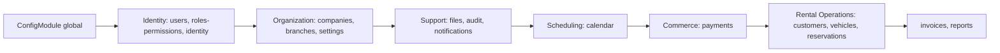

# 03 — Backend Architecture (NestJS)

Este documento fija cómo se compone, arranca y configura el host NestJS (`apps/api`), y qué piezas transversales (interceptors, guards, pipes, filters, jobs) existen y en qué orden actúan. Construye sobre [02-ARQUITECTURA.md](../02-ARQUITECTURA.md) y [05-CONVENCIONES-BACKEND.md](../05-CONVENCIONES-BACKEND.md), que ya fijan la Clean Architecture por módulo y las reglas de capas — aquí se fija la composición del *host*, no la estructura interna de un módulo (eso ya está resuelto).

## 1. Orden de composición de `apps/api`

`apps/api` no contiene lógica de negocio ([05-CONVENCIONES-BACKEND.md §12](../05-CONVENCIONES-BACKEND.md)). Su `AppModule` importa los módulos NestJS de cada librería `infrastructure` en el mismo orden de dependencia ya fijado por [01-ROADMAP.md §2-4](../01-ROADMAP.md) (Platform Core → Rental → Comercial → Comunicación):

El orden de import en `AppModule` no crea dependencias de compilación adicionales a las ya permitidas por [01-MONOREPO.md §5](01-MONOREPO.md) — es únicamente el orden en que NestJS resuelve el grafo de DI al arrancar, elegido para que un módulo nunca dependa (ni en DI ni conceptualmente) de uno que se registra después.

## 2. Bootstrap (`main.ts`)

Secuencia fija, en este orden, para que cada capa transversal esté activa antes de que pueda necesitarse:

1. Crear la aplicación Nest (`NestFactory.create`) con el logger estructurado ya configurado (ver [06-OBSERVABILITY.md §1](06-OBSERVABILITY.md)).
2. Cabeceras de seguridad (Helmet) y CORS explícito (orígenes conocidos, nunca `*` — [09-SEGURIDAD.md §7](../09-SEGURIDAD.md), detalle de implementación en [07-SECURITY.md §4](07-SECURITY.md)).
3. `ValidationPipe` global (whitelist, `forbidNonWhitelisted`, `transform` — ver §5).
4. `DomainExceptionFilter` y `AllExceptionsFilter` globales (ver §6).
5. Interceptors globales, en el orden fijado en §3.
6. Documentación OpenAPI (`@nestjs/swagger`), montada en `/api/docs`, deshabilitada/protegida fuera de desarrollo ([08-API-CONTRACTS.md §8](../08-API-CONTRACTS.md)).
7. Hooks de apagado ordenado (`enableShutdownHooks`): drenar workers de BullMQ (§8) y cerrar el pool de conexiones de Prisma antes de terminar el proceso.
8. `listen()`.

Ningún caso de uso ni entidad se instancia en este archivo — es exclusivamente configuración de infraestructura transversal.

## 3. Configuración

- `ConfigModule` global (`isGlobal: true`), cargado una única vez en `AppModule`, nunca reimportado por módulo.
- Cada módulo de negocio que necesita configuración propia la declara con un namespace propio (p. ej. configuración de `payments` bajo su propio namespace), nunca leyendo `process.env` directamente fuera de `ConfigModule` — evita que la fuente de verdad de configuración se disperse.
- **Validación fail-fast**: un esquema de validación (tipado, con valores por defecto explícitos solo donde el valor por defecto es seguro) se ejecuta al arrancar; si falta una variable requerida o tiene un formato inválido, el proceso no arranca. Preferible a fallar en el primer request que la necesite.
- Módulos que dependen de secretos de proveedores externos (§7 de [11-INTEGRACIONES.md](../11-INTEGRACIONES.md)) usan **módulos dinámicos asíncronos** (`forRootAsync`) para poder inyectar `ConfigService` en su fábrica de configuración — ver §4.
- Los valores en sí (credenciales, claves) nunca viven en el esquema de configuración del repositorio — provienen del gestor de secretos del entorno en runtime (detalle en [07-SECURITY.md §3](07-SECURITY.md) y [08-DEVOPS.md §5](08-DEVOPS.md)).

## 4. Módulos dinámicos

Todo módulo `infrastructure` de Plataforma que necesita configuración resuelta en runtime (credenciales de proveedor, flags por entorno) se expone como módulo dinámico con el patrón `forRootAsync({ useFactory, inject: [ConfigService] })`, uniforme en todo el workspace — un desarrollador que conoce el patrón de `payments` predice el de un futuro `workshop`. Módulos sin configuración externa (p. ej. `shared-kernel`, que no es ni siquiera un módulo NestJS) no necesitan esta forma.

El *binding* puerto → adaptador (`provide`/`useClass` o `useFactory`) ocurre exclusivamente dentro de la fábrica del módulo dinámico correspondiente — regla ya fijada en [05-CONVENCIONES-BACKEND.md §3](../05-CONVENCIONES-BACKEND.md), aquí simplemente ubicada dentro del mecanismo concreto de NestJS que la implementa.

## 5. Pipes

| Pipe | Alcance | Responsabilidad |
|---|---|---|
| `ValidationPipe` (global) | Toda request | Valida DTOs de entrada con `class-validator`; `whitelist: true` + `forbidNonWhitelisted: true` (rechaza campos no declarados, mitiga mass-assignment); `transform: true` (coerción de tipos declarados) |
| `ParseUUIDPipe` | Por parámetro de ruta | Valida que un `:id` de path sea un UUID v7 válido antes de llegar al Controller — rechazo temprano con `400`, coherente con la semántica estricta de códigos de [08-API-CONTRACTS.md §4](../08-API-CONTRACTS.md) |

Ningún Pipe valida reglas de negocio — solo forma sintáctica del borde HTTP, regla ya fijada en [05-CONVENCIONES-BACKEND.md §9](../05-CONVENCIONES-BACKEND.md).

## 6. Filters

| Filter | Alcance | Responsabilidad |
|---|---|---|
| `DomainExceptionFilter` | Global | Traduce cada subclase de `DomainError` a una respuesta `application/problem+json` (RFC 7807), usando el registro declarativo de errores de [09-CODING-STANDARDS.md §3](09-CODING-STANDARDS.md) — nunca un `switch` creciente dentro del propio filter |
| `AllExceptionsFilter` | Global, fallback | Captura cualquier excepción no mapeada; responde `500` genérico sin exponer stack trace ni detalle interno al cliente; registra el error completo en el log estructurado (§1 de [06-OBSERVABILITY.md](06-OBSERVABILITY.md)) |

## 7. Guards

Orden de ejecución (un Guard que falla detiene la cadena, coherente con "rechazo temprano" de [09-SEGURIDAD.md §2](../09-SEGURIDAD.md)):

1. **`JwtAuthGuard`**: valida firma y expiración del `access_token` (estrategia Passport JWT, detalle de claves en [07-SECURITY.md §1](07-SECURITY.md)); adjunta el payload validado a la request. Ausente solo en endpoints explícitamente públicos (`@Public()`).
2. **`TenantContextGuard`**: construye el `RequestContext` (§9) a partir del payload ya validado por `JwtAuthGuard` — nunca del body/query del cliente ([05-CONVENCIONES-BACKEND.md §7](../05-CONVENCIONES-BACKEND.md)).
3. **`CompanyStatusGuard`**: rechaza la request si la `Company` del token está `Suspended` (INV de [model/02-AGGREGATES.md §4](../model/02-AGGREGATES.md)) — verificación barata, antes de cualquier lógica de permiso.
4. **`TenantModuleEnabledGuard`**: para rutas de `scope:product-rental`, verifica que `EnabledProductModules` de `CompanySettings` incluya `Rental` — mecanismo de aplicación de la composición de producto por tenant ya fijada en [02-ARQUITECTURA.md §4.2](../02-ARQUITECTURA.md); es, por diseño, un guard transversal de plataforma, no un Domain Service (ver [model/05-DOMAIN_SERVICES.md §4.6](../model/05-DOMAIN_SERVICES.md)).
5. **`PermissionGuard`** (`@RequirePermission('reservations:create')`): verifica RBAC a nivel de endpoint — primer nivel de los dos que exige [09-SEGURIDAD.md §2](../09-SEGURIDAD.md); el segundo nivel (dependiente de dato runtime, p. ej. "solo reservas de su propia sucursal") se verifica dentro del caso de uso, no en un Guard.
6. **`ThrottlerGuard`**: rate limiting respaldado por Redis (detalle en [07-SECURITY.md §5](07-SECURITY.md)), con configuración más estricta en rutas de autenticación y creación de reservas.

## 8. Interceptors

Orden de ejecución global:

1. **`CorrelationIdInterceptor`**: obtiene o genera el `correlationId` de la request (detalle completo en [06-OBSERVABILITY.md §4](06-OBSERVABILITY.md)) y lo publica en el contexto asíncrono de la request antes que cualquier otro interceptor lo necesite.
2. **`LoggingInterceptor`**: registra entrada/salida de cada request con el `correlationId`, `companyId`, duración y código de resultado — log estructurado, nunca `console.log`.
3. **`TimeoutInterceptor`**: aplica un timeout por defecto a toda operación (evita que una integración externa colgada retenga un worker indefinidamente — coherente con [11-INTEGRACIONES.md §12](../11-INTEGRACIONES.md)).
4. **`ResponseEnvelopeInterceptor`**: envuelve toda respuesta exitosa en `{ data, meta }` según [08-API-CONTRACTS.md §3](../08-API-CONTRACTS.md), de forma uniforme para todo módulo — evita que cada Controller lo construya a mano.
5. **`CacheInterceptor`** (opt-in por endpoint, no global): respaldado por Redis, aplicado únicamente a Query Handlers de catálogo de bajo cambio (p. ej. `vehicle-categories`) — nunca a datos transaccionales de alta volatilidad (`reservations`), decisión caso a caso documentada en el propio endpoint, no una política global.

## 9. `RequestContext`

Provider de scope `REQUEST` (NestJS crea una instancia por request para providers de este scope, [05-CONVENCIONES-BACKEND.md §4](../05-CONVENCIONES-BACKEND.md)) que expone `companyId`, `branchId?`, `userId`, `roles[]` — poblado exclusivamente por `TenantContextGuard` (§7) a partir del JWT ya validado. Es la única fuente que un repositorio Prisma consulta para aplicar el filtro automático de `companyId` (Prisma Client Extension, detalle en [04-PERSISTENCE.md §5](04-PERSISTENCE.md)) y para fijar la variable de sesión de RLS.

**Regla de superficie mínima**: solo `RequestContext` es `REQUEST`-scoped. Ningún otro provider de aplicación se declara `REQUEST`-scoped salvo necesidad explícita y documentada — porque NestJS reconstruye todo el subárbol de DI que depende de un provider `REQUEST`-scoped en cada request, y ampliar esa superficie sin necesidad real degrada el rendimiento de forma silenciosa.

## 10. Health checks

`@nestjs/terminus`, dos endpoints con semántica distinta:

| Endpoint | Verifica | Uso |
|---|---|---|
| `/health/live` | El proceso responde | Política de reinicio del contenedor (§4 de [08-DEVOPS.md](08-DEVOPS.md)) |
| `/health/ready` | Conectividad a PostgreSQL y Redis | Admisión de tráfico del balanceador — un contenedor "vivo" pero sin DB no debe recibir requests |

Ambos endpoints son públicos (sin `JwtAuthGuard`) y no exponen detalle interno más allá de `ok`/`degraded`/`down` por dependencia.

## 11. Jobs en segundo plano (BullMQ)

Cada módulo que necesita trabajo asíncrono de larga duración o con reintento declara su propia cola, con nombre `<module>.<intención>` (p. ej. `notifications.send`, `rental.maintenance-reminder`, `support.outbox-relay` — este último detallado en [05-EVENTING.md §2](05-EVENTING.md)):

- Un `Processor` NestJS por cola, en `infrastructure/jobs/` del módulo dueño — nunca un `Processor` genérico compartido entre módulos.
- Backoff exponencial y número máximo de reintentos configurados explícitamente por cola (ninguna cola usa el default implícito de la librería sin decisión documentada).
- Cola de fallos (`dead-letter`) por cola crítica (pagos, notificaciones de confirmación) — un job que agota reintentos no desaparece silenciosamente, queda visible para intervención manual.
- Todo `Processor` es idempotente (tolera reejecución del mismo job) — requisito no negociable dado que BullMQ garantiza *at-least-once*, no *exactly-once*.
- Los workers corren dentro del mismo proceso `apps/api` en v1.0 (coherente con [ADR-0001](../ADR/0001-modular-monolith.md), un único desplegable) — separarlos a un proceso worker dedicado es un cambio de despliegue, no de código, si el volumen lo justifica en el futuro.

## 12. Qué se decide en otro documento

- Repository Pattern, Unit of Work, transacciones y RLS → [04-PERSISTENCE.md](04-PERSISTENCE.md).
- Bus de eventos, Outbox y listeners → [05-EVENTING.md](05-EVENTING.md).
- Logging estructurado, tracing y métricas → [06-OBSERVABILITY.md](06-OBSERVABILITY.md).
- Claves JWT, gestión de secretos y cabeceras de seguridad → [07-SECURITY.md](07-SECURITY.md).
