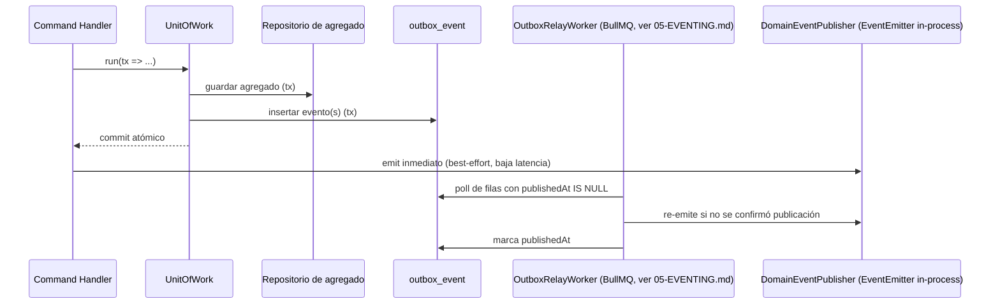

# 04 — Persistence

Este documento fija cómo se construye la capa de persistencia sobre las reglas ya definidas en [04-MODELO-DATOS.md](../04-MODELO-DATOS.md) (schema por Bounded Context, sin FK cross-schema, RLS, convenciones de columna) y [ADR-0003](../ADR/0003-postgresql-prisma.md) (PostgreSQL + Prisma). No redefine ninguna regla de datos — fija el mecanismo de construcción: cómo se organiza el schema de Prisma, cómo se implementa el Repository Pattern, cómo se logra atomicidad entre estado y eventos (Outbox), y cómo se migran los cambios.

## 1. Organización física del schema Prisma

Un archivo `.prisma` por Bounded Context, dentro de una única carpeta de schema multi-archivo que compila a un único `PrismaClient` (ya fijado en [04-MODELO-DATOS.md §2](../04-MODELO-DATOS.md)):

```
prisma/
  schema/
    base.prisma           # datasource + generator, sin modelos
    identity.prisma        # @@schema("identity") — User, Role, Session
    organization.prisma    # @@schema("organization") — Company, Branch, CompanySettings
    scheduling.prisma      # @@schema("scheduling") — AvailabilitySlot
    rental.prisma          # @@schema("rental") — Customer, Vehicle, VehicleCategory, Reservation, Invoice
    commerce.prisma        # @@schema("commerce") — Payment, SecurityDeposit
    support.prisma         # @@schema("support") — File, Notification, AuditLogEntry, outbox_event (ver §4)
  migrations/               # historial único, ver §7
```

**Ownership de archivo, no de cliente**: cada archivo `.prisma` lo modifica el equipo dueño del módulo correspondiente (mapeo exacto en `CODEOWNERS`, [08-DEVOPS.md §2](08-DEVOPS.md)), pero el `PrismaClient` generado es único para todo `apps/api` — un módulo nunca instancia su propio cliente Prisma independiente, evitando N pools de conexión redundantes.

Nota de empaquetado: `Invoice`/`Charge` viven físicamente en `rental.prisma` (schema `rental`), no en `commerce.prisma`, siguiendo la misma decisión de empaquetado físico ya fijada en [model/01-BOUNDED_CONTEXTS.md §3.5](../model/01-BOUNDED_CONTEXTS.md) y reflejada en [02-PROYECTOS.md §2.4](02-PROYECTOS.md).

## 2. Repository Pattern

- El puerto (`VehicleRepository`, `ReservationRepository`, ...) se define junto al dominio o la aplicación del módulo dueño, como interfaz TypeScript pura — cero dependencia de `@prisma/client`.
- La implementación (`PrismaVehicleRepository`) vive en `infrastructure/persistence/prisma/` del mismo módulo, y es la única pieza del sistema que traduce entre el modelo de Prisma (persistencia) y el agregado de dominio (`toDomain(record): Vehicle`, `toPersistence(vehicle): PrismaVehicleRecord`).
- Un agregado se carga y se guarda **como unidad completa**, incluidas sus entidades internas (p. ej. `Vehicle` con sus `VehicleDocument[]`/`MaintenanceRecord[]`, `Reservation` con sus `Inspection[]`/`DamageReport[]`) — el repositorio nunca expone una operación que persista una entidad interna de forma aislada de su agregado raíz, coherente con la unidad transaccional ya fijada en [model/02-AGGREGATES.md](../model/02-AGGREGATES.md).
- Ningún método de repositorio retorna un tipo de Prisma — siempre el tipo de dominio (o `void`/el ID), para que `application/` nunca necesite conocer la forma de persistencia.

## 3. Unit of Work

Prisma no tiene un patrón nativo de Unit of Work — se construye sobre `prisma.$transaction(callback)` (transacción interactiva), que es el único mecanismo permitido para que un Command Handler agrupe:

1. Una o más escrituras de repositorio sobre el agregado del propio módulo.
2. La fijación de la variable de sesión de RLS (§5) dentro de la **misma** transacción/conexión.
3. La inserción del evento de dominio en la tabla de Outbox (§4) — en la **misma** transacción que el cambio de estado.

Un puerto `UnitOfWork` (publicado por una librería de infraestructura común, no por ningún módulo de negocio específico) expone `run(work: (tx) => Promise<T>): Promise<T>`; dentro de `work`, el Command Handler obtiene instancias de repositorio *transaction-scoped* (vinculadas al `tx` de Prisma, no al `PrismaClient` global de solo lectura). Esto es lo que garantiza, mecánicamente, que "el estado cambió" y "el evento se registró" sean atómicos — el fundamento técnico del Outbox Pattern (§4).

Fuera de un `UnitOfWork.run(...)`, ningún caso de uso escribe directamente — un Query Handler de solo lectura usa el `PrismaClient` de scope de aplicación (no transaccional) sin necesidad de UoW, coherente con la separación Command/Query ya fijada en [ADR-0007](../ADR/0007-cqrs-selectivo.md).

## 4. Outbox Pattern

**Problema que resuelve**: [ADR-0005](../ADR/0005-comunicacion-modulos.md) fija el bus de eventos in-process como adaptador actual de `DomainEventPublisher`, aceptando explícitamente que "no sobrevive a un reinicio del proceso a mitad de una cadena de eventos". El Outbox transaccional **no reabre esa decisión** (sigue sin haber un broker externo) — resuelve, con el mismo schema-por-Bounded-Context ya disponible, el riesgo concreto de que un evento se pierda si el proceso cae entre el commit de estado y la emisión del evento. Es la evolución de adaptador que [02-ARQUITECTURA.md §10](../02-ARQUITECTURA.md) ya anticipa ("el puerto `DomainEventPublisher` cambia de adaptador; los módulos consumidores no cambian"). Ver justificación completa en [10-DECISIONES.md](10-DECISIONES.md) #2.

**Mecanismo**: cada schema de Bounded Context que publica eventos tiene una tabla `outbox_event` propia (o, para reducir superficie, todas las tablas de outbox residen físicamente en `support` con una columna `source_schema` — decisión de detalle libre para la implementación, siempre que cada escritura de outbox ocurra en la **misma transacción de base de datos** que el cambio de estado del agregado que la origina, incluso si la tabla vive en otro schema físico dentro de la misma base de datos — esto no viola la regla de "no FK cross-schema" de [04-MODELO-DATOS.md §3](../04-MODELO-DATOS.md), porque una fila de outbox no tiene FK hacia el agregado, solo lleva su `aggregateId` como valor opaco).

Columnas conceptuales de `outbox_event`: `id`, `eventId`, `eventType` (con versión, `.v1`), `aggregateType`, `aggregateId`, `companyId`, `payload` (JSONB, el mismo envelope ya fijado en [model/06-DOMAIN_EVENTS.md §1](../model/06-DOMAIN_EVENTS.md)), `occurredAt`, `publishedAt` (nulo hasta publicarse).

**Flujo**:



La emisión inmediata tras el commit da baja latencia en el camino feliz; el `OutboxRelayWorker` (detalle en [05-EVENTING.md §2](05-EVENTING.md)) es la red de seguridad que garantiza entrega incluso si el proceso cae justo después del commit, sin depender de que la emisión inmediata haya tenido éxito.

## 5. Multi-tenancy: filtro de aplicación + RLS

- **Prisma Client Extension**: intercepta toda query de un modelo con `companyId` y añade el filtro automáticamente a partir de `RequestContext` (§9 de [03-BACKEND-ARCHITECTURE.md](03-BACKEND-ARCHITECTURE.md)) — ningún repositorio escribe `where: { companyId }` a mano ([05-CONVENCIONES-BACKEND.md §7](../05-CONVENCIONES-BACKEND.md)).
- **RLS**: dentro de la misma transacción/conexión de cada request, se ejecuta `SET LOCAL app.current_company_id = <valor>` antes de cualquier query — `SET LOCAL` (no `SET SESSION`) es obligatorio porque su alcance está limitado a la transacción activa, lo que lo hace compatible con connection pooling en modo *transaction* (PgBouncer u equivalente); `SET SESSION` fugaría el valor a la siguiente transacción reutilizando la misma conexión física, una vulnerabilidad de aislamiento cross-tenant bajo pooling.
- Ambas capas son obligatorias y no sustituibles entre sí — ya fijado en [ADR-0004](../ADR/0004-multitenancy.md); este documento solo fija el mecanismo concreto (`Prisma Client Extension` + `SET LOCAL` transaccional) que las implementa.

## 6. Soft delete

Implementado como una segunda Prisma Client Extension, **opt-in por modelo** (no un middleware global): solo los modelos explícitamente marcados con soft-delete en [04-MODELO-DATOS.md §5](../04-MODELO-DATOS.md) (`reservations`, `invoices`) la activan. La extensión:

- Reescribe `delete`/`deleteMany` sobre esos modelos como `update`/`updateMany` fijando `deletedAt`.
- Añade `deletedAt: null` a todo `find*` sobre esos modelos, salvo que el caso de uso pida explícitamente incluir registros eliminados (p. ej. un reporte de auditoría).

El resto de los modelos usa borrado físico o el patrón `isActive`/estado, según ya fijado — la extensión no se aplica globalmente para no ocultar accidentalmente un borrado físico intencional en un modelo no pensado para retención.

## 7. Migraciones

- **Prisma Migrate** como único mecanismo, historial único de migraciones para todo el datasource (el schema multi-archivo compila a un schema lógico único; Prisma Migrate no versiona por archivo, sino por el schema compilado completo) — esto es una restricción de la herramienta, no una decisión de diseño: el ownership de *archivo* (§1) es independiente del hecho de que el historial de migraciones sea uno solo.
- Convención de nombre: `<timestamp>_<module>_<descripción>` (p. ej. `20260115_identity_add_mfa_secret`) — el prefijo de módulo permite identificar el dueño de una migración sin abrir el archivo.
- `CODEOWNERS` mapea cada archivo `.prisma` (§1) a su equipo dueño; una migración que modifica el archivo de otro módulo requiere la revisión de ese equipo — mismo principio de ownership de schema que sigue al ownership de módulo ya fijado en [04-MODELO-DATOS.md §6](../04-MODELO-DATOS.md).
- **Expand/contract** como único patrón de migración con downtime cero: agregar columna nullable → job de backfill → migración separada que agrega `NOT NULL`; eliminar una columna solo tras confirmar que ningún consumidor la lee. Coherente con la regla ya fijada de que toda migración es "aditiva y reversible cuando sea posible".
- **Exclusion constraints** (`EXCLUDE USING gist`, necesarias para el invariante de no-solapamiento de `AvailabilitySlot`, [04-MODELO-DATOS.md §8](../04-MODELO-DATOS.md)) no tienen sintaxis nativa en el DSL de Prisma — se agregan editando manualmente el SQL generado por `prisma migrate dev --create-only` antes de aplicarlo, documentado explícitamente en el cuerpo de esa migración con un comentario que explique el invariante que protege.
- Prohibido alterar el esquema manualmente en ningún entorno — ya fijado, sin excepción.

## 8. Auditoría a nivel de datos

`support.audit_log` es append-only, poblada por un listener transversal que consume **todo** evento de dominio publicado (no un listener por tipo de evento) y lo transcribe a una fila de `AuditLogEntry` — mecanismo ya fijado conceptualmente en [04-MODELO-DATOS.md §7](../04-MODELO-DATOS.md) y en [model/02-AGGREGATES.md §17](../model/02-AGGREGATES.md); el detalle del listener transversal vive en [05-EVENTING.md §5](05-EVENTING.md). Los permisos de base de datos del rol de aplicación **niegan** `UPDATE`/`DELETE` sobre esta tabla — segunda capa de defensa de INV-024, coherente con la tabla de defensa en profundidad de [model/07-INVARIANTS.md §6](../model/07-INVARIANTS.md).

## 9. Pooling de conexiones

- Prisma se conecta a través de un *connection pooler* en modo *transaction* (compatibilidad con `SET LOCAL`, §5) en todo entorno con más de una réplica de `apps/api`.
- Tamaño de pool por instancia calibrado en Fase 6 con datos reales de concurrencia (no se fija un número aquí — mismo criterio de "no calibrar sin datos" ya usado en [09-SEGURIDAD.md §9](../09-SEGURIDAD.md)).
- Réplicas de lectura para `reports`: no se introducen en v1.0; es la misma decisión diferida ya fijada en [04-MODELO-DATOS.md §9](../04-MODELO-DATOS.md) y en [ADR-0007](../ADR/0007-cqrs-selectivo.md).

## 10. Qué se decide en otro documento

- Bus de eventos, listeners, idempotencia de consumidores → [05-EVENTING.md](05-EVENTING.md).
- Testing de repositorios con Testcontainers → [10-TESTING.md](../10-TESTING.md) (sin cambios) y [09-CODING-STANDARDS.md §6](09-CODING-STANDARDS.md).
