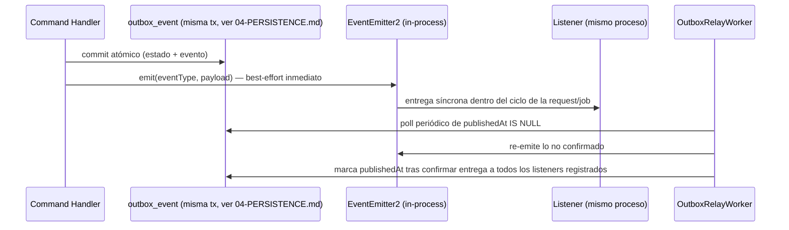

# 05 — Eventing

Construye sobre [ADR-0005](../ADR/0005-comunicacion-modulos.md) (puertos síncronos + eventos in-process), el catálogo completo de eventos ya fijado en [model/06-DOMAIN_EVENTS.md](../model/06-DOMAIN_EVENTS.md), y el mecanismo de Outbox ya fijado en [04-PERSISTENCE.md §4](04-PERSISTENCE.md). Este documento fija la arquitectura del **bus** en sí: quién publica, quién relee, quién consume, y cómo se distingue de la cola de jobs (BullMQ).

## 1. Dos mecanismos distintos, a menudo confundidos

| Mecanismo | Pregunta que responde | Tecnología | Vive en |
|---|---|---|---|
| **Bus de eventos de dominio** | "¿Qué hecho de negocio ya ocurrió, que otro módulo debería conocer?" | `EventEmitter2` de NestJS (in-process) + Outbox (durabilidad, [04-PERSISTENCE.md §4](04-PERSISTENCE.md)) | Todo módulo que produce/consume eventos de [model/06-DOMAIN_EVENTS.md](../model/06-DOMAIN_EVENTS.md) |
| **Cola de jobs** | "¿Qué trabajo de I/O potencialmente lento o con reintento necesito ejecutar como consecuencia de ese hecho?" | BullMQ (respaldado por Redis) | `infrastructure/jobs/` del módulo que necesita ejecutar el trabajo (§11 de [03-BACKEND-ARCHITECTURE.md](03-BACKEND-ARCHITECTURE.md)) |

Un Listener de dominio (`@OnEvent('ReservationConfirmed.v1')`) casi nunca ejecuta directamente una llamada externa lenta (enviar un WhatsApp, generar un PDF) — normalmente **encola un job** de BullMQ y retorna de inmediato. Esto mantiene el bus de eventos rápido y no bloqueante, y delega la garantía de reintento/backoff/dead-letter de trabajo externo a BullMQ, que está diseñado para eso — el bus de eventos no reintenta nada por sí mismo más allá de lo que el Outbox Relay ya cubre (§2).

## 2. `DomainEventPublisher`: adaptador vigente

- `OutboxRelayWorker` es un `Processor` de BullMQ con un job repetible (`support.outbox-relay`, intervalo corto — el valor exacto se calibra en Fase 6 según volumen real, mismo criterio que el resto de calibraciones de esta fase).
- La emisión inmediata post-commit cubre el caso feliz con latencia mínima; el relay cubre el caso en que el proceso cayó entre el commit y la emisión, o un listener no estaba disponible — es la garantía *at-least-once* que ADR-0005 ya reconoce como la garantía del bus, ahora extendida para sobrevivir a un reinicio de proceso (mejora explícita sobre el riesgo que ese ADR aceptó, sin introducir un broker externo, ver [10-DECISIONES.md](10-DECISIONES.md) #2).

## 3. Listeners

- Un módulo que reacciona a un evento de otro registra su `Listener` exclusivamente en su propia carpeta `infrastructure/events/` — nunca importa código del módulo emisor más allá del *shape* versionado del evento ([05-CONVENCIONES-BACKEND.md §8](../05-CONVENCIONES-BACKEND.md)).
- El *shape* de cada evento (tipo TypeScript del payload) se define junto al catálogo — una única fuente de verdad de tipos de evento, consumida tanto por el productor (para construir el payload) como por cualquier consumidor (para tipar su Listener), sin que el consumidor dependa del módulo productor más que de ese tipo.
- **Idempotencia obligatoria**: todo `Listener` debe tolerar entrega duplicada del mismo `eventId` sin efecto secundario doble (ya exigido en [model/06-DOMAIN_EVENTS.md §10](../model/06-DOMAIN_EVENTS.md)). Mecanismo: una tabla ligera `support.event_consumption_log` (o, si el propio efecto del Listener ya es naturalmente idempotente — p. ej. un `upsert` — no se requiere) con clave `(consumerName, eventId)`; el Listener verifica y registra antes de producir cualquier efecto no idempotente por sí mismo (p. ej. encolar un job de envío de notificación).

## 4. Validación de payload

Cada evento tiene, junto a su tipo TypeScript, un schema de validación runtime (misma librería que valida DTOs de entrada HTTP, por consistencia de herramientas — ver [09-CODING-STANDARDS.md §4](09-CODING-STANDARDS.md)) aplicado **al publicar**, no solo al consumir — un Command Handler que construye un payload inválido falla en su propio módulo, nunca en el módulo consumidor. Esto es deliberadamente más estricto que confiar únicamente en el tipo estático de TypeScript, porque el payload cruza el límite de serialización (Outbox → JSONB → deserialización), donde el compilador ya no protege.

## 5. `Audit` como consumidor transversal

`platform-audit-infrastructure` registra un único `Listener` catch-all (suscrito a `*`, patrón de comodín de `EventEmitter2`) que transcribe cualquier evento de dominio a una fila de `AuditLogEntry` — no un `Listener` por tipo de evento, coherente con la regla ya fijada de que `Audit` "observa todo" sin necesidad de listarse como consumidor en cada fila del catálogo ([model/06-DOMAIN_EVENTS.md §9](../model/06-DOMAIN_EVENTS.md)). Este Listener corre en el mismo proceso de emisión (sin pasar por BullMQ) porque escribir una fila de auditoría es una operación local a la base de datos, no una integración externa — no necesita las garantías de reintento de una cola de jobs.

## 6. Versionado y compatibilidad

Hereda sin modificación la disciplina ya fijada en [model/06-DOMAIN_EVENTS.md §11](../model/06-DOMAIN_EVENTS.md) y en [08-API-CONTRACTS.md §10](../08-API-CONTRACTS.md). A nivel de construcción:

- Cada versión de evento (`ReservationConfirmed.v1`, y el día que exista, `.v2`) es un tipo TypeScript distinto — nunca el mismo tipo con un campo opcional que cambia de significado según la versión.
- Durante una migración de `.v1` a `.v2`, el productor publica ambas versiones simultáneamente (dos filas de Outbox por hecho de negocio) hasta confirmar que todo consumidor migró — mecánicamente, esto es una responsabilidad del Command Handler emisor, no del bus.
- Un evento deprecado se marca como tal en el catálogo de [model/06-DOMAIN_EVENTS.md](../model/06-DOMAIN_EVENTS.md) antes de eliminar su publicación — regla de proceso, no de código.

## 7. Ruta de evolución hacia un broker real

Cuando el volumen o la necesidad de garantías de entrega entre procesos distintos lo justifique (extracción del primer módulo a servicio independiente, o volumen de eventos que un `EventEmitter2` in-process no sostenga con margen razonable — mismos criterios ya fijados en [ADR-0005](../ADR/0005-comunicacion-modulos.md)):

- `DomainEventPublisher` cambia de adaptador: `OutboxRelayWorker` pasa de re-emitir localmente a publicar en el broker (Redis Streams/Kafka); los productores (`Command Handler` + inserción en `outbox_event`) no cambian una sola línea.
- Los `Listener` con `@OnEvent` pasan a ser consumidores del broker (suscripción por tópico/stream) en lugar de manejadores locales — el *shape* del evento, su validación (§4) y su disciplina de idempotencia (§3) no cambian, porque ya estaban diseñados para *at-least-once* y entrega potencialmente duplicada.
- El Outbox no desaparece con esta migración — sigue siendo el mecanismo de atomicidad estado+evento dentro de cada módulo productor, independientemente de a qué bus se publique después.

## 8. Qué se decide en otro documento

- Estructura de la tabla `outbox_event` y su relación transaccional con el agregado → [04-PERSISTENCE.md §4](04-PERSISTENCE.md).
- Catálogo completo de eventos (payload, publicador, consumidores) → [model/06-DOMAIN_EVENTS.md](../model/06-DOMAIN_EVENTS.md) (sin cambios).
- Configuración de colas BullMQ por módulo → [03-BACKEND-ARCHITECTURE.md §11](03-BACKEND-ARCHITECTURE.md).
